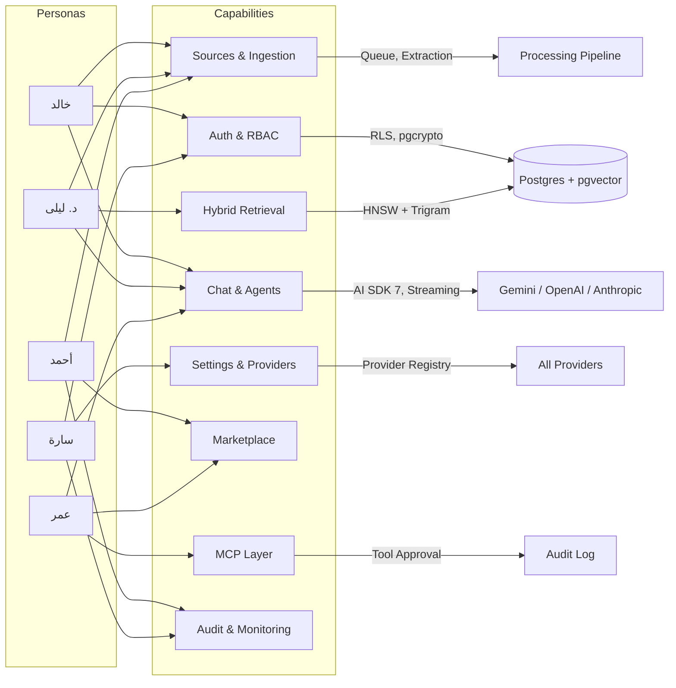

# Personas, Scope, and User Stories

> يحدد هذا القسم المستخدمين المستهدفين، حدود المنتج، وقصص المستخدمين مصنفة حسب القدرات مع معايير قبول قابلة للتحقق. للاطلاع على السياق العام والرؤية، راجع [الرؤية والأهداف ومقاييس النجاح](./01-vision-goals-and-success-metrics.md). لتفاصيل المتطلبات غير الوظيفية والحالات الحدية، راجع [المتطلبات والحالات الحدية والأسئلة المفتوحة](./03-requirements-edge-cases-and-open-questions.md).

---

## 1. Personas (الشخصيات المستهدفة)

| Persona | الدور | الأهداف الأساسية | نقاط الألم الحالية | مستوى التقنية |
|---|---|---|---|---|
| **د. ليلى** — الباحثة الأكاديمية | باحثة في الدراسات الإسلامية واللغوية، تعمل مع كميات كبيرة من المخطوطات والأوراق العربية | بناء قاعدة معرفة موثوقة، البحث الدلالي في النصوص العربية، الاستشهاد الدقيق بالصفحة/المقطع | أدوات RAG الحالية ضعيفة في العربية، تتجاهل الجذور والتشكيل، لا تدعم استشهادًا دقيقًا | متوسط–عالٍ |
| **أحمد** — مدير المعرفة المؤسسي | مسؤول إدارة المعرفة في شركة متعددة الإدارات (500+ موظف) | مركزة مصادر متفرقة (Confluence, SharePoint, Slack) في محرك بحث واحد، ضمان عزل الأقسام | تكامل المصادر معقد، لا يوجد عزل بين الإدارات، صعوبة إدارة الصلاحيات | متوسط |
| **سارة** — المهندسة التقنية / مسؤولة النشر | مهندسة DevOps تدير البنية التحتية لشركة حساسة بياناتها (قطاع صحي/مالي) | نشر ذاتي، تشفير شامل، سجل تدقيق، امتثال GDPR/HIPAA، مراقبة observability | حلول RAG السحابية لا تتيح self-hosting، لا تقدم عزلًا على مستوى الصف، سجلات التدقيق غير كاملة | عالٍ |
| **خالد** — المستخدم العادي (المعرف) | محامٍ أو مستشار قانوني يستخدم المنصة كأداة عمل يومية | رفع مستندات، طرح أسئلة والحصول على إجابات موثوقة بمصادر، مقارنة نصوص بين عربي/إنجليزي | لا يريد التعامل مع تعقيد تقني، يحتاج إجابات سريعة ودقيقة، تكلفة معقولة | منخفض–متوسط |
| **عمر** — مطور الوكلاء / مزوّد تكامل | مطور مستقل أو شركة تنتج قوالب وكلاء وموصّلات للسوق | بناء ونشر وكلاء مخصصين وموصّلات، كسب عائد عبر Marketplace، توثيق MCP | لا يوجد منصة تتيح بيع/مشاركة وكلاء RAG ثنائيي اللغة بسهولة | عالٍ جداً |

### ملاحظات تصميمية مستخلصة من الشخصيات

- **الباحثة د. ليلى** تفرض متطلبات صارمة على جودة الاسترجاع العربي (Normalization, Trigram, Root similarity) → قابلية تحقق عبر RAG Eval Harness.
- **مدير المعرفة أحمد** يحتاج لوحة إدارة مصادر بحالة حية وإعادة محاولة تلقائية → `SourceStatusBadge` + Queue observability.
- **المهندسة سارة** تفرض Self-hosting + Audit + RLS → Provider Registry + pgcrypto + OpenTelemetry إلزامي.
- **المستخدم خالد** يحتاج وضع Strict Mode افتراضيًا مع Groundedness Guard لتفادي الهلوسة → منع الإجابة عند عدم كفاية السياق.
- **المطور عمر** يحتاج Marketplace + MCP Server داخلي + Agent Builder → واجهة نشر وإصدار ومراجعات.

---

## 2. Scope (نطاق المنتج)

### 2.1 In-Scope (ضمن النطاق)

| المجال | ما يشمله | ما لا يشمله (Out-of-Scope) |
|---|---|---|
| **المصادقة والفرق** | تسجيل/دخول متعدد المزودين (Auth.js, Clerk, Supabase, WorkOS SSO)، إدارة أدوار (Owner/Admin/Member/Viewer)، دعوات بالبريد | نظام SSO مخصص لكل عميل على حدة (يُترك لـ WorkOS) |
| **قاعدة المعرفة** | رفع ملفات (PDF/DOCX/PPTX/XLSX/CSV/MD/صور OCR)، موصّلات ويب (Crawler/Sitemap/RSS)، موصّلات سحابية (Drive/OneDrive/Notion/Confluence/Slack/Jira/GitHub/Zendesk) | مزامنة لحظية ثنائية الاتجاه مع الأنظمة الخارجية (Read-only Ingestion فقط) |
| **معالجة المستندات** | Mistral Document AI أو Unstructured.io، تطبيع عربي، Semantic Chunking، Table-aware Chunking، تضمين gemini-embedding-2 | معالجة فيديو/صوت كوقف ضمني (مدخلات متعددة الوسائط متاحة في التضمين لكن لا تُفهرس كمسارات منفصلة) |
| **الاسترجاع** | Hybrid Search (Vector + BM25/Trigram + Metadata Filters)، Reranking عبر Flash-Lite، Scoped Retrieval لكل وكيل | فهرسة كاملة عبر مستأجرين (Cross-tenant search) — ممنوع تصميميًا |
| **الدردشة والوكلاء** | بث SSE، WorkflowAgent قابل للاستئناف، Tool Approvals، Citation Cards، تبديل الوكيل/النموذج منتصف المحادثة، Slash Commands، Sub-agents | محادثات صوتية لحظية (Voice real-time) — مرحلة مستقبلية |
| **MCP** | MCP Server داخلي، MCP Client متعدد، موافقات أدوات، سجل استدقام | تنفيذ MCP على Edge بدون مصادقة (مرفوض من ناحية الأمان) |
| **Marketplace** | موصّلات، خوادم MCP، قوالب وكلاء، أدوات/Skills، تقييمات، إصدارات، marketplace مؤسسي خاص | نظام دفع مدمج (Payment Gateway) — يُتكامل مع Stripe/Paddle في مرحلة لاحقة |
| **الإعدادات والمزودين** | Provider Registry لـ AI/Embedding/Storage/DB/Auth، تبديل مزود مع إعادة فهرسة تلقائية عند تبديل Embedding | دعم مزودي استدلال لا تتوافق مع AI SDK 7 Provider Registry |
| **المراقبة والامتثال** | OpenTelemetry، سجل تدقيق، تصدير/حذف GDPR، RLS، تشفير حقول حساسة | شهادات امتثال رسمية (SOC2/ISO) تصدر عن المنصة ذاتها — المنصة تتيح الأدوات لكن لا تمنح الشهادات |

### 2.2 Out-of-Scope (خارج نطاق الإصدار الأول)

- [ ] واجهة سطح مكتب أصلية (Desktop/Mobile native apps) — الويب فقط في V1
- [ ] تدريب نماذج مخصصة (Fine-tuning) داخل المنصة
- [ ] محرك فوترة ودفع متكامل (Stripe/Paddle) — الإصدار الأول يدعم BYOK (Bring Your Own Key)
- [ ] دعم لغات غير العربية والإنجليزية (المنصة مصممة لثنائية اللغة فقط في V1)
- [ ] بحث عبر المستأجرين (Cross-tenant search) — ممنوع تصميميًا وأمنيًا
- [ ] محادثات صوتية لحظية (Voice real-time)

---

## 3. User Stories (قصص المستخدم)

كل قصة موسومة بـ: **[Priority]** (P0 = حرج، P1 = عالي، P2 = متوسط)، **[Persona]** مرجعية، ومعايير قبول قابلة للتحقق آليًا أو يدويًا.

### 3.1 المصادقة وإدارة المساحات (Auth & Workspace Management)

#### US-AUTH-01: تسجيل مساحة عمل جديدة
**[P0] [خالد/أحمد]**

> بصفتي مستخدمًا جديدًا، أريد إنشاء مساحة عمل واختيار مزود المصادقة والمزودين الأساسيين، حتى أتمكن من البدء خلال أقل من 5 دقائق.

**معايير القبول:**
- [ ] يتدفق المستخدم عبر `/onboarding` في ≤ 4 خطوات
- [ ] يمكن اختيار مزود المصادقة من: Auth.js, Clerk, Supabase, WorkOS
- [ ] يُنشَى سجل `workspace_id` في Postgres مع سياسات RLS تلقائية
- [ ] يُنشَى Bucket/Prefix تخزين منفصل للمساحة
- [ ] تعرض لوحة `/dashboard` رسالة "لا توجد مصادر بعد" عند الانتهاء
- [ ] **Test**: `POST /api/workspaces` يعيد `201` مع `workspace_id` صحيح وRLS مفعّل
- [ ] **Test**: أي استعلام من مستخدم آخر على نفس `workspace_id` يعيد صفرًا من الصفوف

#### US-AUTH-02: إدارة الأدوار والصلاحيات (RBAC)
**[P0] [أحمد]**

> بصفتي مدير مساحة، أريد دعوة أعضاء وتعيين أدوار (Owner/Admin/Member/Viewer) لضمان التحكم في الوصول.

**معايير القبول:**
- [ ] يمكن دعوة عضو بالبريد واختيار الدور قبل الإرسال
- [ ] Owner يمكنه تعديل/حذف الأدوار؛ Admin يدير المصادر والأعضاء؛ Member يُنشئ/يقرأ المصادر؛ Viewer للقراءة فقط
- [ ] لا يمكن للـ Member تعديل إعدادات المزودين
- [ ] لا يمكن لـ Viewer بدء محادثة أو إنشاء وكيل
- [ ] **Test**: محاولة عضو بدور Viewer للوصول إلى `POST /api/agents` تعيد `403`
- [ ] **Test**: سجل التدقيق يسجّل كل تغيير دور مع timestamp وactor_id

#### US-AUTH-03: تسجيل الدخول عبر SSO المؤسسي
**[P1] [سارة/أحمد]**

> بصفتي مسؤولة تقنية، أريد تكوين SSO/SAML عبر WorkOS لتمكين تسجيل دخول الموظفين بحساباتهم المؤسسية.

**معايير القبول:**
- [ ] تكوين SAML من `settings/providers` بـ WorkOS
- [ ] تعيين المستخدمين تلقائيًا إلى مساحة عمل محددة عند تسجيل الدخول SSO
- [ ] فصل المساحات: مستخدم SSO من نطاق مختلف يدخل مساحته أو يُرفض
- [ ] **Test**: محاكاة استجابة SAML من WorkOS وتأكيد إنشاء جلسة صحيحة
- [ ] **Test**: استجابة SAML من نطاق غير مصرّح → `403` مع رسالة واضحة

---

### 3.2 مصادر البيانات وقاعدة المعرفة (Sources & Knowledge Base)

#### US-SRC-01: رفع ملف متعدد الصيغ
**[P0] [خالد/د. ليلى]**

> بصفتي مستخدمًا، أريد رفع ملفات (PDF, DOCX, PPTX, XLSX, CSV, MD, صور ممسوحة) لمعالجتها وفهرستها للبحث الدلالي.

**معايير القبول:**
- [ ] السحب والإفلات (Drag & Drop) أو اختيار ملفات من `/sources`
- [ ] الصيغ المدعومة: `pdf, docx, pptx, xlsx, csv, md, txt, png, jpg, jpeg, tiff`
- [ ] حجم أقصى للملف الواحد: 50 MB (افتراضي، قابل للتهيئة)
- [ ] يظهر `SourceStatusBadge` فورًا بحالة "قيد المعالجة"
- [ ] عند فشل المعالجة: عرض رسالة خطأ مع زر «إعادة المحاولة»
- [ ] **Test**: رفع `sample.pdf` (حجم 2MB) ← حالة تتحول إلى "مفهرس" خلال دقيقتين
- [ ] **Test**: رفع `corrupt.pdf` ← حالة "فشل" مع رسالة `EXTRACTION_FAILED`
- [ ] **Test**: رفع ملف يتجاوز 50MB ← `413` مع رسالة واضحة
- [ ] **Eval**: فحص دقة الاستخلاص على مجموعة اختبار عربية/إنجليزية (دقة ≥ 90%)

#### US-SRC-02: موصّل الويب (Web Crawler)
**[P1] [أحمد]**

> بصفتي مدير معرفة، أريد ربط موقع/مدونة ويب كمصدر للمزامنة الدورية، حتى تُفهرس التحديثات تلقائيًا.

**معايير القبول:**
- [ ] يمكن إدخال URL جذر + تحديد عمق الزحف (≤ 3 مستويات افتراضيًا) + تكرار المزامنة
- [ ] يدعم Sitemap.xml وRSS كبدائل للزحف
- [ ] كشف التكرار: لا تُفهرس صفحة موجودة بالفعل (Hash comparison)
- [ ] سجل حالة: عدد الصفحات المفهرسة، آخر مزامنة، عدد الأخطاء
- [ ] احترام `robots.txt`
- [ ] **Test**: زحف `https://example.com/sitemap.xml` (3 صفحات) ← 3 مصادر بحالة "مفهرس"
- [ ] **Test**: موقع بلا `robots.txt` ← يعمل مع تحذير في السجل
- [ ] **Test**: URL غير صالح ← حالة "فشل" مع `CRAWL_TIMEOUT`

#### US-SRC-03: موصّل Google Drive
**[P1] [أحمد]**

> بصفتي مدير معرفة، أريد ربط Google Drive لفهرسة المستندات القابلة للمشاركة.

**معايير القبول:**
- [ ] OAuth flow يُطلب صلاحيات `drive.readonly` فقط
- [ ] يمكن تحديد مجلدات / ملفات بعينها
- [ ] مزامنة يدوية + تلقائية (مجدولة)
- [ ] لا تُخزَّن بيانات اعتماد OAuth في الواجهة الأمامية أبدًا
- [ ] **Test**: ربط حساب Drive بهدف ← فهرسة ناجحة
- [ ] **Test:** محاولة استدعاء API بدون refresh token صالح ← حالة "انتهت الجلسة" + زر إعادة ربط
- [ ] **Eval**: دقة فهرسة المستندات العربية في Google Docs ≥ 85%

#### US-SRC-04: تفعيل/تعطيل وضع RAG (Strict / Augmented / Open)
**[P0] [خالد]**

> بصفتي مستخدمًا، أريد التبديل بين أوضاع RAG الثلاثة على مستوى المحادثة لمراقبة مصدر الإجابات.

**معايير القبول:**
- [ ] زر تبديل واضح داخلـ `ChatComposer` لعرض الوضع الحالي
- [ ] **Strict Mode**: لا تُعرض أي إجابة إلا من المصادر المفهرسة؛ عند عدم كفاية السياق → رسالة "لا توجد مصادر كافية" بدلاً من إجابة
- [ ] **Augmented Mode**: الإجابة تسلك تسمية واضحة في الواجهة بين "من مصادرك" و"من الويب"
- [ ] **Open Mode**: يظهر تنبيه "الإجابة من الويب/الوكيل غير مقيّدة بالسياق"
- [ ] **Test**: Strict Mode مع قاعدة فارغة ← رسالة "لا توجد مصادر" + لا ينخرط LLM
- [ ] **Test**: Augmented Mode مع مصدر + سؤال خارج نطاق المصدر → يُبحث في الويب ويحتوي `source_type: "web"` في الاستشهاد
- [ ] **Eval**: تقييم جودة الإجابات على مجموعة أسئلة عربية (Rubric: الدقة، الاستشهاد، الوضوح ≥ 3/5)

#### US-SRC-05: استكشاف قاعدة المعرفة الدلالي
**[P1] [د. ليلى]**

> بصفتي باحثة، أريد تصفح والبحث الدلالي داخل قاعدة المعرفة بدون فتح محادثة، لضبط فهم المصادر.

**معايير القبول:**
- [ ] صفحة `/knowledge-base` تعرض شبكة (Grid) من الأجزاء (Chunks) مع معاينة وفلترة بالوسوم/المصدر
- [ ] شريط بحث دلالي Hybrid (Vector + Trigram) يعيد أعلى 20 نتيجة مع درجة تشابه
- [ ] عند الضغط على نتيجة → معاينة المقطع الكامل أم مصدره
- [ ] **Test**: بحث عن كلمة عربية مع خطأ إملائي → نتائج صحيحة (بفضل Trigram/fuzzy)
- [ ] **Test**: البحث عن مرادف → يعيد نتائج ذات صلة دلاليًا (وليس نصيًا فقط)

---

### 3.3 استرجاع وتوليد (Retrieval & Generation)

#### US-RAG-01: إجراء بحث هجين (Hybrid Search) عربي/إنجليزي
**[P0] [د. ليلى/خالد]**

> بصفتي مستخدمًا في محادثة، أريد أن يجيب الوكيل بالاعتماد على بحث هجين (دلالي + نصي مع تشابه ضبابي) يدعم العربية بشكل صحيح.

**معايير القبول:**
- [ ] الـ Query يُطبع (تطبيع الأحرف العربية: توحيد الألف/الهمزة، إزالة التشكيل اختياريًا)
- [ ] Hybrid Search في Postgres عبر `pgvector` (HNSW) + `pg_trgm` في استعلام واحد
- [ ] يعيد Top-K (افتراضي = 8) مع درجة Relevance و Metadata Filter (`workspace_id`, `source_id`)
- [ ] لا تُرجع نتائج من مساحة عمل أخرى (عزل RLS)
- [ ] **Test**: استعلام "التكية الاسدية" → يعيد النص الذي يحتوي "النقابة الأسدية" (تطبيع الألف)
- [ ] **Test**: استعلام عربي بمصطلح إنجليزي مدمج (Code-switching) → نتائج ذات صلة
- [ ] **Eval**: قياس nDCG@10 على مجموعة استعلامات اختبارية عربية ≥ 0.75

#### US-RAG-02: عرض الاستشهادات التفاعلية
**[P0] [خالد]**

> بصفتي مستخدمًا في محادثة، أريد رؤية استشهادات قابلة للنقر تربط كل فقرة في الإجابة بالمصدر الأصلي (المقطع/الصفحة).

**معايير القبول:**
- [ ] كل فقرة عائدة في الإجابة تشير إلى مرجع مرقم `[1]`, `[2]` إلخ
- [ ] عند الضغط/التحويم: `CitationCard` يظهر مقتنًا من المصدر مع اسم الملف ورقم الصفحة
- [ ] يمكن النقر على ال Citation للانتقال إلى `/sources/[id]` بتمييز المقطع
- [ ] لا استشهاد ⇔ الإجابة من "الويب" (في وضع Augmented/Open)
- [ ] **Test:** استعلام بمصدر معروف → إجابة تحتوي `[1]` والبطاقة تشارك البيانات المطابقة من المصدر
- [ ] **Test:** استعلام بلا مصادر في Strict Mode → لا توجد استشهادات + رسالة عدم كفاية السياق

#### US-RAG-03: موافقة الأدوات (Tool Approvals) لاستدعاءات MCP
**[P0] [سارة/أحمد]**

> بصفتي مدير مساحة، أريد أن يطلب أي وكيل موافقتي قبل تنفيذ أداة MCP خارجية (كتابة/حذف/استدعاء مدفوع).

**معايير القبول:**
- [ ] عند استدعاء أداة MCP خارجية أثناء المحادثة → يظهر بطاقة "طلب موافقة" في واجهة الدردشة
- [ ] البطاقة تعرض: اسم الأداة، مقدارها التقريبي، الخادم MCP، نوع العملية (read/write/delete)
- [ ] يمكن الموافقة / الرفض / تأجيل لاحقًا
- [ ] سجل التدقيق يُسجّل: actor_id, agent_id, tool_name, decision, timestamp
- [ ] **Test**: محاكاة استدعاء أداة `delete-file` → يظهر طلب موافقة بدون تنفيذ مباشر
- [ ] **Test**: الموافقة → الأداة تُنفذ وتُسجل في Audit Log
- [ ] **Test**: الرفض → الأداة لا تُنفذ + ينضم رسالة نظام "تم رفض الأداة"

---

### 3.4 الوكلاء والدردشة (Agents & Chat)

#### US-AGENT-01: إنشاء وكيل مخصص
**[P1] [أحمد/عمر]**

> بصفتي مطور وكيل، أريد إنشاء وكيل يحدد له التعليمات والأدوات وMCP ونطاق البحث والوضع.

**معايير القبول:**
- [ ] من `/agents/[id]/build` أتوفر على: System Prompt (عربي/إنجليزي), Select Model, Tools/Skills, MCP servers, Knowledge scope, Mode
- [ ] يمكن اختبار الوكيل جنبًا إلى جنب في المعاينة قبل الحفظ
- [ ] عند تحديد نطاق معرفة → لا يبحث الوكيل خارج المصادر المحددة
- [ ] **Test**: حفظ وكيل بنطاق مصدر واحد → الاستعلام عن مصدر خارجي في المحادثة لا يقع في نتائج الاسترجاع
- [ ] **Test**: تبديل النموذج من gemini-3.5-flash-lite → gemini-3.6-flash وتأكيد تغيير السلوك

#### US-AGENT-02: تبديل الوكيل أثناء المحادثة
**[P1] [خالد]**

> بصفتي مستخدمًا في دردشة، أريد تبديل الوكيل والنموذج منتصف المحادثة دون فقدان السياق التاريخي.

**معايير القبول:**
- [ ] تزويق تبديل الوكيل من داخل `ChatComposer` بدون إنشاء محادثة جديدة
- [ ] سياق الرسائل السابقة يبقى متاحًا للوكيل الجديد
- [ ] تحرك الرسائل يبدأ بـ رسالة نظام: "تبديل الوكيل: [name] → [new_name]"
- [ ] **Test**: محادثة مع 5 رسائل + تبديل وكيل ← الوكيل الجديد يمكنه الاستشهاد بالرسائل السابقة

#### US-AGENT-03: WorkflowAgent قابل للاستئناف
**[P2] [أحمد/د. ليلى]**

> بصفتي مستخدمًا، أريد إكمال بحث عميق متعدد الخطوات على عدة جلسات، مع قدرة الوكيل على التصرف في انقطاع الاتصال.

**معايير القبول:**
- [ ] في حالة فقدان الاتصال أثناء تنفيذ مهمة طويلة، تُحفظ الحالة ويُستأنف من آخر نقطة عند الربط
- [ ] يعرض الوكيل مؤشر "يعمل خلفية" (Activity API)
- [ ] المتابعة تعمل عبر جلسة/جهاز آخر (نفس workspace_id)
- [ ] **Test**: الوكيل يبدأ مهمة بـ 3 خطوات → فصل اتصال موسكًا → إعادة الاتصال → الخطوة الرابعة تبدأ من النقطة الصحيحة

---

### 3.5 السوق والموصّلات (Marketplace)

#### US-MKT-01: تصفح وتثبيت موصل من Marketplace
**[P1] [أحمد]**

> بصفتي مدير معرفة، أريد تصفح Marketplace وتثبيت موصل أو خادم MCP بضغطة واحدة بدلاً من تكوينه يدويًا.

**معايير القبول:**
- [ ] صفحة `/marketplace` تعرض الفئات: Connectors, MCP Servers, Agent Templates, Tools & Skills
- [ ] لكل عنصر: اسم، مؤلف، إصدار، تقييم متوسط، لقطة شاشة، وثائق
- [ ] زر "تثبيت" يفتعل OAuth flow (إن لزم) أو يضيف التهيئة تلقائيًا
- [ ] يمكن إلغاء التثبيت من نفس الصفحة
- [ ] **Test**: تثبيت "Notion Connector" ← يظهر في قائمة الموصّلات ويمكن استخدامه فورًا
- [ ] **Test**: تثبيت MCP Server يحتاج مفاتيح API ← يُطلب الإدخال في نافذة منفصلة مشفرة
- [ ] **Test:** فشل تثبيت ← رسالة واضحة في `toast` ولا يُنشَى سجل مكسور

#### US-MKT-02: نشر وكيل/أداة على Marketplace
**[P2] [عمر]**

> بصفتي مطور وكيل، أريد نشر وكيل مخصص على Marketplace (عام أو خاص في مساحة مؤسستي) مع إصدارات.

**معايير القبول:**
- [ ] من `/agents/[id]/build` → زر "نشر على Marketplace"
- [ ] يختار: عام (Public) أو خاص مساحي (Private)
- [ ] يجب إدخال: وصف، لقطة شاشة، وثائق Markdown، الترخيص
- [ ] كل تحديث للوكيل = إصدار جديد (SemVer) مع مراجعات منفصلة
- [ ] **Test**: نشر وكيل كPrivate ← يظهر في Marketplace مساحة المؤسسة فقط
- [ ] **Test:** محاولة الوصول له من مساحة أخرى → غير مرئي

---

### 3.6 الإعدادات والمزودين (Settings & Providers)

#### US-SET-01: تبديل مزود الاستدلال
**[P0] [سارة/أحمد]**

> بصفتي مسؤول تقني، أريد تبديل مزود الاستدلال (Gemini → OpenAI → Anthropic) من الإعدادات مع تأكيد التأثير على التكلفة والأداء.

**معايير القبول:**
- [ ] صفحة `/settings/providers` تعرض المزودين المفعّلين والمتاحين
- [ ] عند التبديل: تنبيه أن الوكلاء القائمين سيستخدمون المزود الجديد في المحادثة القادمة
- [ ] المفاتيح تُدخل مرة واحدة لكل مساحة وتُخزَّن مشفّرة (pgcrypto/Vault)
- [ ] **Test**: إدخال مفتاح API صالح → `test-provider-connection` يعيد `200`
- [ ] **Test**: مفتاح غير صالح → `401` مع رسالة "مفتاح غير صحيح"
- [ ] **Test**: التبديل من Gemini → OpenAI والبدء بمحادثة جديدة → يستخدم OpenAI

#### US-SET-02: تبديل مزود التضمين مع إعادة فهرسة
**[P1] [سارة]**

> بصفتي مسؤول تقني، أريد تبديل مزود التضمين مع إعادة فهرسة كاملة تلقائيةً لأن فضاءات المتجهات تختلف.

**معايير القبول:**
- [ ] تنبيه عند تبديل Embedding Provider: "يجب إعادة فهرسة جميع المصادر"
- [ ] عند التأكيد: يُنشأ Job لإعادة فهرسة كاملة (قائمة انتظار)
- [ ] تظهر حالة الإعادة في لوحة `/dashboard` (مع تقدم وقائمة انتظار)
- [ ] لا تُحجر المصادر أثناء الإعادة: الاسترجاع يعمل على المتجهات القديمة حتى اكتمال الإعادة
- [ ] **Test**: التبديل من gemini-embedding-2 → بديل → يُنشأ job جديد ويتوفر كل مصدر بالحالة "يُعاد فهرسته"
- [ ] **Test**: الاسترجاع أثناء الإعادة يعمل بدون أخطاء 500

#### US-SET-03: سياسة الخصوصية والتشفير
**[P0] [سارة]**

> بصفتي مسؤول تقني، أريد تكوين التشفير على مستوى الحقول وسياسات الاحتفاظ وتصدير/حذف GDPR.

**معايير القبول:**
- [ ] يمكن تمكين/تعطيل التشفير على مستوى الحقول الحساسة (مفاتيح API، بيانات اعتماد OAuth)
- [ ] سياسة احتفاظ قابلة للتهيئة لكل مصدر (بالأيام)
- [ ] حذف بيانات المستخدم بالكامل (GDPR right-to-be-forgotten) يضرب: المصادر + المقاطع + المتجهات + المحادثات + يدوياً سجل التدقيق
- [ ] تصدير بيانات المستخدم إلى ملف (JSON) قابل للتنزيل
- [ ] **Test**: تمكين التشفير → بيانات اعتماد OAuth في قاعدة البيانات ليست بلا معنى بدون المفتاح
- [ ] **Test**: طلب حذف + تأكيد → لا يتبقى أي سجل مرتبط بـ `user_id` بعد 24 ساعة
- [ ] **Test**: تصدير البيانات → ملف JSON يحتوي على: المستخدم، المساحات، المحادثات (لا مفاتيح API)

---

### 3.7 المراقبة والتدقيق (Monitoring & Audit)

#### US-MON-01: سجل التدقيق الشامل
**[P0] [سارة]**

> بصفتي مسؤول تقني، أريد سجل تدقيق رسمي لكل عملية تعديل مصدر/حذف/مشاركة/استدعاء أداة MCP خارجية.

**معايير القبول:**
- [ ] كل حماسة تُسجّل: actor_id, action, resource_type, resource_id, workspace_id, timestamp, IP, user_agent
- [ ] صفحة `/settings/security` تعرض السجل مع فلترة بالأحداث (created/deleted/shared/exported/tool_call)
- [ ] تصدير السجل إلى CSV/JSON
- [ ] لا يمكن للمستخدم العادي حذف السجل (فقط Owner/Master Admin)
- [ ] **Test**: حذف مصدر ← سجل بقاعدة `audit_log` يحتوي الإدخال المطابق
- [ ] **Test:** منع حذف سجل يوم أقدم من 90 يومًا (سياسة احتفاظ إلزامية) (`solt.delete` → `403`)

#### US-MON-02: لوحة تحكم الاستخدام والتكلفة
**[P1] [أحمد]**

> بصفتي مدير مساحة، أريد رؤية استهلاك الرموز (Tokens) والتضمينات والتخزين لكل مزود ومصدر.

**معايير القبول:**
- [ ] لوحة `/settings/usage-billing` تعرض: Tokens مستهلكة (input/output), عدد التضمينات, حجم التخزين, عدد المواد المفهرسة
- [ ] فلترة بالفترة (يوم/أسبوع/شهر) وبالمزود
- [ ] تنبيهات قابلة للتهيئة عند تجاوز حد معين
- [ ] **Test**: محادثة تستهلك 1000 input token ← يُسجل في `usage_log` ويعرض اللوحة الرقم خلال 60 ثانية

---

### 3.8 MCP (Model Context Protocol)

#### US-MCP-01: الاتصال بخادم MCP خارجي
**[P1] [أحمد/عمر]**

> بصفتي مدير مساحة، أريد ربط خادم MCP خارجي (مثل GitHub MCP) ليستخدمه الوكيل أثناء المحادثة.

**معايير القبول:**
- [ ] من `/mcp` يمكن إضافة خادم MCP بـ: URL, Auth method (none/API key/OAuth), الأدوات المسموح بها
- [ ] الفحص الصحي (Health check) للخادم قبل الحفظ
- [ ] الأدوات المتاحة من الخادم تظهر في قائمة أدوات الوكيل
- [ ] كل استدعاء أداة MCP يمر عبر Tool Approval flow (US-RAG-03)
- [ ] **Test**: إضافة خادم MCP صالح ← `health_check` → `200`
- [ ] **Test**: استدعاء أداة من خادم غير صالح ← `503` + رسالة "الخادم غير متاح"

#### US-MCP-02: استخدام MCP Server الداخلي من عميل خارجي
**[P2] [عمر]**

> بصفتي مطورًا، أريد استخدام MCP Server الذي توفيره المنصة لربط Claude Desktop بـ قاعدة معرفة مساحتي.

**معايير القبول:**
- [ ] صفحة `/mcp` تعرض URL وصلاحيات MCP Server الداخلي
- [ ] يمكن إنشاء/إلغاء رمز وصول (Access Token) للموصّل
- [ ] نفس صلاحيات RLS تنطبق على الوصول البرمجي
- [ ] لا يُكشف مفتاح API للمزود أبدًا عبر MCP
- [ ] **Test**: إنشاء token, استخدام `claude-mcp connect <url> --token` ← يدخل وضع الاتصال
- [ ] **Test:** الاستعلام عن مصدر workspace آخر ← صفر نتائج (عزل RLS)

---

## 4. Cronologia/Conversion Map (تحويل القصص إلى قدرات تقنية)

---

## 5. Prioritization Matrix (مصفوفة الأولوية)

| ID | Priority | Effort | Risk | Persona | الإصدار المستهدف |
|---|---|---|---|---|---|
| US-AUTH-01 | P0 | S | Medium | خالد/أحمد | V1.0 MVP |
| US-AUTH-02 | P0 | M | High | أحمد | V1.0 MVP |
| US-AUTH-03 | P1 | M | Medium | سارة | V1.1 |
| US-SRC-01 | P0 | L | High | خالد/د. ليلى | V1.0 MVP |
| US-SRC-02 | P1 | M | Medium | أحمد | V1.1 |
| US-SRC-03 | P1 | L | Medium | أحمد | V1.1 |
| US-SRC-04 | P0 | M | High | خالد | V1.0 MVP |
| US-SRC-05 | P1 | S | Low | د. ليلى | V1.0 MVP |
| US-RAG-01 | P0 | L | High | د. ليلى/خالد | V1.0 MVP |
| US-RAG-02 | P0 | M | Medium | خالد | V1.0 MVP |
| US-RAG-03 | P0 | M | High | سارة/أحمد | V1.0 MVP |
| US-AGENT-01 | P1 | M | Medium | أحمد/عمر | V1.0 MVP |
| US-AGENT-02 | P1 | S | Low | خالد | V1.0 MVP |
| US-AGENT-03 | P2 | XL | High | أحمد/د. ليلى | V1.2 |
| US-MKT-01 | P1 | L | Medium | أحمد | V1.1 |
| US-MKT-02 | P2 | M | Medium | عمر | V1.2 |
| US-SET-01 | P0 | S | Low | سارة/أحمد | V1.0 MVP |
| US-SET-02 | P1 | L | High | سارة | V1.1 |
| US-SET-03 | P0 | M | High | سارة | V1.0 MVP |
| US-MON-01 | P0 | M | High | سارة | V1.0 MVP |
| US-MON-02 | P1 | S | Low | أحمد | V1.1 |
| US-MCP-01 | P1 | M | High | أحمد/عمر | V1.1 |
| US-MCP-02 | P2 | L | Medium | عمر | V1.2 |

**مفاتيح الجهد:** S = صغير (≤ 3 أيام)، M = متوسط (1–2 أسبوع)، L = كبير (2–4 أسابيع)، XL = كبير جدًا (4+ أسابيع)

**تغطية المستخدمين في V1.0 MVP:**

- [x] **خالد**: AUTH-01, SRC-01, SRC-04, RAG-01, RAG-02, RAG-03, AGENT-02, SET-01, MON-01
- [x] **د. ليلى**: SRC-01, SRC-05, RAG-01, RAG-02
- [x] **أحمد**: AUTH-02, SRC-04, RAG-03, MON-01, MON-02, SET-01
- [x] **سارة**: AUTH-02, RAG-03, SET-01, SET-03, MON-01

---

## 6. ملاحظات التوجيه للوكلاء (Agent Guidance Notes)

> هذه الملاحظات تستهدف وكلاء التوليد/الكود لتفادي المشكلات الشائعة في تنفيذ هذه القصص.

| الملاحظة | الأثر على القصص | التوجيه |
|---|---|---|
| **تطبيع العربية** يجب أن يتم دائمًا قبل الاسترجاع والتضمين | US-RAG-01, US-SRC-01 | استخدم `arabic-normalizer` في خطوة preprocessing — لا تفترض أن البيانات نظيفة |
| **عزل RLS** لا استثناءات في الاستعلامات المباشرة | US-RAG-01, US-SRC-05 | كل استعلام في `pgvector` يجب أن يحتوي `WHERE workspace_id = $1` — لا استعانة بـ `SET LOCAL` في Serverless |
| **Tool Approval** يجب أن يكون غير متزامن وقابل للحفظ | US-RAG-03, US-MCP-01 | لا تعلق بث SSE في انتظار الموافقة؛ احفظ حالة الطلب في `pending_tool_calls` ثم استأنف |
| **Re-indexing** خط الدفنية دلاليًا وليس إعدادًا ثابتًا | US-SET-02 | عيّن `index_status = 'reindexing'` على المصدر؛ لا تحذف المتجهات القديمة حتى اكتمال |
| **Citations** يجب أن تحتوي على `source_id`, `chunk_id`, `page_number`, `char_span` | US-RAG-02 | لا تستخدم رقمًا ترتيبيًا فقط؛ ربط الاستشهاد بـ UUID المقطع |
| **Marketplace** Private vs Public | US-MKT-02 | عمود `visibility` في `marketplace_items` مع RLS: Private مرتبط بـ `workspace_id`, Public بـ `NULL` |
| **WorkflowAgent** مع Activity API | US-AGENT-03 | سجل الحالة في Postgres بعد كل خطوة؛ لا تعتمد على in-memory state |
| **Audit Log** غير قابل للحذف ضمن نافذة الاحتفاظ | US-MON-01 | RLS على `audit_log`: SELECT فقط للـ Owner/Admin؛ DELETE ممنوع لجميع الأدوار |

---

> **التوجيه للقسم التالي:** القصص الموسومة بـ Risk = High تحتاج إلى تفصيل حالات حدية وأسئلة مفتوحة في [المتطلبات والحالات الحدية والأسئلة المفتوحة](./03-requirements-edge-cases-and-open-questions.md). القصص الموسومة بـ P0 تحدد نطاق MVP ويجب أن تتوفر لها اختبارات آلية وتقييمات RAG Eval Harness قبل النشر.