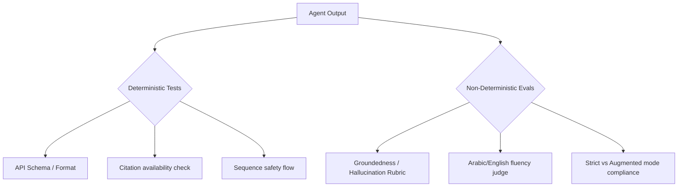

# Requirements, Edge Cases, and Open Questions

> القسم الثالث من وثيقة متطلبات المنتج (PRD) لمنصة **Aqli RAG**. يركّز هذا الملف على المتطلبات القابلة للتحقق، الحالات الحدّية (Edge Cases) التي يفوّتها الوكلاء الذكيون عادةً، القرارات التي تتطلب حكمًا بشريًا، ومتطلبات الجودة غير الوظيفية.

## 3.1 المتطلبات الوظيفية القابلة للتحقق (Functional Requirements)

كل متطلب موسوم بمعرّف فريد (FR-x) ويترتب عليه اختبار/تقييم صريح.

| المعرّف | المتطلب | المعيار القابل للتحقق (Acceptance Criterion) | التتبع (Traceability) |
|---|---|---|---|
| FR-01 | تبديل وضع التأريض (Strict/Augmented/Open) | يجب أن يستجيب مفتاح التبديل في أقل من 100ms، ويحفظ التفضيل في قاعدة البيانات، ولا يتسرب السياق بين الوكلاء في نفس المحادثة. | User Story: US-04 |
| FR-02 | عزل المستأجرين (Row-Level Security) | اختبار اختبار اختراق (Penetration Test): لا يمكن لأي مستخدم في Workspace (A) الوصول لأي صف أو متجه في Workspace (B) عبر استدعاءات API المباشرة أو البحث الدلالي. | Vision Goal: G-02 |
| FR-03 | خط أنابيب الفهرسة غير المتزامن | رفع مستند PDF (حتى 50 صفحة) يجب أن يُعيد استجابة 202 Accepted فورًا، وتظهر حالة "قيد المعالجة" في الواجهة، ثم تتحول تلقائيًا إلى "مفهرس" عبر WebSocket/SSE. | US-06 |
| FR-04 | البحث الهجين (Hybrid Search) | للاستعلام الواحد، يجب أن يدمج النظام نتائج الـ BM25 (pg_trgm) والبحث الدلالي (pgvector) باستخدام خوارزمية RRF (Reciprocal Rank Fusion)، وتظهر نتائج عربية وإنجليزية. | US-03 |
| FR-05 | الاستشهادات التفاعلية (Citations) | كل فقرة مُولّدة في وضع Strict/Augmented يجب أن تحمل روابط مرجعية (1..n) تفتح `CitationCard` يعرض النص الأصلي معلّمًا في الصفحة المصدريّة. | US-08 |
| FR-06 | موافقة الأدوات (Tool Approval) | عند محاولة الوكيل استدعاء خادم MCP خارجي (مثل إرسال إيميل)، يجب أن يتوقف التوليد، ويعرض طلب موافقة صريح لا يمكن تجاوزه برمجيًا. | US-10 |
| FR-07 | دعم MCP Client/Server | يجب أن يستطيع المستخدم تسجيل خادم MCP خارجي عبر /mcp، ونجاح الاتصال يجب أن يخضع لاختبار Handshake (JSON-RPC) قبل حفظ التهيئة. | US-09 |
| FR-08 | تعدد المزودين (BYOE) | مسؤول المساحة قادر على تبديل مزود الاستدلال من Gemini إلى Anthropic من صفحة /settings/providers، ويستمر النظام في العمل دون تغيير في واجهة الدردشة. | US-02 |

## 3.2 المتطلبات غير الوظيفية (Non-Functional Requirements)

تغطي متطلبات الأداء، الأمان، والامتثال، وهي حاسمة للنطاق المؤسسي.

### الأداء والاستجابة (Performance)

| المعرّف | المتطلب | المعيار (NFR Criterion) |
|---|---|---|
| NFR-P01 | زمن استجابة واجهة المستخدم (UI) | يجب أن يحقق LCP < 2.5s، FID < 100ms على شبكة 4G (ملفات بصرية مضافة للواجهة). |
| NFR-P02 | زمن استجابة البحث الدلالي | يجب أن تُعاد نتائج البحث من pgvector في أقل من 300ms لقاعدة معرفة تحتوي على 1 مليون مقطع (Chunk)، مع تحميل HNSW في الذاكرة. |
| NFR-P03 | زمن تبديل اللغة/الاتجاه (RTL/LTR) | يجب ألا يتجاوز زمن إعادة رسم الواجهة (Reflow/Repaint) عند تبديل اللغة 150ms، دون وميض (Flickering) للمحتوى. |

### الأمان والامتثال (Security & Compliance)

| المعرّف | المتطلب | المعيار (NFR Criterion) |
|---|---|---|
| NFR-S01 | التشفير عند الراحة (At Rest) | يجب أن تُخزّن مفاتيح مزودي الذكاء الاصطناعي مشفّرة باستخدام `pgcrypto` (Envelope Encryption مع KMS)، ولا تُسجّل أبدًا في سجلات الن plainly text. |
| NFR-S02 | سجل التدقيق (Audit Log) | كل عمليات (CRUD) على المصادر، تغيير الإعدادات، واستدعاءات MCP تُسجّل في Audit Log غير قابل للتعديل (Append-only) مع (Timestamp, User, Workspace, Action). |
| NFR-S03 | GDPR / حق النسيان | تنفيذ أمر `DELETE /workspace/{id}/sources/{sid}` يجب أن يحذف الملف الأصلي من S3، والمقاطع من pg_vector، والسجلات المرتبطة، ويولّد تقرير حذف قابل للتصدير خلال 30 يومًا. |

## 3.3 الحالات الحدّية ومشكلة الـ 80% (Edge Cases & The 80% Problem)

هذه هي السيناريوهات التي يفشل الوكلاء الذكيون في التعامل معها ضمنيًا وتتطلب حراسة صريحة (Guardrails) أو منطقًا برمجيًا محددًا:

| المعرّف | الحالة الحدّية | السلوك المتوقع (Handling Strategy) | التخفيف (Mitigation) |
|---|---|---|---|
| EC-01 | إدخال عربي غير مُشكّل وبدون همزات | المستخدم يبحث عن "مدرسه" ويقصد "مَدْرَسَة" أو "مدرسة". يجب أن يستخدم النظام `pg_trgm` للبحث الضبابي وتطبيع الأحرف (Character Normalization) قبل التضمين. | مطلوب: Postgres Function لتطبيع الألف والهمزة والتاء المربوطة قبل إجراء BM25. |
| EC-02 | التبديل بين مزودي التضمين (Embedding) | مسؤول النظام يبدّل من Gemini إلى OpenAI Embeddings. | يجب أن يكتشف النظام اختلاف أبعاد المتجهات (Dimensions)، ويُحظر التبديل حتى يقوم المسؤول بتأكيد "إعادة الفهرسة الشاملة" (Re-index All)، مع عرض تحذير واضح حول التكلفة والزمن. |
| EC-03 | المهام الطويلة المتقطعة (Long-running Tasks) | يتوقف اتصال المستخدم (Network) أثناء قيام الوكيل ببحث متعدد الخطوات عبر MCP. | بفضل `WorkflowAgent` في AI SDK 7، يجب استئناف المهمة من نقطة التوقف (Checkpoint) دون إعادة التفكير من الصفر عند عودة الاتصال. |
| EC-04 | تجاوز حد الاستخدام (Rate Limits) للمزود | وصول النموذج إلى 429 Too Many Requests من مزود LLM أثناء توليد الإجابة. | آلية إعادة محاولة (Exponential Backoff) مع عرض رسالة "الوكيل يأخذ استراحة..." للمستخدم في واجهة الدردشة، دون انهيار الجلسة. |
| EC-05 | تسرّب السياق عبر RLS | أداة MCP خارجية تحاول الاستعلام عن قاعدة البيانات خارج نطاق Workspace المستخدم الحالي. | فلاتر RLS في Postgres تمنع ذلك، ولكن يجب أن يمرّر الخادم `workspace_id` صراحةً في جلسة قاعدة البيانات (Session Variables) قبل كل استدعاء MCP. |
| EC-06 | رفض الإجابة (Groundedness Failure) | في وضع Strict، لا توجد مصادر كافية للإجابة. | يجب أن يرد الوكيل بنصirate: "لا أملك معلومات كافية في قاعدة معرفتك للإجابة". ولا يقوم بالهلوسة (Hallucinate). تقييم LM Judge يلزم بهذا. |

## 3.4 عقد الاختبار والتقييم (Tests AND Evals as the Contract)

بناءً على مبادئ Agentic Engineering، ينقسم ضمان الجودة إلى اختبارات برمجية حتمية وتقييمات احتمالية (LM Judges).

| النوع | النطاق (Scope) | الأداة/الإطار | المعيار Pass/Fail |
|---|---|---|---|
| **Unit Test** | منطق تقسيم النص (Chunking)، تطبيع النصوص العربي. | Vitest | 100% تغطية لدوال التطبيع. |
| **Integration Test** | خط أنابيب RAG الكامل (قراءة ملف -> استخراج -> تضمين -> حفظ). | Vitest + Playwright | الدخول من رفع ملف حتى ظهوره في البحث بنجاح. |
| **RAG Eval** | قياس دقة الاسترجاع استنادًا إلى معايير (Faithfulness, Answer Relevance). | RAGAS (Custom Harness) | دقة الاسترجاع > 85% على مجموعة بيانات عربية/إنجليزية مُصنّفة. |
| **LM Judge** | التزام وضع Strict (عدم الهلوسة). | `gemini-3.6-flash` كقاضي | 0% محاولة لتوليد معلومات خارج السياق في وضع Strict. |

## 3.5 الأسئلة المفتوحة والقرارات التي تتطلب حكمًا بشريًا (Open Questions)

قرارات استراتيجية تتطلب مدخلات من أصحاب المنتج (Product Owners) أو مهندسي الحلول قبل المضي قدمًا في التنفيذ.

> المستوى: `Conductor` (يتطلب قرارًا بشريًا). الوكلاء لا يملكون صلاحية تنفيذ هذه القرارات.

| المعرّف | السؤال / القرار | الخيارات (Options) والتبادل (Trade-offs) | التأثير (Impact) |
|---|---|---|---|
| OQ-01 | استراتيجية الفوترة (Billing) المتعددة المزودين | **(أ)** فوترة موحدة عبر Aqli RAG (هامش ربح).   **(ب)** مفاتيح Bring Your Own Key (BYOK) بدون فوترة وساطة.   *Trade-off*: (أ) يجعل النظام SaaS-Ready ويحقق ربحًا معقدية التتبع؛ (ب) يجلب المستخدمين المؤسسيين بسرعة لكنه يمنع دخل الاستهلاك. | **lvl: Critical** - يؤثر على بنية التكامل وصفحة /settings/usage-billing. |
| OQ-02 | موفر التخزين السحابي الافتراضي | **(أ)** Vercel Blob (تكامل سهل).   **(ب)** Cloudflare R2 (بدون رسوم خروج Egress).   **(ج)** AWS S3 (أوسع انتشار).   *Trade-off*: الراحة مقابل التكلفة مقابل التوافق المؤسسي. | **lvl: High** - يؤثر على عزل (Isolation) الـ Buckets وبنية Provider Adapter. |
| OQ-03 | دقة نموذج `gemini-3.5-flash-lite` مقابل الاحتياج | هل كفاءة `flash-lite` كافية لإعادة الترتيب (Reranking) للمحتوى العربي القصير؟   *Trade-off*: تكلفة رخيصة مقابل احتمالية سوء ترتيب بيانات حساسة. | **lvl: Medium** - يتطلب تنفيذ RAG Eval مقارن قبل النشر الإنتاجي. |

## 3.6 قائمة مراجعة جودة المتطلبات (Requirements Quality Checklist)

- [x] تم تعريف معايير النجاح (Acceptance Criteria) لكل متطلب وظيفي.
- [x] تم تحديد الحالات الحدّية الخاصة باللغة العربية (EC-01).
- [x] تم وضع آلية لمنع تسرّب المستأجرين (NFR-S01, EC-05).
- [x] تم تحديد العقود بين النظام والذكاء الاصطناعي (Tests + Evals).
- [ ] تم حسم القرارات الاستراتيجية المفتوحة (OQ-01 إلى OQ-03). ⚠️ **(مطلوب قرار بشري)**

---
*هذا القسم يكمل المنظور الهندسي الموجه للوكلاء (Agentic Engineering). للمزيد حول نوايا المنتج والقصص المصاغة للمستخدم، يُرجى الرجوع إلى [الرؤية والأهداف](./01-vision-goals-and-success-metrics.md) و[الشخصيات والنطاق](./02-personas-scope-and-user-stories.md).*