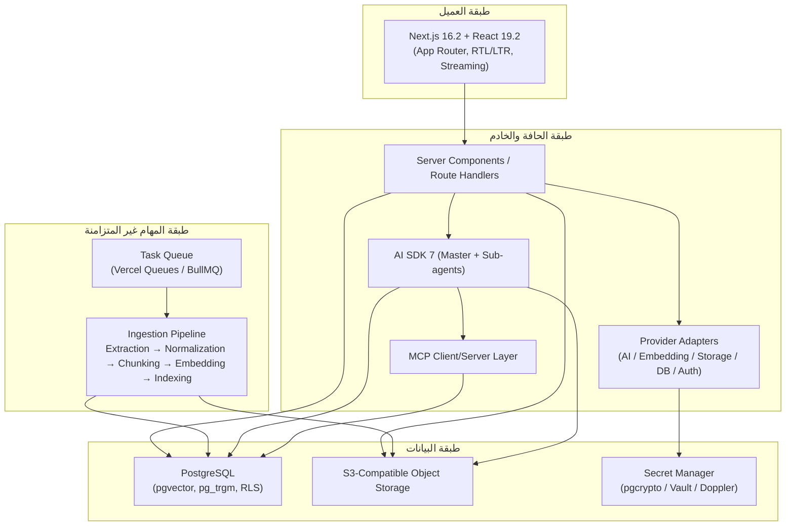
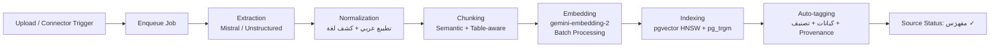

# System Overview and Technology Decisions

## الغاية والنطاق المعماري

يصف هذا القسم المعمارية الهدف لمنصة **Aqli RAG**، المكدس التقني المختار، وقيود التصميم عالية المستوى. المنصة نظام استرجاع وتوليد هجين (Hybrid RAG) ثنائي اللغة (عربي/إنجليزي) بمعمارية Multi-Tenant ومعدّة لتشغيل كخدمة SaaS. التصميم يتبع مبدأ **Bring Your Own Everything** — حيث يمكن استبدال كل مزود (AI, DB, Storage, Auth) عبر طبقة تجريد موحّدة.

التفاصيل التنفيذية للوحدات والكيانات موجودة في [Components, Data Model, and API Surface](./02-components-data-model-and-api-surface.md)، وقرارات الموثوقية والأمان والامتثال في [Cross-Cutting Concerns, ADRs, and Risks](./03-cross-cutting-concerns-adrs-and-risks.md).

---

## مخطط المعمارية الهدف

---

## المكدس التقني المختار والمبررات

| الطبقة | التقنية المختارة | المبرر |
|---|---|---|
| الواجهة والتطبيق | Next.js 16.2 (App Router) + React 19.2 (+ View Transitions, Activity API) | أحدث إصدار مستقر يحسّن أداء App Router وTurbopack ويدعم Activity API لإبقاء المحادثة نشطة أثناء التنقل. |
| إدارة الحالة (العميل) | Zustand + TanStack Query v5 | فصل واضح بين حالة UI والتخزين المؤقت لبيانات الخادم؛ يقلّل من إعادة التصيير في المحادثات الطويلة. |
| التدويل وRTL | next-intl + Tailwind v4 + shadcn/ui | تبديل تلقائي بين RTL/LTR حسب لغة المحتوى لا لغة الواجهة فقط. |
| حزمة الذكاء الاصطناعي | Vercel AI SDK 7 | دعم الوكلاء (WorkflowAgent)، موافقات الأدوات، المهارات (uploadSkill)، MCP Apps، وOpenTelemetry مدمج — يلغي الحاجة لأغلفة خاصة بكل مزود. |
| نموذج الاستدلال الرئيسي | `gemini-3.6-flash` | أداء أفضل في الاستدلال متعدد الخطوات والمحادثات المعقدة؛ يدعم نافذة سياق تصل لمليون رمز و64K رمز إخراج. |
| نموذج المهام الفرعية | `gemini-3.5-flash-lite` | منخفض الكمون وفعّال من حيث التكلفة — يُستخدم لـ Query Rewriting، Reranking، استخراج البيانات، والتلخيص السريع. |
| التضمين (Embeddings) | `gemini-embedding-2` (3072 بُعد، 100+ لغة) | تضمين متعدد الوسائط (نص، صور، صوت، مستندات) في نفس فضاء التضمين — مثالي للعربية والإنجليزية معًا. |
| قاعدة البيانات | PostgreSQL + امتدادات `pgvector` و`pg_trgm` و`pgcrypto` و`uuid-ossp` و`pg_stat_statements` | Hybrid Search (Vector + BM25/Trigram) على مستوى قاعدة البيانات؛ RLS إلزامي لعزل المستأجرين. |
| التخزين الكائني | S3-compatible (AWS S3 / Cloudflare R2 / GCS / Supabase Storage) | عزل كل Workspace في Bucket/Prefix منفصل مع سياسات IAM ديناميكية. |
| المصادقة | Auth.js / Clerk / Supabase Auth / WorkOS | مزودات قابلة للاستبدال عبر Adapter؛ يدعم WorkOS نمط SSO/SAML للمؤسسات. |
| قوائم الانتظار | Vercel Queues (أساسي) / BullMQ+Redis (بديل ذاتي الاستضافة) | معالجة الفهرسة والتضمين بشكل غير متزامن لتفادي حدود زمن تنفيذ الدوال. |
| المراقبة | OpenTelemetry (`@ai-sdk/otel`) + `pg_stat_statements` | تتبّع كل خطوة استدلال ومراقبة أداء الاستعلامات. |
| الاختبار | Vitest + Playwright + RAG Eval Harness | اختبارات وحدة + تكامل لخط أنابيب RAG + E2E للواجهة ثنائية اللغة. |
| Monorepo | Turborepo | فصل الحزم: `ui`, `db`, `ai-providers`, `mcp`, `connectors`. |

---

## قرارات التصميم عالية المستوى

### D1: Hybrid RAG بأوضاع قابلة للتبديل لحظيًا

| الوضع | السلوك | حالة الاستخدام |
|---|---|---|
| **Strict** | الإجابة من مصادر المستخدم حصرًا؛ رفض أو تنبيه عند عدم كفاية السياق (Groundedness Guard) | امتثال تنظيمي، أسئلة قانونية/طبية |
| **Augmented** | مصادر المستخدم كأساس + بحث ويب لسد الفجوات؛ تمييز بصري "من مصادرك" مقابل "من الويب" | جلسات بحث عامة مع تفضيل المعرفة الداخلية |
| **Open** | الوكيل حر في استخدام أدوات الويب وMCP الخارجية دون تقييد | استكشاف إبداعي، مهام لا تتطلب دقة مصدرية |

**مستوى التطبيق**: التطبيق ⟶ قاعدة المعرفة ⟶ المحادثة ⟶ الوكيل الواحد (Granular).

### D2: Multi-Tenancy على مستوى الصف (Row-Level Isolation)

- **RLS إلزامي** على كل جدول عبر `workspace_id` / `user_id` — لا يمكن تعطيله.
- **عزل المتجهات**: فهارس `pgvector` مقسّمة منطقيًا بـ `workspace_id` مع Partial Index لمنع تسرّب السياق أثناء البحث الدلالي.
- **تشفير الأسرار**: `pgcrypto` على مستوى العمود لمفاتيح API وبيانات اعتماد الموصلات، مع Envelope Encryption عبر KMS خارجي اختياري. المفاتيح لا تُمرَّر أبدًا إلى الطبقة الأمامية.
- **عزل التخزين**: كل Workspace له Bucket/Prefix منفصل مع سياسات IAM مولّدة ديناميكيًا.

### D3: Bring Your Own Everything عبر Provider Registry

طبقة تجريد (Adapter Pattern) موحّدة في الخادم تبقي منطق التطبيق مستقلًا عن أي مزود بعينه. التبديل بين المزودين يتم من صفحة الإعدادات دون إعادة نشر.

| الفئة | المزودون المدعومون | ملاحظة |
|---|---|---|
| الاستدلال/الذكاء الاصطناعي | Google Gemini (افتراضي)، OpenAI، Anthropic، Mistral، Groq | عبر AI SDK Provider Registry |
| التضمين | Gemini Embedding 2 (افتراضي) | **تنبيه إعادة الفهرسة** عند التبديل لاختلاف فضاء المتجهات |
| معالجة المستندات | Mistral Document AI / Unstructured.io (API/MCP) | اختيار المستخدم في الإعدادات |
| قاعدة البيانات | Supabase / Neon / AWS RDS / Self-hosted Postgres | بشرط دعم الامتدادات المطلوبة |
| التخزين الكائني | AWS S3 / Cloudflare R2 / Supabase Storage / GCS | أي واجهة متوافقة مع S3 API |
| المصادقة | Auth.js / Clerk / Supabase Auth / WorkOS | SSO/SAML للمؤسسات عبر WorkOS |

### D4: MCP ثنائي الاتجاه

- **MCP Server داخلي**: التطبيق يعرض MCP Server لأي عميل خارجي (Claude Desktop، IDE، تطبيقات أخرى) للاتصال بقاعدة المعرفة مع نفس صلاحيات RLS ونطاق Workspace.
- **MCP Client متعدد**: التطبيق يتصل بخوادم MCP خارجية (GitHub، Notion، Slack، مخصصة) مع **موافقة صريحة** من المستخدم قبل كل استدعاء حساس (Tool Approval flow في AI SDK 7).
- **MCP Apps**: عرض نتائج غنية (جداول، رسوم بيانية، معاينات مستندات) داخل واجهة الدردشة مباشرة من استجابة أداة MCP.

### D5: مسارات المهام غير المتزامنة

المعالجة الثقيلة (استخلاص المستندات، التضمين، الفهرسة) تعمل كـ Background Jobs عبر قوائم انتظار لتفادي حدود زمن تنفيذ الدوال:

---

## قيود التصميم (Design Constraints)

| القيد | الوصف | الأثر على المعمارية |
|---|---|---|
| **الامتثال التنظيمي** | GDPR / HIPA / PCI — بيانات حساسة تتطلب تشفير وسجلات تدقيق | RLS + pgcrypto + Audit Log شامل لكل عملية جلب/حذف/مشاركة/استدعاء MCP |
| **العربية والإنجليزية جنبًا إلى جنب** | تطبيع الأحرف العربية (إزالة التشكيل، توحيد الألف/الهمزة)، البحث الضبابي والصوتي | `pg_trgm` + `fuzzystrmatch` كامتدادات إلزامية |
| **العزل التام بين المستأجرين** | لا يمكن أن يتسرّب سياق أو متجه بين مستأجرين تحت أي ظرف | RLS + Partial Vector Index + Bucket/Prefix isolation — جميعها إلزامية ولا يمكن تعطيلها |
| **النشر Platform-Agnostic** | قابلية النشر على Vercel أو Docker/Kubernetes على أي مزود سحابي | Provider Adapters + متغيرات بيئة + قوائم انتظار قابلة للتبديل |
| **عدم تمرير الأسرار للطبقة الأمامية** | مفاتيح API لا تُ Exposure للعميل أبدًا | كل استدعاء للمزودين يتم من Server Components / Route Handlers |
| **استئناف المهام الطويلة** | يتطلب WorkflowAgent مهام بحث عميق قابلة للاستئناف بعد انقطاع | AI SDK 7 WorkflowAgent + حالة محفوظة في قاعدة البيانات |

---

## استراتيجية توجيه النماذج (Model Routing Economics)

طبقًا لمبدأ توجيه العمل المعقد للنماذج الكبيرة والعمل الحتمي للنماذج الصغيرة:

| نوع المهمة | النموذج | المبرر الاقتصادي |
|---|---|---|
| استدلال متعدد الخطوات، إجابات معقدة | `gemini-3.6-flash` | جودة استدلال أعلى، دالة رئيسية |
| Query Rewriting، Reranking، تلخيص، استخراج | `gemini-3.5-flash-lite` | منخفض الكمون وفعّال من حيث التكلفة للمهام المتكررة عالية الحجم |
| التضمين (Embedding) | `gemini-embedding-2` | Batch Processing لخفض التكلفة عبر المعالجة الجماعية |
| المطابقة الضبابية والبحث النصي | PostgreSQL (`pg_trgm`, BM25) | حتمي على مستوى قاعدة البيانات — لا يتطلب استدعاء نموذج |

---

## معايير القبول المعمارية (Architecture Acceptance Criteria)

- [ ] **AC-ARCH-001**: كل جدول في قاعدة البيانات يمتلك سياسة RLS مفعّلة بـ `workspace_id`؛ اختبار penetration يؤكد عدم إمكانية وصول مستأجر لم بيانات مستأجر آخر.
- [ ] **AC-ARCH-002**: التبديل بين أوضاع Hybrid RAG (Strict / Augmented / Open) يعمل على مستوى المحادثة الواحدة دون إعادة تحميل الصفحة.
- [ ] **AC-ARCH-003**: تبديل أي مزود (AI / Embedding / Storage / DB / Auth) من الإعدادات يتم عبر Provider Adapter دون تعديل كود منطق الأعمال.
- [ ] **AC-ARCH-004**: عند تبديل مزود التضمين، يظهر تنبيه واضح للمستخدم يطلب تأكيد إعادة الفهرسة الكاملة.
- [ ] **AC-ARCH-005**: لا توجد أي سلسلة في كود العميل تحتوي على مفاتيح API أو بيانات اعتماد مزودين؛ كلها من جهة الخادم فقط.
- [ ] **AC-ARCH-006**: كل استدعاء أداة MCP خارجية يمر عبر Tool Approval flow مع سجل في Audit Log.
- [ ] **AC-ARCH-007**: المهام الطويلة (_INDEXING، تضمين مستندات كبيرة) تعمل خارج حدود طلب HTTP عبر Queue، وتظهر حالتها (`pending` / `processing` / `indexed` / `failed`) للمستخدم مع إعادة محاولة تلقائية.
- [ ] **AC-ARCH-008**: WorkflowAgent يمكنه استئناف مهمة بحث متعددة الخطوات بعد انقطاع الشبكة دون فقدان السياق.
- [ ] **AC-ARCH-009**: البحث الهجين (Vector + BM25 + Trigram) يعيد نتائج مع صناعة المحاذير العربية (التشكيل، الهمزات، الأخطاء الإملائية) بدقة تتجاوز 90% (وفق RAG Eval Harness).
- [ ] **AC-ARCH-010**: نشر التطبيق ممكن على Vercel وعلى Docker/Kubernetes دون تعديل كود التطبيق (عبر متغيرات البيئة فقط).
- [ ] **AC-ARCH-011**: OpenTelemetry يصدر spans لكل خطوة استدلال (tool call، embedding، retrieval، generation) ويمكن تصفيتها بـ `workspace_id`.
- [ ] **AC-ARCH-012**: تدقيق GDPR — تصدير جميع بيانات مستخدم بنقرة واحدة + حذف كامل متسلسل عبر الجداول، Storage، والفهارس المتجهية.

---

## النقاط الغامضة المحددة (The 80% Problem)

| النقطة الغامضة | الخيارات والتبديلات | التوصية |
|---|---|---|
| **إعادة الفهرسة عند تبديل مزود التضمين** | (أ) منع التبديل نهائيًا بعد وجود بيانات، (ب) السماح مع إعادة فهرسة كاملة تلقائية، (ج) السماح مع إعادة فهرسة في الخلفية مع الإبقاء على الفهرس القديم | **(ب)** — إعادة فهرسة كاملة في الخلفية مع عرض تقدم واضح؛ أمان أعلى لأن الفهرس القديم سيكون متجهات في فضاء مختلف |
| **تقارب أداء Multi-provider** | عند استخدام مزود AI مختلف (OpenAI بدلاً من Gemini)، التضمين لا يزال من Gemini — كيف نضمن اتساق الجودة؟ | توثيق صريح أن تضمين Gemini + استدلال OpenAI مدعوم لكن جودة الاسترجاع تعتمد على التضمين وحده؛ مزود الاستدلال يؤثر على التوليد فقط |
| **حدود MCP External في بيئة Serverless** | استدعاء MCP خارجي قد يستغرق وقتًا يتجاوز حدود Vercel Serverless | استخدام Vercel Workflows/Queues لكل استدعاء MCP يتجاوز 30 ثانية؛ عرض حالة "ينفذ أداة خارجية..." للمستخدم |
| **أمان الـ MCP Server الداخلي** | كيف نمن مستخدم غير مصرّح من الوصول لـ MCP Server الخاص بمستخدم آخر؟ | نفس RLS + شهادة OAuth لكل جلسة MCP + تحقق من `workspace_id` في كل طلب؛ لا جلسات مجهولة |
| **معالجة المستندات العربية الممسوحة (OCR)** | Mistral Document AI مقابل Unstructured.io في دقة OCR العربي | إجراء RAG Eval مقارن قبل الالتزام بأحدهما كافتراضي؛ السماح للمستخدم بالاختيار مع عرض دقة متوقعة |
| **إدارة النزاعات عند تعدد المستخدمين في نفس Workspace** | مستخدمان يعدّلان نفس الوكيل أو المصدر في آن واحد | ولاية تفائلية (Optimistic Concurrency) عبر `updated_at` + تنبيه "تم تعديل هذا العنصر من مستخدم آخر" |

---

## حدود سياق الوكيل (Context Window Strategy)

| المكون | استراتيجية السياق | الحد العملي |
|---|---|---|
| المحادثة الفردية | آخر N رسالة + ملخص آلي للأقدم (Summarization via Flash-Lite) | نافذة Gemini تصل لمليون رمز — لا حد عملي قريب، لكن وجود ملخص يخفض التكلفة |
| RAG Retrieval | Top-K = 10 مقاطع (قابل للتهيئة) → Reranking بواسطة Flash-Lite → Top-5 واردة في السياق | متجه 3072 بُعد × 5 مقاطع ≈ حمولة متناهية الصغر |
| أدوات MCP | تمرّر قائمة أدوات ثابتة للنموذج؛ استدعاء الأداة يحمل سياق النتيجة فقط لا كامل تاريخ MCP | يقلل الرموز غير الضرورية |
| Skills (AI SDK 7) | ترفع المهارة مرة واحدة عبر `uploadSkill` ثم يُشار إليها بمرجع فقط في الاستدعاءات اللاحقة | يتجنب إعادة تمرير تعليمات المهارة في كل استدعاء |

---

## الانتقال إلى الأقسام التالية

- **الوحدات والواجهات التفصيلية**: [Components, Data Model, and API Surface](./02-components-data-model-and-api-surface.md)
- **الموثوقية، الأمان، الامتثال، ADRs، والمخاطر**: [Cross-Cutting Concerns, ADRs, and Risks](./03-cross-cutting-concerns-adrs-and-risks.md)