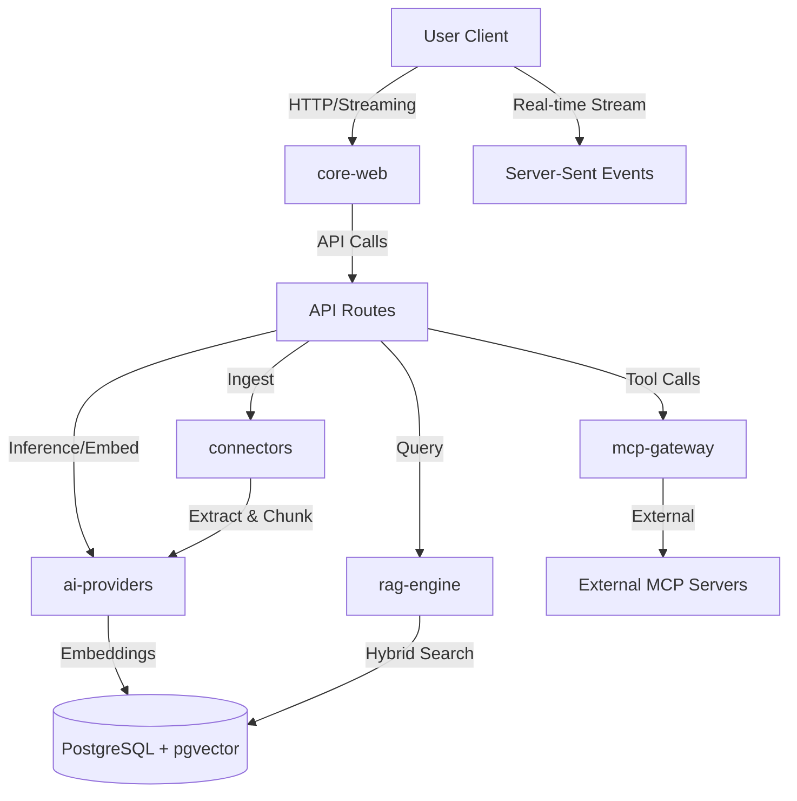
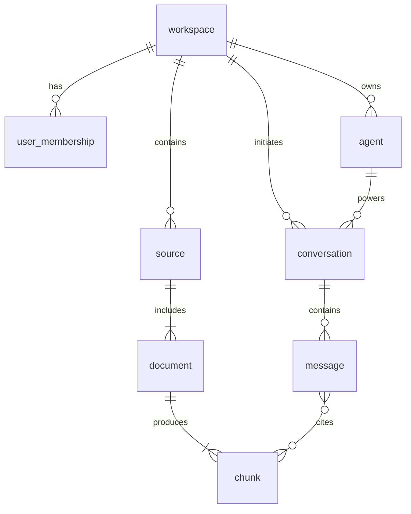

# Components, Data Model, and API Surface

يغطي هذا القسم التقسيم المعماري للوحدات (Modules)، نموذج البيانات العلائقي والمتجهي (Relational & Vector Data Model)، والعقود التكاملية (API Contracts). يُكمل هذا القسم ما ورد في [System Overview and Technology Decisions](./01-system-overview-and-technology-decisions.md) ويُمهد لقرارات الموثوقية والمخاطر في [Cross-Cutting Concerns, ADRs, and Risks](./03-cross-cutting-concerns-adrs-and-risks.md).

---

## 1. تحليل المكونات (Component Breakdown)

تعتمد المنصة بنية **Monorepo** (عبر Turborepo) لفصل الحزم (Packages) والوحدات الخدمية (Service Modules). كل مكون هو وحدة حدودية صريحة (Explicit Bounded Context) تُختبر بمعزل عن غيرها.

| الحزمة / الوحدة | المسؤولية الرئيسية | التقنيات الأساسية | معايير القبول (Acceptance Criteria) |
| :--- | :--- | :--- | :--- |
| `core-web` | واجهة المستخدم، إدارة الحالة، التدويل (RTL/LTR). | Next.js 16.2, React 19.2, Zustand | تمرير اختبارات E2E (Playwright) لتبديل اللغة والاتجاه دون تسرّب الحالة. |
| `db-schema` | تعريف الجداول، سياسات RLS، وهجرات قاعدة البيانات. | PostgreSQL, pgvector, pgcrypto | جميع الجداول تمتلك سياسات RLS إلزامية. لا وجود لعمود `workspace_id` بلا فهرسة. |
| `ai-providers` | طبقة التجريد للمزودين، تنفيذ الاستدلال والتضمين. | AI SDK 7, Provider Registry | التبديل بين Gemini و OpenAI برمجيًا دون تغيير كود الاستدلال الأساسي. |
| `connectors` | خط أنابيب جلب ومعالجة المستندات (Ingestion Pipeline). | Node.js, Mistral/Unstructured | معالجة مستند PDF عربي (10 صفحات) واستخراج النص والجداول خلال < 30 ثانية. |
| `mcp-gateway` | إدارة خوادم MCP الصادرة والواردة، ومصادقتها. | MCP Protocol, Tool Approvals | تسجيل كل استدعاء أداة MCP خارجية في سجل التدقيق (Audit Log). |
| `rag-engine` | تنفيذ البحث الهجين (Hybrid Search) وإعادة الترتيب. | pgvector, BM25, gemini-3.5-flash-lite | استرجاع 5 مقاطع دقيقة لاستعلام ضبابي عربي (تشابه الجذور) بدقة > 85%. |
| `marketplace` | كتالوج الموصلات، الوكلاء، الأدوات، وخوادم MCP. | Internal API, Versioning | تثبيت أداة من السوق وإضافتها لوكيل خلال أقل من 3 خطوات UI. |

### مخطط تدفق البيانات (Data Flow)



---

## 2. نموذج البيانات (Data Model)

يُبنى نموذج البيانات على PostgreSQL مع دعم `pgvector` و `RLS`. كل الجداول تتضمن `workspace_id` كعمود إلزامي لفرض العزل متعدد المستأجرين.

### الكيانات الأساسية (Core Entities)



### جدول الكيانات والعلاقات

| الكيان (Table) | الأعمدة الرئيسية | العلاقات | القيود والفهارس |
| :--- | :--- | :--- | :--- |
| `workspaces` | `id` (UUID, PK), `name`, `encryption_key_id` | 1:N مع `sources`, `agents` | فهرس على `id`. |
| `sources` | `id` (UUID, PK), `workspace_id` (FK), `type`, `metadata` (JSONB) | N:1 مع `workspace`, 1:N مع `documents` | RLS على `workspace_id`. فهرس GIN على `metadata`. |
| `documents` | `id` (UUID, PK), `source_id` (FK), `status`, `raw_url` | N:1 مع `source`, 1:N مع `chunks` | فهرس على `status` (مفهرَس جزئيًا للسجلات غير المكتملة). |
| `chunks` | `id` (UUID, PK), `doc_id` (FK), `content`, `embedding` (vector(3072)) | N:1 مع `document` | RLS موروث. فهرس HNSW على `embedding`. فهرس `pg_trgm` على `content`. |
| `agents` | `id` (UUID, PK), `workspace_id`, `config` (JSONB) | N:1 مع `workspace` | RLS على `workspace_id`. |
| `conversations` | `id` (UUID, PK), `workspace_id`, `agent_id` (FK) | N:1 مع `agent` | RLS على `workspace_id`. |
| `messages` | `id` (UUID, PK), `conv_id` (FK), `role`, `token_count` | N:1 مع `conversation` | فهرس على `conv_id`. |
| `audit_logs` | `id` (UUID, PK), `workspace_id`, `action`, `entity_id` | مستقل (Log Table) | RLS. جدول أقسام (Partitioned) شهريًا حسب التاريخ لتقليل مسح الاستعلامات. |

### قيود صارمة (Constraints)
- **عزل التضمين (Vector Isolation):** أي استعلام بحث متجهي (Vector Search) يجب أن يُنجز كاستعلام فرعي (Subquery) يُفلتر `workspace_id` أولاً، لضمان عدم تحميل فهارس مستأجرين آخرين في الذاكرة.
- **التشفير:** حقل `api_keys` في جدول `providers_config` يُخزَّن عبر `pgcrypto` باستخدام التشفير المتناظر (Symmetric Encryption) ويُفك تشفيره فقط في الخادم (Server-side) وقت الاستخدام.

---

## 3. عقود التكامل (API Surface)

تعتمد المنصة واجهات RESTful للتزامن (Sync) و Server-Sent Events (SSE) للبث (Streaming).

### 3.1 واجهات إدارة المصادر (Sources & Ingestion)

| نقطة النهاية (Endpoint) | الطريقة | الوصف | معايير النجاح (Success Criteria) |
| :--- | :--- | :--- | :--- |
| `/api/sources` | `POST` | رفع ملف/إنشاء موصل. | إرجاع `202 Accepted` مع `job_id`. إدراج سجل في `documents` بحالة `pending`. |
| `/api/sources/{id}` | `GET` | جلب حالة الفهرسة والمقاطع. | إرجاع `200 OK` مع حالة المعالجة وعدد المقاطع المُستخرجة. |
| `/api/sources/{id}/reprocess` | `POST` | إعادة معالجة مصدر فاشل. | مسح المقاطع القديمة وإعادة إدراجها. |

### 3.2 واجهات الوكلاء والمحادثة (Chat & Agents)

تستخدم هذه الواجهات بروتوكول **SSE** لدعم البث اللحظي من نموذج الاستدلال.

| نقطة النهاية (Endpoint) | الطريقة | الوصف | معايير النجاح (Success Criteria) |
| :--- | :--- | :--- | :--- |
| `/api/chat` | `POST` | بدء/متابعة محادثة مع بث الاستجابة. | يُرجع `200 OK` مع `Content-Type: text/event-stream`. بث أول توكن (Token) خلال < 1.5s. |
| `/api/agents` | `POST` | إنشاء وكيل جديد. | التحقق من صحة `config` (JSON Schema) وإرجاع `201 Created`. |
| `/api/tools/approve` | `POST` | الموافقة على استدعاء أداة MCP. | تسجيل الموافقة في `audit_logs`، استئناف تنفيذ الأداة. |

#### مخطط حمولة طلب المحادثة (Chat Request Payload)
```json
{
  "conversationId": "uuid",
  "message": "ما هو ملخص التقرير المالي؟",
  "agentId": "uuid",
  "mode": "strict", /* strict | augmented | open */
  "attachments": [
    { "type": "file", "id": "uuid" }
  ]
}
```
- **معيار القبول:** إذا كان `mode` = `strict` ولم يجلب محرك RAG سياقًا ذا صلة (Score > Threshold)، يجب أن يرفض النموذج الإجابة ويرجع كائن رسالة من النظام `groundedness_failed`.

### 3.3 بروتوكول MCP (Model Context Protocol)

توفر المنصة بوابة MCP (Gateway) تعمل كوسيط (Proxy) لتستيفد من ميزة Tool Approvals في AI SDK 7.

| نقطة النهاية | الطريقة | الوصف |
| :--- | :--- | :--- |
| `/api/mcp/servers` | `GET` | قائمة خوادم MCP المُثبتّة من السوق. |
| `/api/mcp/connect` | `POST` | مصادقة وإضافة خادم MCP خارجي. |
| `/api/mcp/tools/invoke` | `POST` | تنفيذ أداة (يتم اعتراضها للتدقيق). |

---

## 4. أنماطworkflow للوكلاء (Agentic Patterns)

لضمان سلوك حتمي (Deterministic) لمنظومة الذكاء الاصطناعي، تم تصميم الوكلاء وفق نمطين أساسيين:

1. **Conductor Mode (للمهام القصيرة المتزامنة):**
   - يُستخدم في المحادثات اليومية، حيث يوزّع الـ Conductor المهمة فورًا إلى: Retriever Agent (جلب السياق) و Responder Agent (توليد الإجابة).
   - **معيار القبول:** زمن الاستجابة الكلي (End-to-End Latency) أقل من 5 ثوانٍ للمحادثات التي لا تتطلب أدوات خارجية.

2. **Orchestrator Mode (للمهام العميقة متعددة الخطوات):**
   - يُستخدم في مهام مثل "ابحث في كل مستندات العقود وفلترها حسب التاريخ ثم أنشئ جدول مقارنة".
   - يُنشئ الـ Orchestrاء خطة تنفيذ (Plan)، ويستدعي وكلاء فرعيين (Sub-agents) بالاعتماد على `WorkflowAgent` من AI SDK 7.
   - **معيار القبول:** قدرة الـ Orchestrator على استئناف العمل (Resume) بعد انقطاع الشبكة دون فقدان الخطوات المكتملة (التخزين المؤقت للخطوات في قاعدة البيانات).

---

## 5. تكامل المراقبة والأدوات (Observability & Tool Integrations)

تكامل الأدوات جزء من "الـ Harness". كل مكوّن في القسم الأول مرتبط بأنظمة المراقبة لضمان الجودة المؤسسية.

| الأداة / النظام | نطاق التكامل | الغاية | معيار النجاح |
| :--- | :--- | :--- | :--- |
| **OpenTelemetry** | `ai-providers`, `rag-engine` | تتبع كل استدعاء LLM/Embedding وتقدير التكلفة. | تمرير Traces إلى Vercel APM / Jaeger. زمن كل Span مسجل. |
| **pg_stat_statements** | `db-schema` | رصد الاستعلامات البطيئة في Hybrid Search. | توليد تنبيه (Alert) لأي استعلام RAG يتجاوز 500ms. |
| **Vercel Queues / BullMQ** | `connectors` | طابور مهام معالجة الملفات الثقيلة. | معالجة 50 مستندًا متزامنًا دون إسقاط أي طلب. |