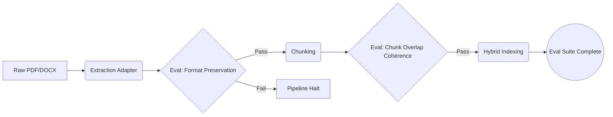

# Cross-Cutting Concerns, ADRs, and Risks

يُوثّق هذا القسم القرارات المعمارية المركزية (ADRs)، والمخاوم العابرة للطبقات (Cross-Cutting Concerns) كالأمان والموثوقية وقابلية التوسع، والمخاطر والتقييمات التجريبية المعروفة لمنصة **Aqli RAG**.

> **السياق:** هذا القسم يفترض قراءتك لـ [نظرة عامة على النظام والقرارات التقنية](./01-system-overview-and-technology-decisions.md) و[المكونات ونموذج البيانات وسطح الـ API](./02-components-data-model-and-api-surface.md).

---

## 1. مخاوم عابرة للطبقات (Cross-Cutting Concerns)

### 1.1 الأمان والخصوصية (Security & Compliance)
نظراً لطبيعة النظام التي تسمح بجلب بيانات حساسة من مصادر مؤسسية (Slack, Jira, SharePoint)، يجب تطبيق الحماية على flera مستويات.

| المجال | التنفيذ المعماري | معيار النجاح (Success Criteria) |
|---|---|---|
| **عزل المستأجرين (Isolation)** | Row-Level Security (RLS) في Postgres، ودوائر تخزين (Buckets) منفصلة لكل Workspace في S3، وفهارس `pgvector` مقسّمة جزئياً بـ `workspace_id`. | لا يمكن لأي استعلام (Query) أو بحث متجهي (Vector Search) أن يُعيد بيانات من `workspace_id` آخر (0% تسريب بيانات). |
| **إدارة الأسرار (Secrets Mgmt)** | مفاتيح الـ API لكل Workspace تُخزّن مشفّرة بـ `pgcrypto` (Envelope Encryption) أو في KMS خارجي ولا تُمرّر للواجهة الأمامية أبداً. | يجب أن تكون مفاتيح الـ API غير مرئية في Network Logs ومُشفّرة At-Rest. |
| **موافقة الأدوات (Tool Approval)** | استغلال `Tool Approval flow` في AI SDK 7 لإلزام الوكيل بطلب إذن صريح قبل استدعاء أي MCP خارجي. | 100% من استدعاءات MCP الخارجية تتطلب `Approved` من المستخدم أو تُرفض. |
| **سجل التدقيق (Audit Log)** | جدول `audit_logs` يحتفظ بـ `who, what, when, where` لكل عمليات CRUD واستدعاءات الأدوات. | القدرة على استرجاع تاريخ أي عملية حساسة خلال 50ms. |

### 1.2 الموثوقية ومعالجة الأخطاء (Reliability & Fault Tolerance)
النظام يعتمد على مصادر خارجية متعددة (مزودو AI، موصلات بيانات) قد تفشل؛ التعامل مع الفشل هو عقد أساسي مع وكيل الذكاء الاصطناعي اللاهث (Vibe Coding Agent).

- **نضج حالات الفشل (Failure States):** الـ Agent المبرمج يجب أن يميز بين فشل المهام الخفيفة (Reranking/Flash-Lite) والثقيلة (Inference/Flash)، ويطبق استراتيجية Fallback عند فشل مزود أساسي.
- **إعادة المحاولة (Retries):** خط أنابيب المعالجة (Ingestion Pipeline) يجب أن يستخدم نظام Queues (Vercel Queues أو BullMQ) مع سياسات Exponential Backoff.
- **الموضعية في الـ 80% Problem:** الـ AI Agents غالباً تتجاهل مهلات الاتصال (Timeouts) لمزودي AI. **يجب** برمجة وكيل التوليد ليرفض الإجابة (Strict Mode Grounding) إذا انقطع اتصال قاعدة البيانات الداخلية، ولا يعود للويب كحل بديل تلقائي خفيةً.

### 1.3 قابلية التوسع (Scalability)
نظراً لأن الفهارس المتجهية (Vector Indexes) تستهلك ذاكرة كبيرة وعمليات التضمين (Embedding) مكثفة:

- **الفهرسة المتجهية:** استخدام `HNSW` في `pgvector` بدلاً من `IVFFlat` للأداء الأعلى في الاسترجاع، مع ضبط `ef_search` ديناميكياً.
- **المعالجة الخلفية:** لا يُسمح بالمعالجة المتزامنة (Synchronous) للمستندات الكبيرة نهائياً. يجب أن تُدفع كل المصادر إلى Queue.

---

## 2. سجل القرارات المعمارية (ADR - Architecture Decision Records)

تم اعتماد القرارات التالية بناءً على متطلبات النطاق المؤسسي وثنائية اللغة واحتياجات الـ SaaS.

### ADR-001: تفضيل PostgreSQL (pgvector) على قواعد البيانات المتجهية المنفصلة
- **الحالة (Status):** مُقترح (Proposed)
- **السياق (Context):** يحتاج النظام إلى بحث هجين (Hybrid Search) يجمع بين المتجهات الدلالية والبحث النصي (BM25) مع دعم لغة عربية سليم (Trigrams/Fuzzy)، مع ضمان عزل المستأجرين.
- **القرار (Decision):** استخدام PostgreSQL مع امتدادات `pgvector`, `pg_trgm`, `pgcrypto` داخل كتلة قاعدة بيانات واحدة بدلاً من فصل Pinecone + PostgreSQL.
- **العواقب (Consequences):**
  - **الإيجابية:** تبسيط البنية التحتية، ضمان العزل عبر RLS بصرياً وبياناتياً، إجراءات ACID موحدة، وتقليل الكمون (Latency) لعمليات الهجينة.
  - **السلبي:** تحديات توسعية (Scalability) تظهر عند تجاوز 10 مليون متجه لكل Workspace، مما يتطلب Shard مستقبلي.

### ADR-002: الاعتماد على AI SDK 7 كطبقة موحّدة للوكلاء والمزودين
- **الحالة (Status):** مُقترح (Proposed)
- **السياق (Context):** المنصة تحتاج إلى توجيه الطلبات لمزودين مختلفين (Gemini, OpenAI) وبروتوكول MCP ثنائي الاتجاه مع إمكانية استئناف الجلسات.
- **القرار (Decision):** تبني `AI SDK 7` واستخدام `Agent`, `WorkflowAgent`, و `useChat` كواجه وحيدة بدلاً من كتابة Integrations مخصصة لكل مزود.
- **العواقب (Consequences):**
  - **الإيجابية:**time-to-market أسرع، دعم مهارات (Skills) متقدمة، موافقة الأدوات (Approvals) جاهزة.
  - **السلبي:** ترابط معقول (Coupling) مع Vercel Ecosystem (EDGE/SSE)، وتكلفة ترقية عالية عند إصدارات SDK الكاسرة (Breaking Changes).

### ADR-003: نمط "Bring Your Own Everything" عبر Adapter Pattern
- **الحالة (Status):** مُقترح (Proposed)
- **السياق (Context):** المتطلبات تفرض ألا يكون النظام محصوراً في مزود واحد (Vendor Lock-in). المستخدم ينتقل بين Mistral و Unstructured، أو بين AWS RDS و Supabase.
- **القرار (Decision):** تصميم Interfaces ثابتة في `@aqli/ai-providers` و `@aqli/db` و `@aqli/connectors`، وتنفيذها عبر Adapters.
- **العواقب (Consequences):**
  - **الإيجابية:** مرونة عالية وقابلية بناء Marketplace للتكاملات.
  - **السلبي:** عبء صيانة كود أعلى، التزامات كتابة اختبارات تكامل (Integration Tests) لكل Adapter جديدة، وتسريب تجريدي (Interface Leakage) متوقع.

---

## 3. تقييمات الوكيل الذكي (Agent Evals - The Non-Deterministic Contract)

يعتمد الذكاء الاصطناعي على نماذج غير حتمية (Non-deterministic). هذا يفرض أن "تقييمات الـ RAG" (Evals) تكون هي العقد الحقيقي بين المهندس والوكيل اللاهث بدلاً من اختبارات وحدة تقليدية.

### 3.1 معايير تقييم خط أنابيب الاسترجاع (Retrieval Evals)
يجب ألا يُسمح لأي PR باستبدال أو تعديل منطق التضمين أو الاسترجاع دون اجتياز التقييمات التالية:

| اسم التقييم (Eval Name) | الوصف | أداة القياس | الحد الأدنى للقبول |
|---|---|---|---|
| `Context Relevance` | هل المقاطع المسترجعة ترتبط بالاستعلام المُدخل؟ | LM Judge (`gemini-3.6-flash`) | ≥ 85% |
| `Groundedness Guard` | هل الإجابة المُولّدة تشير حصراً للسياق المسترجع في وضع Strict؟ | LM Judge (`gemini-3.6-flash`) | 100% (أي إخفاق يُسقط الـ PR) |
| `Arabic Citation Accuracy` | هل الاستشهادات تحيل للنص العربي بسلامة (خصوصاً الهمزات والتشكيل)؟ | Fuzzy String Matching | ≥ 95% |

### 3.2 معايير تقييم خط أنابيب الاستيعاب (Ingestion Evals)

**ملاحظة للوكيل:** الـ Agent الذي يبني الـ Data Connectors يجب أن ينجح في Cobra Eval التالي: لا يُسمح بفقدان الجداول (Tables) أثناء الـ PDF Extraction. يجب اختبار كل مستند يحتوي `<table>` والتأكد من إ.output بـ JSON Structured صالح.

---

## 4. المخاطر والتقييمات التجريبية المعروفة (Known Risks & Trade-offs)

### 4.1 تحديات اللغة العربية (Arabic NLP Challenges)
- **المشكلة:** نماذج التضمين (gemini-embedding-2) قد تختلف دقتها بين العربية الفصحى واللهجات المحكية.
- **الحل المؤقت:** تطبيع الأحرف (Normalization) في طبقة Post-processing، واستخدام `pg_trgm` لسد فجوات التطابيق حتى لو فشل البحث الدلالي الدقيق.
- **Trade-off:** قد نتجاهل التشكيل الاختياري مما يقلل دقة البحث في النصوص الدينية أو الشعرية. الـ Workspace Settings يجب أن توفر خيار "Strict Arabic Normalization" للمستخدم.

### 4.2 اختناقات المهام الطويلة (Long-Running Task Bottlenecks)
- **المشكلة:** خطوات الفهرسة المتعددة (Extract → Embed → Index) قد تتجاوز حدود Vercel Serverless (50s) عند تحميل ملفات كبيرة.
- **القرار:** الاعتماد الكامل على `Vercel Queues` أو `BullMQ`، واستخدام `WorkflowAgent` من AI SDK 7.
- **Trade-off:** تكلفة استضافة Redis إضافية في حالة الجداول الذاتية، أو كلفة Vercel Queues في حالة الاستضافة السحابية. الإيجابية هي موثوقية 99.9% لخط المعالجة.

### 4.3 أمان MCP الخارجي (MCP External Threat Model)
- **المشكلة:** عند اتصال الوكيل بخادم MCP خارجي (مقدم من المجتمع)، يمكن لذلك الخادم نظرياً إرجاع Prompt Injection يوجه الوكيل لقراءة بيانات حساسة وإرسالها لخادم MCP نفسه.
- **التقييم:** الـ `Tool Approval flow` لا يكفي لوحده. 
- **التخفيف (Mitigation):** فرض Sandbox على استدعاءات MCP، وعدم السماح للوكيل بتمرير سياق غير مفلتر إلى MCP Tools غير موثوقة. يجب أن يتعامل الوكيل مع مخرجات MCP كبيانات (Data) وليست تعليمات (Instructions).