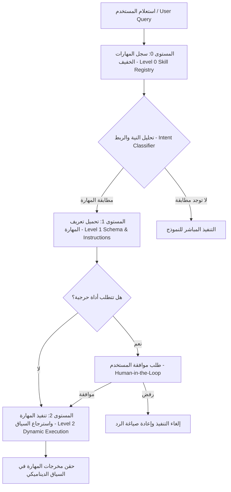
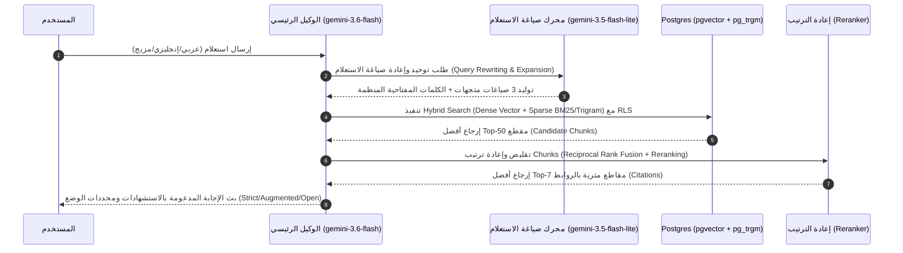

# Agent Skills and Retrieval Strategy

تعتمد منصة **Aqli RAG** على نمط الكشف التدريجي للمهارات (**Progressive Disclosure of Agent Skills**) واستراتيجية استرجاع متعددة المراحل (**Multi-stage Dynamic Retrieval Engine**) للحد من استهلاك الرموز (Tokens) وحماية نافذة السياق، مع ضمان أعلى دقة في معالجة الاستعلامات ثنائية اللغة (عربي/إنجليزي) عبر بيئة متعددة المستأجرين (Multi-Tenant).

تُكَمِّل هذه الوثيقة ما تم تحليله في [Context Architecture and Six Context Types](./01-context-architecture-and-six-context-types.md) وتُحدد كيفية اكتشاف المعرفة والمهارات ديناميكيًا عند الطلب بدلاً من شحنها مسبقًا في النافذة الثابتة للنماذج.

---

## 1. معمارية الكشف التدريجي للمهارات (Progressive Disclosure Architecture)

لتجنب تحميل النماذج الكبيرة (مثل `gemini-3.6-flash`) بكافة تعريفات الأدوات (Tool Schemas) وخوادم MCP في كل طلب، تعتمد المنصة آلية التدرج من ثلاثة مستويات:



### مستويات الكشف الثلاثة:

1. **المستوى 0: سجل المهارات المدمج (Level 0: Compact Skill Index)**
   - يُحقن في النافذة الثابتة للوكيل الرئيسي بحجم لا يتجاوز 300 رمز.
   - يحتوي فقط على: `skill_id`، `short_description` (عربي/إنجليزي)، و`trigger_keywords`.
2. **المستوى 1: استدعاء المخطط التفصيلي (Level 1: Dynamic Schema Fetching)**
   - عند اكتشاف نية المستخدم (Intent Matching)، يطلب الوكيل مخطط المهارة كاملاً (JSON Schema + System Sub-prompt) عبر AI SDK 7 باستخدام ميزة التحميل عند الطلب.
3. **المستوى 2: النقل والاستدعاء المؤقت (Level 2: Execution Runtime & Sandbox)**
   - يتم رفع المهارة مريضة الحجم أو تنفيذ استدلالها عبر `uploadSkill` / AI SDK 7 Dynamic Tool Engine، وتمرير مخرجات المهارة فقط إلى حيز الاستدلال، ثم تفريغ المهارة فور انتهاء المهمة.

---

## 2. استراتيجية استرجاع المعرفة الديناميكية (Dynamic Knowledge Retrieval Strategy)

يعمل محرك الاسترجاع في منصة **Aqli RAG** كنظام هجين يدمج البحث الدلالي (Semantic Vector Search) والبحث النصي التقليدي (BM25 / Trigram) على مستوى قاعدة البيانات مع دعم متقدم للغة العربية.



### 2.1 خط أنابيب الاسترجاع متعدد المراحل (Multi-stage Retrieval Pipeline)

1. **إعادة صياغة الاستعلام وتوسيع الجذور (Query Rewriting & Expansion)**:
   - نموذج `gemini-3.5-flash-lite` يتولى إزالة التشكيل، توحيد أشكال الهمزات والألف والمقصورة، واستخراج الجذور اللغوية العربية، وتوليد صياغة باللغتين العربية والإنجليزية لضمان الاسترجاع عابر اللغات (Cross-lingual Retrieval).
2. **البحث الهجين في Postgres (Database-level Hybrid Search)**:
   - دمج نتائج `gemini-embedding-2` (3072 dimension) المسجلة في `pgvector` (باستخدام فهرس HNSW) مع نتائج `pg_trgm` و`fuzzystrmatch` للنصوص العربية والمصطلحات الإنجليزية.
   - دمج النتائج باستخدام معادلة **Reciprocal Rank Fusion (RRF)** المنفذة مباشرة كـ Stored Procedure داخل Postgres لتقليل وقت النقل (Network Overhead).
3. **إعادة الترتيب الحجمي (Reranking & Filtering)**:
   - يمرر المحرك أفضل 50 قطعة ناتجة من RRF إلى `gemini-3.5-flash-lite` كـ Reranker لتصفيتها إلى أفضل 5 إلى 10 قطع (Top-K) ذات صلة مباشرة بالمفهوم، وحذف المقاطع المكررة.
4. **العزل التام والتصفية المحددة (Tenant Context Guarding)**:
   - كل استعلام يحتوي على شرط إجباري `WHERE workspace_id = current_setting('app.current_workspace_id')` لضمان عدم تسرب أي قطعة نصية خارج النطاق المُحدد.

### 2.2 مصفوفة تشغيل الأوضاع الثلاثة (Hybrid RAG Modes Execution Matrix)

| الوضع (Mode) | مصادر المعرفة المسموحة | سلوك الاسترجاع عند نقص السياق | أداة البحث الخارجي (Web Grounding) |
| :--- | :--- | :--- | :--- |
| **Strict Mode** | قاعدة معرفة المستأجر حصرًا | رفض الإجابة بعبارة توضيحية محددة (*"لا تتوفر معلومات كافية في مستنداتك"*). | **معطلة تمامًا** (`enabled: false`) |
| **Augmented Mode** | قاعدة المعرفة + الويب عند الفجوات | استخدام الويب لتكملة الإجابة مع تمييز المصادر بصراحة. | **مفعلة مشروطة** (تُستدعى فقط عند انخفاض Groundedness Score < 0.70) |
| **Open Mode** | الويب + خوادم MCP + قاعدة المعرفة | الإجابة باستخدام المعرفة العامة والأدوات المتوفرة بحرية. | **مفعلة دائمًا** بمرونة كاملة |

---

## 3. مصفوفة سجل المهارات للأجهزة والوكلاء (Agent Skills Registry Matrix)

يوضح الجدول التالي المهارات المتاحة للوكلاء، وآلية اكتشافها، ونطاق وصولها:

| اسم المهارة (`skill_id`) | محفز الاستدعاء (Trigger Intent) | النطاق والحماية (Scope & Guardrails) | وضع الكشف (Disclosure Level) | الأداة/النموذج الفرعي المستغل |
| :--- | :--- | :--- | :--- | :--- |
| `hybrid_knowledge_search` | استعلامات المعرفة، البحث في الملفات، الأسئلة التخصصية | اقتصار على `workspace_id` المفتوح. RLS صارم. | **Level 0 -> Level 1** (آلي عند بدء الاستعلام) | Postgres `pgvector` + `gemini-3.5-flash-lite` |
| `web_grounding_search` | أسئلة الأخبار، التحديثات، عدم كفاية المعرفة المحلية | معطل في Strict Mode. يتطلب موافقة في Augmented إذا تطلب تكلفة إضافية. | **Level 1** (ينشط حسب وضع RAG) | Google Search Grounding API |
| `mistral_doc_parser` | رفع مستندات جديدة، معالجة الجداول والمخططات البصرية | التحقق من ملحقات الملفات المسموحة وحجم الملف (< 50MB). | **Level 2** (ينشط فقط أثناء خط أنابيب معالجة المستندات) | Mistral Document AI / Unstructured API |
| `external_mcp_client` | استدعاء GitHub, Notion, Jira, Slack أو سيرفر خاص | يتطلب موافقة صريحة من المستخدم (`Tool Approval Flow`) لكل عملية كتابة/حذف. | **Level 1 -> Level 2** (تحميل المخطط عند ربط MCP Server) | AI SDK 7 MCP Adapter Protocol |
| `code_sandbox_executor` | تحليل البيانات، الحسابات المعقدة، رسم البيانيات | بيئة معزولة Sandbox ذات مهلة زمنية (Timeout 10s) وبدون وصول للشبكة الخارجية. | **Level 2** (عند طلب تنفيذ كود) | Isolated Code Execution Container |
| `rag_evaluator` | قياس دقة الإجابة متانتها قبل التسليم | لا تتصل بالمستخدم. تعمل كطبقة تدقيق خلفية (Background Eval). | **Internal Engine** | LLM Judge (`gemini-3.5-flash-lite`) |

---

## 4. تكامل أدوات MCP ومكونات الأمان (MCP Integration & Tool Approvals)

### 4.1 بروتوكول الموافقة على الأدوات (Tool Approval Workflow)

للحد من مخاطر الاستدعاءات غير المصرح بها أو المكلفة عبر خوادم MCP الخارجية، تُطبق المنصة نمط **Tool Approval** من AI SDK 7:

```typescript
// هيكل الاستجابة المطلوبة لتنفيذ أداة ذات تأثير حرج
export interface ToolApprovalRequest {
  approval_id: string;
  tool_name: string;
  workspace_id: string;
  requested_by_user_id: string;
  parameters: Record<string, unknown>;
  risk_level: 'LOW' | 'MEDIUM' | 'HIGH' | 'CRITICAL';
  status: 'PENDING' | 'APPROVED' | 'REJECTED';
  expires_at: string;
}
```

- **قواعد الحظر والموافقة**:
  - **LOW** (قراءة فقط من معرفة محددة): تنفيذ تلقائي دون إزعاج المستخدم.
  - **MEDIUM** (البحث عبر الويب أو جلب بيانات خارجية): تنفيذ تلقائي مع إظهار مؤشر شريط النشاط (Activity API / Indicator).
  - **HIGH / CRITICAL** (كتابة، تعديل، حذف بيانات عبر MCP أو إجراء عمليات مدفوعة): يتوقف بث المحادثة مؤقتًا، ويُعرَض للمستخدم بطاقة موافقة صريحة (`CitationCard` / `ToolApprovalWidget`) تتطلب ضغطة زر للاستمرار.

---

## 5. شروط القبول والتثبت والمعايير القياسية (Acceptance Criteria & Eval Rubrics)

### 5.1 اختبارات التحقق المحددة (Deterministic Acceptance Criteria)

- [ ] **عزل RLS**: عدم قدرة استعلام الاسترجاع الخاص بـ `workspace_A` على إرجاع أي مقطع نصي ينتمي لـ `workspace_B` تحت أي ظرف (معدل تسريب 0%).
- [ ] **التدرج في الشحن**: عدم تجاوز حجم المخطط المبدئي (Level 0 Index) حاجز 400 رمز بكسل عند بدء جلسة المحادثة.
- [ ] **المعايير الزمانية لاسترجاع RAG**:
  - الاسترجاع الهجين الكامل (Query Rewrite + Postgres Hybrid Search + Rerank) يجب أن يكتمل في زمن أقل من **1200 ميلي ثانية** لـ 95% من الطلبات (P95).
- [ ] **دعم اللغة العربية**: نجاح مطابقة الكلمات ذات الجذور المتشابهة (مثال: "استخراج" و"مستخرج") وإرجاع المقاطع ذات الصلة بدقة Recall لا تقل عن 85%.

### 5.2 تقييم السلوك غير المحدد (LLM Evals Rubric)

تُقيَّم جودة استجابة نظام RAG والمهارات بصفة دورية عبر نظام تقييم آلي (Eval Harness):

| التقييم (Metric) | الهدف (Target) | طريقة القياس (Measurement Method) | الإجراء عند الفشل |
| :--- | :--- | :--- | :--- |
| **Groundedness (التأريض)** | $\ge 0.92$ | تقييم مدى اعتماد الإجابة حصرًا على المقاطع المسترجعة باستخدام LM Judge (`gemini-3.5-flash-lite`). | تنبيه النظام وتفعيل حظر Strict Mode التلقائي. |
| **Context Recall (تغطية السياق)** | $\ge 0.88$ | التثبت من أن المقاطع المسترجعة تحوي جميع الحقائق المطلوبة لإجابة الاستعلام. | تعديل أوزان RRF وزيادة عينات HNSW search k. |
| **Bilingual Citation Accuracy** | $100\%$ | التأكد من أن كل استشهاد (Citation) يشير بدقة إلى المقطع ورقم الصفحة الأصلي باللغة الصحيحة. | رفض الرد وإعادة المحاولة بسياق مصحح. |

---

## 6. روابط الأقسام المجاورة

- **السابق**: [Context Architecture and Six Context Types](./01-context-architecture-and-six-context-types.md)
- **التالي**: [Token Economics and Maintenance](./03-token-economics-and-maintenance.md)