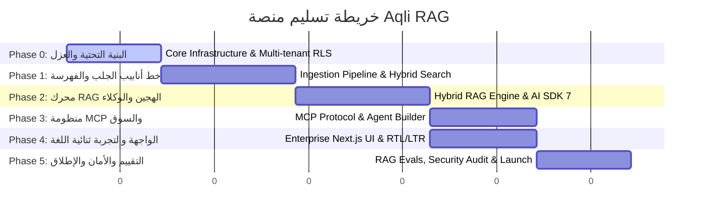

# Delivery Strategy and Milestones

تهدف استراتيجية التسليم لمنصة **Aqli RAG** إلى تحويل المعمارية المحددة في وثائق النظام إلى منتج مؤسسي جاهز للإنتاج بأسلوب عالي الاعتمادية، يعتمد على مرحلية صارمة تدعم "هندسة الوكلاء البرمجية" (Agentic Engineering). تم تقسيم خطة التنفيذ إلى 6 مراحل متسلسلة، حيث تملك كل مرحلة مدخلات ومخرجات محددة، واختبارات حتمية (Deterministic Tests)، وتقييمات معيارية للذكاء الاصطناعي (AI Evals)، مع شروط خروج غير قابلة للتجاوز.

---

## 1. خريطة المراحل والمسار الحرج (Phase Delivery Sequence)



---

## 2. التفصيل المرحلي وركائز التسليم (Detailed Phases & Deliverables)

### Phase 0: البنية التحتية الأساسية وعزل المستأجرين (Core Infrastructure & Multi-Tenant Isolation)
* **الهدف**: بناء القاعدة الصلبة للنظام المقاومة للثغرات، مع تفعيل العزل التام للبيانات على مستوى الصفوف وقواعد التشفير.
* **المدخلات**: مواصفات معمارية Postgres مع الامتدادات المعتمدة، وإعدادات الموصلات الأساسية.
* **المخرجات**:
  - قاعدة بيانات Postgres مجهزة بـ (`pgvector`, `pg_trgm`, `fuzzystrmatch`, `pgcrypto`).
  - سياسات الأمان على مستوى الصف (RLS) مفعّلة ومجربة لكل من `workspace_id` و `user_id`.
  - طبقة التجريد لمزودي الخدمة (Provider Adapter Registry) لمصادقة المستخدمين وتدفقات الأسرار.
  - إعداد هيكل التخزين السحابي (S3-compatible) مع حظر الوصول المقاطع عبر المستأجرين.

### Phase 1: خط أنابيب معالجة البيانات والبحث الهجين (Ingestion Pipeline & Hybrid Search)
* **الهدف**: تمكين جلب المستندات ومعالجتها واستخراج المتجهات وفهرستها بدقة عالية للغة العربية والإنجليزية.
* **المدخلات**: بيئة Phase 0 المكتملة، وتكاملات APIs لـ Mistral Document AI و Unstructured.
* **المخرجات**:
  - خط أنابيب معالجة الملفات والويب والتخزين السحابي مع دعم المعالجة غير المتزامنة (Background Queues).
  - محرك التقطيع الدلالي والهيكلي (Semantic & Table-aware Chunking) مع تطبيع النص العربي.
  - توليد المتجهات عبر `gemini-embedding-2` بأبعاد 3072 وتخزينها في فهارس `HNSW`.
  - دالة `hybrid_search` على مستوى Postgres تجمع بين البحث المتجهي، والبحث النصي BM25، والبحث الضبابي (Trigram) مع تصفية Metadata.

### Phase 2: محرك RAG الهجين والتكامل مع AI SDK 7 (Hybrid RAG Engine & Agent Framework)
* **الهدف**: بناء محرك الاستدلال والاسترجاع الذي يدعم الأوضاع الثلاثة (Strict, Augmented, Open) مع ضبط الهلوسة.
* **المدخلات**: خط أنابيب Phase 1، نماذج `gemini-3.6-flash` و `gemini-3.5-flash-lite`.
* **المخرجات**:
  - تنفيذ الأوضاع الثلاثة (Strict Mode مع Groundedness Guard، Augmented Mode مع Web Search، Open Mode).
  - دعم تدفق الاستجابات (Streaming) وحفظ حالة المحادثات الممتدة عبر `WorkflowAgent` في AI SDK 7.
  - نظام الاستشهاد التفاعلي (Citations Engine) المربوط بالمقاطع والمصادر الأصلية.
  - نظام موافقات الأدوات الصريحة (Tool Approval Flow) للأعمال الحساسة.

### Phase 3: منظومة بروتوكول سياق النموذج والسوق (MCP Ecosystem & Marketplace MVP)
* **الهدف**: تفعيل التكامل ثنائي الاتجاه عبر MCP وإنشاء سوق المهارات والوكلاء.
* **المدخلات**: محرك الدردشة والوكلاء من Phase 2.
* **المخرجات**:
  - خادم MCP داخلي (Internal MCP Server) معزول بنطاق RLS للـ Workspace.
  - عميل MCP متعدد (MCP Client) قادر على الاتصال بخوادم خارجية (GitHub, Notion, Slack).
  - واجهة منشئ الوكلاء (Agent Builder) لتحديد التعليمات والأدوات ونطاق المعرفة (Scoped Retrieval).
  - سوق التجميعات (Marketplace) لدعم تثبيت الموصلات وخوادم MCP ونشر مهارات `uploadSkill`.

### Phase 4: واجهة المستخدم المؤسسية والتجربة ثنائية اللغة (Enterprise Web UI & i18n)
* **الهدف**: إطلاق واجهة مستخدم متكاملة وسريعة باستخدام Next.js 16.2 و React 19.2 مع دعم كامل لـ RTL/LTR.
* **المدخلات**: خدمات الخادم الخلفية وواجهات APIs البرمجية من المراحل 0-3.
* **المخرجات**:
  - تطبيق Next.js 16.2 متكامل مع App Router، مجهز بـ `next-intl` لدعم العربي/الإنجليزي وتوجيه اتجاه الشاشة الديناميكي.
  - المكونات التفاعلية: `ChatComposer`، `CitationCard`، `SourceStatusBadge`، و `ProviderSwitcher`.
  - لوحات التحكم والإدارة: إدارة المصادر، إعدادات المزودين، سجلات التدقيق، والفوترة.
  - تطبيق ميزات React 19.2 مثل `Activity API` للدردشات الخلفية و View Transitions.

### Phase 5: التقييم الشامل، الأمان والإطلاق (Evals, Security Hardening & Launch)
* **الهدف**: التحقق الفعلي من جودة النظام، إجراء اختبارات الأمان والتسريب، وتحسين الأداء للإنتاج المؤسسي.
* **المدخلات**: المنتج المكتمل في البيئة التجريبية (Staging).
* **المخرجات**:
  - مجموعة تقييمات RAG (Retrieval & Generation Evals) بنسبة دقة وتأييد تفي بالمعايير المؤسسية.
  - تتبع كامل عبر OpenTelemetry (`@ai-sdk/otel`) لمراقبة زمن الاستجابة وتكلفة الرموز (Tokens).
  - تقرير فحص أمان البيانات ومنع تسريب المستأجرين (Multi-tenant Leak Penetration Test).
  - حزمة التشغيل الجاهزة للنشر على Vercel أو Docker/Kubernetes.

---

## 3. مصفوفة التبعيات والمسار الحرج (Dependencies & Critical Path)

| المرحلة | التبعيات المباشرة (Upstream Dependencies) | تقع على المسار الحرج؟ | المخاطر الرئيسية للتأخير |
|---|---|---|---|
| **Phase 0** | - لا يوجد | **نعم (Critical)** | عيوب تصميم RLS تتطلب إعادة بناء قاعدة البيانات بالكامل. |
| **Phase 1** | Phase 0 | **نعم (Critical)** | بطء معالجة المستندات العربية أو فشل استخراج التخطيطات من PDF. |
| **Phase 2** | Phase 1 | **نعم (Critical)** | انخفاض دقة التأريض (Groundedness) وزيادة نسبة الهلوسة في اللغة العربية. |
| **Phase 3** | Phase 2 | لا (يمكن بالتوازي مع Phase 4) | تعقد مصادقة OAuth في خوادم MCP الخارجية. |
| **Phase 4** | Phase 2 | لا (يمكن بالتوازي مع Phase 3) | مشاكل محاذاة RTL/LTR مع مكونات شاشات معقدة. |
| **Phase 5** | Phase 3, Phase 4 | **نعم (Critical)** | رسوب تقييمات الاسترجاع أو اكتشاف ثغرات في RLS أثناء الفحص الأمني. |

*لمعرفة تفاصيل توزيع المهام البرمجية للوكلاء على هذه المراحل، يُرجى مراجعة [Agent-Sized Task Decomposition](./02-agent-sized-task-decomposition.md).*

---

## 4. معايير الخروج وبوابات الجودة (Exit Criteria & Quality Gates)

لا يُسمح بالانتقال من مرحلة إلى أخرى إلا بعد تحقيق 100% من معايير الخروج المحددة في الجدول التالي:

```
[Phase Entry] ➔ [Deterministic Unit/Integration Tests Pass] ➔ [AI Eval Thresholds Met] ➔ [Phase Exit Approval]
```

### جدول بوابات الجودة لكل مرحلة:

| المرحلة | الاختبارات الحتمية (Deterministic Gates) | تقييمات الذكاء الاصطناعي (AI Evals Gates) | المخرجات البرمجية المطلوبة |
|---|---|---|---|
| **Phase 0** | • نجاح 100% لاختبارات RLS Integration Tests (محاولة التسلل بين Workspaces مرفوضة).<br>• نجاح تشفير pgcrypto وفك التشفير لمفاتيح API. | • غير تطبيقية في هذه المرحلة. | SQL Migrations جاهزة ومثبتة.<br>ملاءمة معايير TypeScript الصارمة. |
| **Phase 1** | • نجاح دالة `hybrid_search` في إرجاع نتائج صحيحة عند الاستعلام النصي والمتجهي.<br>• معالجة ملفات PDF/DOCX بدون استثناءات runtime errors. | • **Chunking Quality Eval**: احتفاظ المقطع بالمعنى السياقي المستقل بنسبة ≥ 88%. | خط أنابيب غير متزامن شغال بالكامل مع معالجة الأخطاء وإعادة المحاولة. |
| **Phase 2** | • نجاح التبديل اللحظي بين الحالات (Strict, Augmented, Open).<br>• عمل تدفق Stream عبر SSE بدون انقطاع.<br>• التقيد بواجهة API لـ AI SDK 7. | • **Context Faithfulness**: بنسبة ≥ 92%.<br>• **Answer Relevance**: بنسبة ≥ 90%.<br>• **Groundedness Pass Rate** في Strict Mode: بنسبة 100% (صفر هلوسة خارج السياق). | محرك RAG مكتمل مع دعم Citations والموافقات على الأدوات. |
| **Phase 3** | • خادم MCP الداخلي يستجيب لطلبات البروتوكول المعيارية.<br>• تنفيذ طلبات الموافقات الحساسة (Tool Approval Flow) قبل التشغيل. | • **Agent Tool Selection Accuracy**: اختيار الأداة الصحيحة بنسبة ≥ 94%. | نظام Agent Builder وسوق المهارات وموصلات MCP شغال تمامًا. |
| **Phase 4** | • اجتياز اختبارات E2E عبر Playwright لشاشات الدردشة وإدارة المصادر.<br>• عدم وجود أي خرق لتنسيقات LTR/RTL في الشاشات ثنائية اللغة. | • **Translation Naturalness Eval**: تقييم جودة الصياغة العربية في الواجهة بنسبة 4.5/5. | تطبيق Next.js 16.2 مع جميع الشاشات والمكونات المحددة في الوثيقة. |
| **Phase 5** | • تغطية اختبارات أفقية (Test Coverage) بنسبة ≥ 85%.<br>• نجاح فحص الاختراق وعدم وجود ثغرات عالية/حرجية (High/Critical). | • **RAG Triad Eval (Faithfulness, Answer Relevance, Context Relevance)**: متوسط ≥ 90% على مجموعة بيانات الاختبار (1000 سؤال عربي/إنجليزي). | تقرير التقييم النهائي وجاهزية النشر للإنتاج (Production Ready). |

*للاطلاع على كيفية معالجة الفشل في هذه البوابات وإعادة توجيه البيانات، راجع [Risk Register and Feedback Loops](./03-risk-register-and-feedback-loops.md).*

---

## 5. استراتيجية توجيه النماذج والتنفيذ (Model Allocation Strategy)

تضمن الاستراتيجية الاقتصادية والهندسية توجيه النماذج الذكية بناءً على طبيعة المهمة وتعقيدها، سواء أثناء مرحلة البناء (Development/Agent Coding) أو أثناء التشغيل (Runtime Execution):

### أ. توزيع النماذج أثناء مرحلة التطوير والإنشاء (Build-time Model Allocation)

```
              [مهمة تطوير جديدة]
                      │
        ┌─────────────┴─────────────┐
        ▼                           ▼
[مهام حتمية وهيكلية]         [مهام معقدة واستدلال عالي]
  - كتابة Schemas             - تصميم معمارية RLS
  - إنشاء CRUD API            - ضبط خط أنابيب Hybrid Search
  - كتابة React Components     - بناء وكيل MCP متعدد Step
        │                           │
        ▼                           ▼
[نماذج منخفضة التكلفة/سريعة]    [نماذج استدلال تقدمي مرتفع]
  (e.g., Claude 3.5 Haiku /    (e.g., Gemini 3.6 Flash /
   Gemini 3.5 Flash-Lite)        Claude 3.7 Sonnet)
```

### ب. توزيع النماذج أثناء التشغيل في الإنتاج (Runtime Model Allocation)

| المكون / المهمة | النموذج المخصص (Assigned Model) | السبب الهندسي والاقتصادي |
|---|---|---|
| **Query Rewriting & HyDE** | `gemini-3.5-flash-lite` | سرعة عالية زمن كمون منخفض للغاية (<150ms)، وتكلفة معدومة تقريبًا لعمليات المعالجة المسبقة. |
| **Document Classification & Auto-Tagging** | `gemini-3.5-flash-lite` | استخراج الكيانات المحددة والمخرجات المهيكلة (Structured Outputs) بكفاءة عالية. |
| **Embeddings Generation** | `gemini-embedding-2` | دعم التضمين متعدد الوسائط (نص، صور، جداول) بأبعاد 3072 وبدعم ممتاز للغة العربية. |
| **Master Agent & Deep Reasoning Chat** | `gemini-3.6-flash` | القدرة المتقدمة على الاستدلال متعدد الخطوات، دعم نافذة سياق حتى 1M symbol، واستدعاء أدوات MCP بدقة متناهية. |
| **Groundedness Evaluation (LM Judge)** | `gemini-3.6-flash` أو نموذج مستقل | استخدام كحكم مستقل لتقييم صحة الإجابات ومطابقتها للمصدر قبل إرسالها للمستخدم النهائي في Strict Mode. |

---

## 6. قائمة مراجعة الجاهزية للتنفيذ (Execution Readiness Checklist)

قبل بدء تشغيل وكلاء التطوير (AI Coding Agents)، يجب التأكد من اكتمال المتطلبات التالية:

- [ ] إعداد بيئة Monorepo المعتمدة (Turborepo) وتقسيم الحزم (`ui`, `db`, `ai-providers`, `mcp`, `connectors`).
- [ ] توفر جميع مفاتيح APIs المطلوبة للاختبار (`GEMINI_API_KEY`, `MISTRAL_API_KEY`, `UNSTRUCTURED_API_KEY`).
- [ ] إعداد قاعدة بيانات Postgres محلية أو سحابية مجهزة بالملحقات (`pgvector`, `pg_trgm`, `pgcrypto`).
- [ ] تكامل أطر الاختبار الحتمي (Vitest للوحدات، و Playwright لـ E2E).
- [ ] تهيئة بيئة التقييم المستمر (`@ai-sdk/otel` و RAG Eval Datasets باللغتين العربية والإنجليزية).
- [ ] مراجعة وتفعيل خطة المهام المقسمة في [Agent-Sized Task Decomposition](./02-agent-sized-task-decomposition.md).