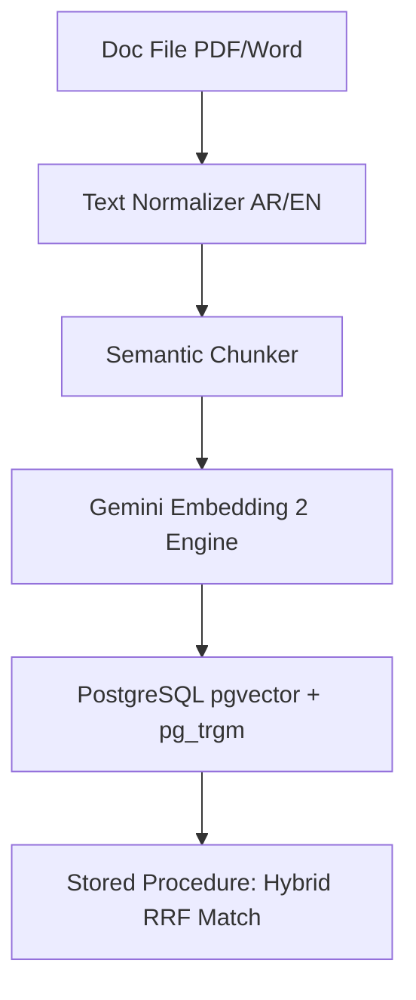
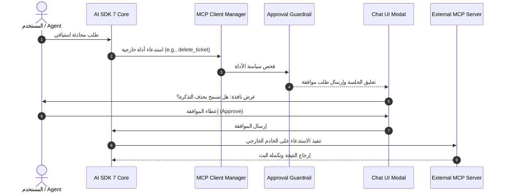

# Agent-Sized Task Decomposition

تهدف هذه الوثيقة إلى تفكيك النظام العالي المستوى لمنصة **Aqli RAG** إلى "بطاقات مواصفات مهام" (Task Spec Cards) محددة بنطاق دقيق بحجم يتناسب مع قدرات وكلاء البرمجة (Agent-Sized Units). صُمّمت هذه البطاقات لتُنفَّذ بواسطة وكلاء الذكاء الاصطناعي بنسبة استقلالية عالية وبأقل قدر من التشتت، مع وضع معايير قبول واضحة وتحديد نمط التشغيل الهندسي ومستوى النموذج المناسب لكل مهمة.

تستكمل هذه البطاقات الاستراتيجية العامة المفصلة في [Delivery Strategy and Milestones](./01-delivery-strategy-and-milestones.md)، وتغذّي بشكل مباشر مسارات قياس الأخطاء والمخاطر الموضحة في [Risk Register and Feedback Loops](./03-risk-register-and-feedback-loops.md).

---

## 1. دليل الوكلاء وإرشادات التنفيذ (Agent Execution Protocol)

لكل مهمة من المهام المعرفة أدناه، يجب على الوكيل المُنَفّذ الالتزام ببروتوكول التشغيل التالي:

1. **الالتزام بنطاق السياق المغلق (Scoped Context Boundary):** يُمنع تعديل أو إنشاء ملفات خارج القائمة المحددة في الحقل `Target Files & Context Scope` الخاص بالبطاقة دون إذن صريح.
2. **الالتزام بنمط التشغيل الموصى به (Execution Mode):**
   - **نمط المايسترو (Conductor Mode):** يُستخدم للمهام المحددة بدقة (Deterministic Transformation / Schema Setup / Strict Interfaces). تعتمد على نماذج سريعة ومنخفضة التكلفة (`gemini-3.5-flash-lite`) وتلتزم بتعليمات صارمة دون اجتهاد معماري.
   - **نمط الموجه (Orchestrator Mode):** يُستخدم للمهام الاستكشافية متعددة الخطوات أو المعقدة بنشاط (Dynamic Tools / RAG Logic / Complex State). تعتمد على نماذج عالية القدرة والاستدلال (`gemini-3.6-flash` أو ما يعادلها) مع تفعيل حلقات استدعاء الأدوات وتقييم الاستجابات.
3. **مراعاة مشكلة الـ 80% (The 80% Edge-Case Trap):** التركيز على الحالات الحدية التي يُغفلها الذكاء الاصطناعي عادةً (معالجة أخطاء الشبكة، دعم النص العربي/الإنجليزي المزدوَج RTL/LTR، عزل بيانات RLS عند الاستعلامات المعقدة، والمهلات الزمنية Serverless Timeouts).
4. **حلقة التحقق القائمة على الاختبارات والتقييمات (Test & Eval Verification):** لا تُعتبر أي مهمة مكتملة إلا إذا اجتازت اختبارات الوحدة الصارمة (Deterministic Unit Tests) واختبارات التقييم للذكاء الاصطناعي (LLM Evals) المحددة في البطاقة.

---

## 2. فهرس بطاقات المهام (Task Spec Index)

| معرف المهمة | عنوان المهمة | المجال / Epic | النمط الموصى به | مستوى النموذج |
|---|---|---|---|---|
| `TASK-CORE-001` | طبقة عزل المستأجرين والتشفير بالمفتاح المشتق (RLS & `pgcrypto`) | البنية التحتية والأمان | Conductor | Low-Cost (`flash-lite`) |
| `TASK-INGEST-002` | خط معالجة النصوص العربية/الإنجليزية والبحث الهجين (Hybrid Search) | معالجة المستندات وRAG | Orchestrator | High-Capability (`3.6-flash`) |
| `TASK-RAG-003` | محرك المحادثة ثلاثي الأوضاع وحارس التأريض (Groundedness Guard) | محرك RAG والوكلاء | Orchestrator | High-Capability (`3.6-flash`) |
| `TASK-MCP-004` | جسر خادم/عميل MCP وتأكيد موافقات الأدوات (Tool Approvals) | التجميع والبروتوكولات | Orchestrator | High-Capability (`3.6-flash`) |
| `TASK-CHAT-005` | مكونات واجهة الدردشة ثنائية الاتجاه واستئناف جلسات `WorkflowAgent` | واجهة المستخدم (UI) | Conductor | Low-Cost (`flash-lite`) |

---

## 3. بطاقات مواصفات التنفيذ التفصيلية (Task Spec Cards)

### بطاقة المهمة `TASK-CORE-001`

```yaml
Task ID: TASK-CORE-001
Title: Multi-Tenant RLS & Envelope Encryption Infrastructure
Epic: Core Platform & Security
Mode: Conductor Mode
Model Tier: Low-Cost / High-Speed (e.g., gemini-3.5-flash-lite)
Target Files:
  - packages/db/src/schema/workspaces.ts
  - packages/db/src/schema/sources.ts
  - packages/db/src/schema/chunks.ts
  - packages/db/migrations/0001_rls_and_pgcrypto.sql
  - packages/db/src/client.ts
```

#### 1. الهدف والمواصفات المحددة (Specification)
تأسيس مخطَّط قاعدة البيانات (PostgreSQL Schema) لنظام RAG متعدد المستأجرين مع تفعيل سياسات سيادة البيانات والخصوصية الصارمة:
- إنشاء الجداول الأساسية: `workspaces`، `workspace_members`، `sources`، `document_chunks`.
- تفعيل امتدادات PostgreSQL المطلوبة: `pgvector` (للمتجهات)، `pg_trgm` (للصفات النصية)، `pgcrypto` (لتشفير أسرار المستأجرين).
- فرض سياسات **Row-Level Security (RLS)** المعتمدة على `current_setting('app.current_workspace_id')` لجميع الجداول بدون استثناء.
- بناء آلية تشفير الغلاف (Envelope Encryption) لأسرار المستأجرين (مثل مفاتيح Gemini/OpenAI API الخاصة بكل مساحة عمل) باستخدام `pgcrypto` والاقتران بمفتاح تشفير رئيسي يُمرّر عبر بيئة التشغيل `ENCRYPTION_MASTER_KEY`.

#### 2. مشكلة الـ 80% والحالات الحدية (Edge Cases & Traps)
- **RLS Bypass Trap:** التأكد من عدم إمكانية الالتفاف على RLS أثناء استعلامات `JOIN` بين الجداول أو في الاستعلامات المعقدة الخاصة بالمتجهات.
- **Null Workspace Context:** في حال استعلام الخادم دون ضبط `app.current_workspace_id` يجب أن ترجع الاستعلامات صفوفًا فارغة (`empty set`) فورًا دون إلقاء أخطاء تسرب تفاصيل النظام.
- **pgvector Index Partial Filtering:** عند إنشاء فهرس HNSW على جدول المتجهات، يجب إنشاؤه بشكل يدعم التصفية الجزئية بناءً على `workspace_id` لمنع تدهور أداء البحث عند زيادة عدد المستأجرين.

#### 3. معايير القبول والتحقق التلقائي (Acceptance Criteria)
- [ ] تنفيذ ملف الهجرة SQL واجتيازه بدون أخطاء على قاعدة بيانات PostgreSQL 16+.
- [ ] **اختبار وحدة محدد (Deterministic Test):** المحاولة البرمجية لقراءة `sources` الخاصة بـ `workspace_A` باستخدام سياق جلسة مخصص لـ `workspace_B` ترجع `0` نتائج.
- [ ] **اختبار تشفير:** التحقق من أن القيم المخزنة في عمود `encrypted_api_key` لجدول `workspaces` غير قابلة للقراءة كنص واضح (Plain Text) عند تنفيذ `SELECT` مباشر دون استخدام دالة فك التشفير برمز الحماية.

---

### بطاقة المهمة `TASK-INGEST-002`

```yaml
Task ID: TASK-INGEST-002
Title: Bilingual Ingestion Pipeline & Database Hybrid Search Stored Procedure
Epic: Ingestion Engine & RAG Retrieval
Mode: Orchestrator Mode
Model Tier: High-Capability (e.g., gemini-3.6-flash)
Target Files:
  - packages/connectors/src/pipeline/processor.ts
  - packages/connectors/src/pipeline/normalizer.ts
  - packages/connectors/src/pipeline/chunker.ts
  - packages/db/src/queries/hybrid_search.sql
  - packages/ai-providers/src/embeddings/gemini.ts
```

#### 1. الهدف والمواصفات المحددة (Specification)
بناء خط أنابيب المعالجة غير المتزامنة للمستندات باللغتين العربية والإنجليزية، ودالة البحث الهجين في قاعدة البيانات:
- **التطبيع اللغوي (Normalization):** بناء معالج نصوص مخصص للغة العربية ينظف النص، يزيل التشكيل الاختياري، ويوحد أشكال الهمزات والألف المقصورة/الممدودة دون الإخلال بتركيب الكلمات، مع الحفاظ الكامل على الكلمات الإنجليزية كما هي.
- **التقسيم الدلالي (Semantic Chunking):** تقسيم المستندات إلى قطع (Chunks) بأحجام تتراوح بين 512 و1024 رمزًا مع overlap بنسبة 15%، مع الحفاظ على سلامة الجداول والجمل الكاملة.
- **التضمين المتعدد الوسائط:** توليد المتجهات لكل المقتطعات عبر نموذج `gemini-embedding-2` بأبعاد 3072.
- **دالة البحث الهجين (Hybrid Search Procedure):** كتابة إجراء مخزَّن `plpgsql` باسم `match_document_chunks_hybrid` يدمج بين:
  1. البحث الدلالي المتجهي (`pgvector` cosine similarity).
  2. البحث النصي التقليدي BM25/Trigram (`pg_trgm`).
  3. إعادة الترتيب وإرجاع درجة مطابقة مركبة (Reciprocal Rank Fusion - RRF).



#### 2. مشكلة الـ 80% والحالات الحدية (Edge Cases & Traps)
- **تكسر النصوص العربية:** تأكد من أن عملية التقسيم (Chunking) لا تقطع الجمل العربية في منتصف الكلمة أو عند علامات الترقيم الخاصة باللغة العربية (مثل `؛` و`؟`).
- **تفاوت أبعاد المتجهات:** حماية خط الأنابيب عند رمي خطأ إذا تم استخدام نموذج تضمين بأبعاد تختلف عن 3072 دون إعادة فهرسة الجدول.
- **معالجة المستندات الضخمة في Vercel Serverless:** تفادي تجاوز حد الـ 60 ثانية لتنفيذ الدوال من خلال تقسيم عملية المعالجة إلى jobs متسلسلة عبر Vercel Queues / BullMQ.

#### 3. معايير القبول والتحقق التلقائي (Acceptance Criteria)
- [ ] اجتياز اختبارات تطبيع النصوص العربية: التطابق التام لمدخلات مثل "الإستراتيجية والذّكاء" إلى "الاستراتيجية والذكاء".
- [ ] إجراء استعلام هجين من خلال دالة `match_document_chunks_hybrid` وإرجاع مخرجات مهيكلة تحتوي على: `chunk_id`, `content`, `similarity_score`, `provenance_metadata`.
- [ ] **اختبار أداء (Performance Benchmark):** استجابة البحث الهجين في زمن أقل من 150 ملي ثانية لجدول يحتوي على 100,000 مقطع متوفر لفضاء مستأجر مخصص.

---

### بطاقة المهمة `TASK-RAG-003`

```yaml
Task ID: TASK-RAG-003
Title: Granular Grounding Mode Switcher & Groundedness Guard Evaluator
Epic: Core Agent Engine
Mode: Orchestrator Mode
Model Tier: High-Capability (e.g., gemini-3.6-flash)
Target Files:
  - apps/web/lib/ai/agents/rag-master.ts
  - apps/web/lib/ai/guardrails/groundedness.ts
  - apps/web/lib/ai/tools/web-search.ts
  - apps/web/app/api/chat/route.ts
```

#### 1. الهدف والمواصفات المحددة (Specification)
تطوير محرك الاستجابة الرئيسي بنظام RAG ذي الأوضاع الثلاثة المحددة على مستوى المحادثة/الوكيل:
1. **Strict Mode (مقيّد بالمصادر):** الإجابة تعتمد 100% على المقاطع المسترجعة من قاعدة المعرفة. إذا كان السياق المسترجع غير كافٍ، يجب إرجاع رسالة اعتذار قياسية محددة بالعربية والإنجليزية بدون التكهن أو التوليد الحر.
2. **Augmented Mode (هجين):** تُستخدم قاعدة المعرفة كسياق أساسي، وإذا اكتشف المحرك فجوة معرفية، يقوم باستدعاء أداة `web_search_grounding` لسد الفجوات مع إضافة الوسوم المميّزة `[من مصادرك]` و`[من الويب]`.
3. **Open Mode (مفتوح):** حرية كاملة للوكيل في استخدام أدوات البحث الخارجي وMCP دون تقيد بحجم السياق المحلي.
- **حارس التأريض (Groundedness Guardrail):** طبقة تقييم فورية سريعة تستخدم `gemini-3.5-flash-lite` لمراجعة الإجابة المولّدة مقابل السياق المسترجع ومطابقتها قبل بثها للمستخدم في النمط المقيّد (Strict Mode).

#### 2. مشكلة الـ 80% والحالات الحدية (Edge Cases & Traps)
- **هلوسة النمط المقيّد (Strict Mode Hallucination):** ميل النماذج لإجابة الأسئلة العامة من معارفها الخاصة عند فشل الاسترجاع. يجب تطبيق System Prompt صارم جداً متبوع بـ Evaluator Hook لتأكيد الصدمة ورفض الإجابة.
- **خلط المصادر في النمط الهجين:** تداخل الاستشهادات بحيث يُشار لمصدر ويب كأنه ملف داخلي للمستأجر. يجب ضبط المخرجات المهيكلة (Structured Outputs) للفصل بين النوعين.

#### 3. معايير القبول والتحقق التلقائي (Acceptance Criteria)
- [ ] **اختبار تقييم الذكاء الاصطناعي (LLM Eval - Strict Mode):** تقديم سؤال غير موجود في قاعدة المعرفة المرفقة تحت النمط Strict Mode. النتيجة المطلوبة: رفعت الكود استجابة عدم التوفر بنسبة نجاح 100% في 20 عينة اختبار دون تسريب أي معلومات خارجية.
- [ ] **اختبار التقييم للنمط الهجين (Augmented Mode Eval):** التأكد من احتواء المخرجات المحدثة على وسم `[من مصادرك]` للحقائق المستخرجة محليًا ووسم `[من الويب]` للحقائق المجلوبة بالأداة.
- [ ] اجتياز اختبار التدفّق اللحظي (Streaming Compatibility) لردود الاستجابة عبر HTTP Streaming دون انقطاع.

---

### بطاقة المهمة `TASK-MCP-004`

```yaml
Task ID: TASK-MCP-004
Title: Bidirectional MCP Server/Client Bridge with AI SDK 7 Tool Approvals
Epic: Extensibility & MCP Architecture
Mode: Orchestrator Mode
Model Tier: High-Capability (e.g., gemini-3.6-flash)
Target Files:
  - packages/mcp/src/server/index.ts
  - packages/mcp/src/client/manager.ts
  - packages/mcp/src/guardrails/approval.ts
  - apps/web/app/api/mcp/sse/route.ts
```

#### 1. Objetivo / المواصفات المحددة (Specification)
تأمين وتنفيذ بنية Model Context Protocol (MCP) ثنائية الاتجاه داخل التطبيق:
- **MCP Server الداخلي:** تعريض واجهة SSE / JSON-RPC تتيح للعملاء الخارجيين (مثل Claude Desktop أو IDEs) الاستعلام عن قاعدة معرفة المستأجر مع التحقق من جلسة المصادقة المشفّرة وبصمة `workspace_id`.
- **MCP Client متعدد الخوادم:** بناء عميل ديناميكي يتصل بخوادم MCP الخارجية المسجلة من قبل المستأجر في السوق (Marketplace).
- **نظام موافقات الأدوات (Tool Approvals Flow):** دمج ميزة Tool Approvals في AI SDK 7 لتعليق التنفيذ وإرسال طلب موافقة للواجهة الأمامية عند محاولة أداة MCP تنفيذ عمليات كتابة، حذف، أو تعديل خارجي.



#### 2. مشكلة الـ 80% والحالات الحدية (Edge Cases & Traps)
- **Dangling SSE Connections:** قطع اتصالات SSE بشكل مفاجئ من طرف العملاء الخارجيين يتسبب في استهلاك موارد الخادم. يجب تنفيذ آلية Heartbeat كل 15 ثانية وإغلاق الجلسات الميتة.
- **Malicious Tool Parameters:** تمرير حقول الخبيثة (Injection) ضمن وسائط استدعاء خوادم MCP الخارجية. يجب تمرير كافة المدخلات عبر مخططات Zod صارمة وتطهيرها قبل التنفيذ.

#### 3. معايير القبول والتحقق التلقائي (Acceptance Criteria)
- [ ] **اختبار تكامل MCP Server:** نجاح خادم MCP الداخلي في الرد على طلبات `tools/list` و`tools/call` من عميل اختبار مستقل مع حظر جميع الطلبات غير المرفقة بـ Workspace Auth Token صحيح.
- [ ] **اختبار تدفق الموافقة (Approval Flow Test):** عند استدعاء أداة ذات معلمة `requiresApproval: true` يتوقف التنفيذ فوراً في حالة `onToolCall` حتى إرسال تأكيد الموافقة برمجياً أو توقف الجلسة بالمهلة الزمنية (Timeout).

---

### بطاقة المهمة `TASK-CHAT-005`

```yaml
Task ID: TASK-CHAT-005
Title: Bilingual Dynamic RTL/LTR Chat Composer & WorkflowAgent Session Resync
Epic: UI Component & Frontend Architecture
Mode: Conductor Mode
Model Tier: Low-Cost / High-Speed (e.g., gemini-3.5-flash-lite)
Target Files:
  - apps/web/components/chat/chat-composer.tsx
  - apps/web/components/chat/citation-card.tsx
  - apps/web/components/chat/message-list.tsx
  - apps/web/hooks/use-workflow-agent.ts
```

#### 1. Objetivo / المواصفات المحددة (Specification)
تطوير واجهة المحادثة الرئيسية ومكونات إدخال النصوص وتفاعلاتها المتقدمة:
- **المحرر ثنائي الاتجاه التكيفي (Dynamic RTL/LTR Composer):** محرر نصي يبدل اتجاه الكتابة وتنسيق القائمة ديناميكياً بناءً على اللغة المكتوبة في السطر الأول من قبل المستخدم دون تغيير لغة الصفحة الكاملة.
- **بطاقة الاستشهاد التفاعلية (CitationCard):** عرض المصادر المستشهد بها عند تحويم الفأرة (Hover) أو الضغط مع إظهار المقتطف الأصلي ورقم الصفحة ورابط المصدر المباشر.
- **استئناف الجلسات الطويلة (WorkflowAgent Resynchronization):** دعم استقبال تحديثات حالات الوكلاء الذين يعملون لمهام طويلة في الخلفية، مع إعادة الاتصال والربط في حالة انعاش الصفحة (Page Refresh) بفضل حالة الـ Persistence لـ `WorkflowAgent` في AI SDK 7.

#### 2. مشكلة الـ 80% والحالات الحدية (Edge Cases & Traps)
- **RTL Layout Distortion:** حدوث مشاكل في تنسيق أزرار الإرسال والوسائط المرفقة والأيقونات عند التحويل بين العربية والإنجليزية داخل نفس نافذة الشات. يجب استخدام مقاييس Tailwind v4 الاتجاهية (`ms-*`, `me-*`, `start-*`, `end-*`) بدلاً من القياسية (`ml-*`, `mr-*`).
- **Citation Highlight Misalignment:** مطابقة نص المقتطف المستشهد به مع الملفات عند وجود أحرف خاصة أو مسافات زائدة.

#### 3. معايير القبول والتحقق التلقائي (Acceptance Criteria)
- [ ] **اختبار مكون الواجهة (Component Unit Test):** كتابة نص يبتدئ بحروف عربية تحول اتجاه `textarea` إلى `dir="rtl"`، بينما كتابة نص إنجليزي تحوله فورياً إلى `dir="ltr"`.
- [ ] اجتياز اختبار الرندر البصري لمكون `CitationCard` واستعادة البيانات عند النقر على رابط المقتطف المرجعي.
- [ ] **اختبار قطع وانعاش الجلسة:** انقطاع الشبكة أثناء تنفيذ `WorkflowAgent` لعملية متعددة الخطوات، ثم العودة واكتشاف أن الواجهة استأنفت عرض الحالة من النقطة الأخيرة بنجاح دون تكرار للرسائل.

---

## 4. مصفوفة تتبع الاعتمادية والجاهزية (Execution Readiness Matrix)

توضح المصفوفة التالية تسلسل التنفيذ والروابط بين مهام التفكيك وشروط البدء لكل بطاقة:

```
[TASK-CORE-001]
       │
       ├───► [TASK-INGEST-002] ───► [TASK-RAG-003]
       │                                   │
       └───► [TASK-MCP-004] ───────────────┴───► [TASK-CHAT-005]
```

- لا يمكن البدء في `TASK-INGEST-002` أو `TASK-MCP-004` حتى اكتمال وتدقيق `TASK-CORE-001` بالكامل لضمان توفر جداول وعزل RLS.
- تتطلب المهمة `TASK-CHAT-005` اكتمال واجهات API الناتجة عن `TASK-RAG-003` و `TASK-MCP-004`.

للاطلاع على كيفية توجيه الأخطاء وإدارة معالجة الإخفاقات أثناء تنفيذ هذه المهام بواسطة الوكلاء، يُرجى الانتقال إلى [Risk Register and Feedback Loops](./03-risk-register-and-feedback-loops.md).