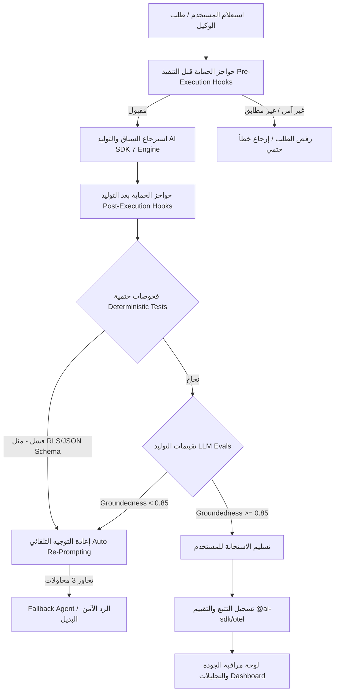

# Risk Register and Feedback Loops

يُعالج هذا المستند نقاط الفشل المحتملة لذكاء المنصة الاصطناعي ووكلاء التوليد والاسترجاع في نظام **Aqli RAG**، ويحدّد آليات توجيه هذه الإخفاقات عبر حلقات تغذية راجعة (Feedback Loops) ممركبة ومؤتمتة. يدمج التصميم بين الاختبارات الحتمية (Deterministic Tests) والتقييمات الذكية القائمة على النماذج (LLM-as-a-Judge Evals) للحفاظ على جودة المؤسسات (Enterprise-grade) ومنع التسرب وتداعي الأداء.

---

## 1. سجل مخاطر الوكلاء وأنماط الفشل (Agent Risk Register)

يصنف هذا السجل أنماط الفشل الشائعة لدى الوكلاء المتميزة ببيئات الـ RAG الهجينة وثنائية اللغة، مع تحديد خطورة الفشل وآلية كشفه التلقائي واستراتيجية الملافاة (Mitigation):

| معرّف الخطر | نمط الفشل (Failure Mode) | محفز الفشل / السبب الجذر | مستوى الخطورة | طريقة الكشف التلقائي (Detection) | استراتيجية المعالجة والتحويل (Mitigation & Fallback) |
|---|---|---|---|---|---|
| **RSK-01** | **تسرّب سياق بين المستأجرين (Cross-Tenant Leakage)** | استعلام `pgvector` يغفل تصفية `workspace_id` أو تجاوز RLS أثناء الـ Hybrid Search. | **حرج جدًا (Critical)** | اختبارات تكامل حتمية في CI/CD تحاول استعلام بيانات Workspace A باستخدام مفتاح Workspace B. | تنفيذ RLS إلزامية على مستوى Postgres + فحص حتمي للاستعلام عبر AST Parser قبل التنفيذ + حظر النتيجة فورًا. |
| **RSK-02** | **عدم تطابق الفضاء المتجهي (Vector Mismatch)** | تبديل مزود/نموذج التضمين (مثلاً من `gemini-embedding-2` إلى مزود آخر) دون إعادة الفهرسة. | **حرج (High)** | كشف اختلاف أبعاد المتجهات (Dimensions Shift Check) أو قياس انخفاض مفاجئ في Cosine Similarity إلى قارب الصفر. | حظر الاسترجاع تلقائيًا، تعيين حالة المصدر إلى `NEEDS_REINDEX`، وتنبيه المسؤول عبر الواجهة بضرورة إعادة الفهرسة. |
| **RSK-03** | **تدهور المعالجة العربية (Arabic NLP Shift)** | فشل تطبيع النصوص العربية (إزالة التشكيل، توحيد الهمزات/الألف) مما يؤدي لفقدان المطابقة النصية (BM25/Trigram). | **متوسط (Medium)** | اختبارات تقييم استرجاع (Retrieval Eval) تقارن معدل Hit Rate للكلمات العربية المشكولة مقابل غير المشكولة. | إجبار الاستدلال عبر خط أنابيب تطبيع حتمي (Deterministic Normalizer Pipeline) كخطوة سابقة للفهرسة والاستعلام. |
| **RSK-04** | **الهلوسة في وضع التقييد (Strict Mode Hallucination)** | توليد النموذج لمعلومات خارجية أثناء تفعيل `Strict Mode` عندما يكون السياق المسترجع غير كافٍ. | **عالي (High)** | تقييم Groundedness Eval تلقائي باستعمال نموذج القاضي (LLM-as-a-Judge) لحساب نسبة الادعاءات غير المدعومة. | اعتراض الاستجابة عبر Post-Execution Hook، رفض الإجابة، وإرجاع رد قياسي: "المصادر المتاحة غير كافية للإجابة". |
| **RSK-05** | **تجاوز/مهلة أدوات MCP (MCP Tool Timeout/Failure)** | بطء أو انقطاع اتصال خادم MCP خارجي أثناء استدعاء الوكيل لأداة حية. | **متوسط (Medium)** | كشف تجاوز مهلة التنفيذ (Timeout Check > 5000ms) أو إرجاع خطأ بروتوكولي من خادم MCP. | إلغاء الاستدعاء، تحويل الوكيل إلى نمط Degradation Mode، واستخدام التخزين المؤقت المحلي إن وجد مع تنبيه المستخدم. |
| **RSK-06** | **انحراف التوجيه ثنائي اللغة (Bilingual Prompt Drift)** | خلط النموذج بين لغة التعليمات ولغة المستندات (مثلاً الإجابة بالإنجليزية على سؤال عربي لاستناد السياق لمستند إنجليزي). | **منخفض-متوسط (Low-Med)** | أداة كشف اللغة (Language Detector Hook) تقارن لغة الاستعلام بلغة الإجابة النهائية. | تطبيق System Prompt Rule صارم يُلزم التوليد بـ "لغة سؤال المستخدم حصرًا" وإعادة التوجيه (Re-prompting) عند الاختلاف. |

---

## 2. معمارية حلقات التغذية الراجعة (Feedback Loop Architecture)

يعتمد النظام معمارية تغذية راجعة ثنائية المسار لتصحيح أخطاء الوكلاء تلقائيًا قبل وصولها للمستخدم النهائي:



### 1.2 مسار التحقق الحتمي (Deterministic Verification Loop)
*   **المستوى**: مستوى الكود وشبكة البيانات (CI/CD + Middleware).
*   **الأدوات**: Vitest، Zod Schemas، Postgres RLS Enforcement.
*   **التشغيل**: يتم مع كل طلب استعلام أو استدعاء أداة MCP.
*   **الإجراء عند الفشل**: إيقاف التنفيذ فورًا، تسجيل حدث أمني في سجل التدقيق (Audit Log)، وإرجاع خطأ هيكلي دون تمريره إلى النموذج.

### 2.2 مسار التقييم الذكي غير الحتمي (Non-Deterministic Eval Loop)
*   **المستوى**: تقييم جودة التوليد والاسترجاع (RAG Evals).
*   **الأدوات**: LLM-as-a-Judge (باستخدام `gemini-3.5-flash-lite`) + `@ai-sdk/otel`.
*   **التشغيل**: معالجة أزامية (Asynchronous) لكل الاستجابات، ومعالجة تزافية (Synchronous) في وضع `Strict Mode`.
*   **الإجراء عند الفشل**: إطلاق حلقة إعادة المحاولة الهيكلية (Structured Retry Loop) بحد أقصى 3 محاولات، ثم التحويل إلى الوكيل البديل (Fallback Mode).

---

## 3. تقييمات RAG والمعايير القياسية (RAG Evals & Metrics)

نعتمد ثالوث تقييم الـ RAG (The RAG Triad) مضافًا إليه معايير الدعم ثنائي اللغة لضمان القبول المعتمد للمخرجات:

```
                  +-------------------------+
                  |    استعلام المستخدم     |
                  +-------------------------+
                     /                   \
                    /                     \
                   /  [Context Relevance]  \
                  v                         v
       +--------------------+      +--------------------+
       |  السياق المسترجع  |----->|  الإجابة المولّدة  |
       +--------------------+      +--------------------+
               [Groundedness / Faithfulness]
```

### معايير القبول والحدود الحرجية (Thresholds)

| المعيار (Metric) | الوصف والدالة المنهجية | الحد الأدنى المقبول (Threshold) | النموذج المقيّم (Judge Model) |
|---|---|---|---|
| **Context Relevance** | مدى صلة المقاطع المسترجعة (`Chunks`) باستعلام المستخدم وعدم تضمين ضوضاء. | $\ge 0.80$ | `gemini-3.5-flash-lite` |
| **Groundedness (Faithfulness)** | نسبة الحقائق في الإجابة المدعومة تمامًا بالمصادر المسترجعة (منع الهلوسة). | $\ge 0.90$ (Strict Mode)<br>$\ge 0.75$ (Augmented Mode) | `gemini-3.5-flash-lite` |
| **Answer Relevance** | مدى تلبية الإجابة للسؤال المطروح دون الخروج عن الموضوع أو الإسهاب الفائض. | $\ge 0.85$ | `gemini-3.5-flash-lite` |
| **Bilingual Consistency** | مطابقة لغة الإجابة للغة السؤال وتماسك المصطلحات المترجمة (عربي/إنجليزي). | $100\%$ مطابقة للغة | أداة حتمية + Rule Check |
| **Citation Accuracy** | مدى صحة المراجع والروابط الراجعة للمصادر الأصيلة (Provenance Alignment). | $100\%$ صحة العناوين/الصفحات | فحص حتمي متقاطع (Cross-Ref) |

---

## 4. نظام حواجز الحماية والخطاطيف (Guardrails & Dynamic Hooks)

يتم تنصيب حواجز الحماية في طبقة التطبيق والتكامل مع AI SDK 7 عبر Middleware موحد:

### 1.4 خطاف فحص RLS الحتمي (Pre-Retrieval RLS Guard)
يضمن هذا الخطاف تطبيق فلتر `workspace_id` قبل إرسال أي استعلام إلى `pgvector` أو `pg_trigram`.

```typescript
// lib/ai/guardrails/rls-retrieval-hook.ts
import { CustomError } from '@/lib/errors';

export interface RetrievalContext {
  workspaceId: string;
  userId: string;
  queryVector: number[];
}

export function validateRetrievalScope(ctx: RetrievalContext) {
  if (!ctx.workspaceId || typeof ctx.workspaceId !== 'string') {
    throw new CustomError('SECURITY_VIOLATION', 'Workspace ID is missing from retrieval context.');
  }
  
  // إجبار الفهرس الجزئي وإلزامية الشرط
  return {
    sqlClause: 'workspace_id = $1 AND is_deleted = false',
    params: [ctx.workspaceId],
  };
}
```

### 2.4 خطاف التحقق من الموثوقية (Post-Generation Groundedness Eval Hook)
يقيم هذا الخطاف مدى التزام النموذج بالمصادر قبل تسليم الإجابة للمستخدم في `Strict Mode`.

```typescript
// lib/ai/guardrails/groundedness-hook.ts
import { generateObject } from 'ai';
import { google } from '@ai-sdk/google';
import { z } from 'zod';

const GroundednessSchema = z.object({
  score: z.number().min(0).max(1),
  unsupportedClaims: z.array(z.string()),
  reasoning: z.string(),
});

export async function verifyGroundedness(
  generatedAnswer: string,
  retrievedContext: string[]
): Promise<{ passed: boolean; score: number; reasoning: string }> {
  const prompt = `
أنت قاضٍ متخصص في تقييم أنظمة RAG. تقيّم مدى التزام الإجابة بالسياق المرفق فقط.
السياق المتاح:
${retrievedContext.join('\n---\n')}

الإجابة المولدة:
${generatedAnswer}

قم بتحليل الإجابة واستخراج أي ادعاء غير مدعوم مباشرة بالسياق، واحسب درجة التزام من 0.0 إلى 1.0.
`;

  const { object } = await generateObject({
    model: google('gemini-3.5-flash-lite'),
    schema: GroundednessSchema,
    prompt,
  });

  return {
    passed: object.score >= 0.90,
    score: object.score,
    reasoning: object.reasoning,
  };
}
```

---

## 5. قائمة تحقق الجاهزية للإنتاج والتغذية الراجعة (Production Readiness Checklist)

تضم قائمة التحقق التالية المقتضيات الإلزامية التي يجب استيفاؤها قبل اعتماد جاهزية النظام لمرحلة التشغيل:

- [ ] **عزل RLS**: اختبارات Vitest التلقائية تتأكد من فشل 100% من المحاولات العابرة للمساحات (Cross-workspace isolation tests).
- [ ] **تكييف مزود التضمين**: آلية الحظر التلقائي تعمل فور تغير أبعاد التضمين مع إطلاق تنبيه `NEEDS_REINDEX`.
- [ ] **معالجة النصوص العربية**: دالة التطبيع النصي تعالج الهمزات والتشكيل والرموز الخاصة وتخضع لاختبارات انحدار أسبوعية.
- [ ] **تقييم Strict Mode**: معدل Groundedness للوكيل في وضع Strict يُسجل نسبة أعلى من $0.90$ عبر أطقم اختبار مرجعية (Benchmark Evaluation Datasets).
- [ ] **إدارة أدوات MCP**: جميع استدعاءات الأدوات الخارجية تتضمن مهلة تنفيذ حساسة (Timeout <= 5000ms) ومحاطة بـ `try/catch` للتحويل للوضع الآمن (Graceful Fallback).
- [ ] **المراقبة والتتبع**: تصدير المقاييس والآثار متكامل تمامًا مع `@ai-sdk/otel` للرصد المباشر لزمن الاستجابة ونسبة دقة الاسترجاع.

---

## الروابط المرجعية الداخلية

- لتفاصيل الاستراتيجيات العامة للتقسيم والتنفيذ: [Delivery Strategy and Milestones](./01-delivery-strategy-and-milestones.md)
- لتفاصيل بطاقات المهام المحددة للوكلاء: [Agent-Sized Task Decomposition](./02-agent-sized-task-decomposition.md)