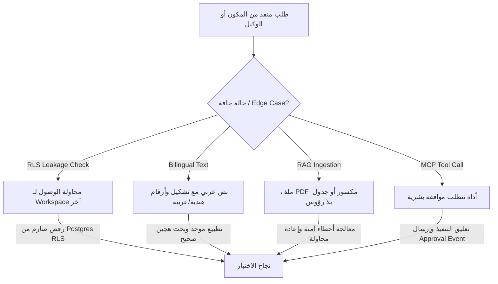

# Testing Philosophy and Test Matrix

تعتمد **منصة Aqli RAG** فلسفة اختبار مؤسسية حازمة تقوم على نموذج المصنع (The Factory Model) والهندسة الموجهة بالوكلاء (Agentic Engineering). في هذه المعمارية، تُعتبر الاختبارات والتأكيدات الحتمية (Deterministic Quality Gates) بمثابة **العقد الصارم (Contract)** بين المهندسين البشر ووكلاء التطوير بالذكاء الاصطناعي (AI Coding Agents).

تُفرّق المنصة بوضوح تام بين نوعين من التحقق:
1. **الاختبارات الحتمية (Deterministic Tests)**: وهي موضوع هذا المستند، حيث تُقاس المخرجات بأسلوب مدخل/مخرج متوقع برمجياً بنسبة 100% (مثل: العزل بين المستأجرين، تشفير البيانات، معالجة النصوص العربية، وتدفقات MCP).
2. **التقييمات غير الحتمية (Non-Deterministic Evals)**: الخاصة بجودة الاسترجاع ودقة توليد LLM ومعدلات التهلوس، والمفضلة بالتفصيل في المستند التالي [Eval Suite and CI Quality Gates](./02-eval-suite-and-ci-quality-gates.md).

---

## 1. فلسفة الاختبار (Agentic Testing Philosophy)

* **الشفافية والحتمية قبل التوليد (Shift-Left Verification)**: لا يُسمح لأي وكيل تطوير (Agent) بدمج شفرة برمجية جديدة ما لم تمر بكافة بوابات الاختبار الحتمية محلياً وفي بيئة التكامل المستمر (CI).
* **قاعدة العزل المطلق للمستأجرين (Zero-Trust Multi-Tenancy)**: يُعامل تسريب البيانات بين مساحات العمل (`workspace_id`) كخطأ كارثي (P0 Security Severity) يوقف أنبوب النشر فوراً.
* **تغطية حالات الحواف الثنائية اللغة (Arabic/English Edge Cases)**: البرمجيات الموجهة للمستخدم العربي تميل للسقوط في مشاكل التطبيع النصي، اتجاه الواجهة (RTL/LTR)، والترميز (UTF-8). تُبنى الاختبارات للتحقق من هذه الحالات كمتطلبات أساسية وليست ثانوية.
* **سرعة التغذية الراجعة (Sub-Minute Feedback Loop)**: يجب أن تُنفذ كافة اختبارات الوحدة والشفرات البرمجية الحرجة خلال أقل من 45 ثانية لتوفير سياق سريع لوكلاء التطوير أثناء جولات التكرار (Iterative Coding Loops).

---

## 2. مصفوفة طبقات الاختبار (Test Matrix Strategy)

| طبقة الاختبار (Layer) | أدوات التنفيذ (Tooling) | النطاق المستهدف (Scope) | معيار النجاح (Success Criteria) | دورها في تطوير الوكلاء (Agent Harness) |
| :--- | :--- | :--- | :--- | :--- |
| **Unit Testing** | `Vitest` | - منطق تطبيع النص العربي (`alef/hamza/tashkeel`).<br>- استراتيجيات `Semantic Chunking` و`Table Extraction`.<br>- دالّات تشفير غلاف البيانات (`Envelope Encryption`).<br>- محولات المزودين (`Provider Adapters`). | تغطية كود $\ge 90\%$، زوال كافة الأخطاء النحوية والهيكلية، زمن تنفيذ $< 15s$. | تُشغَّل تلقائياً بواسطة المطور/الوكيل قبل كل عملية `commit`. |
| **Integration Testing** | `Vitest` + `Testcontainers` (PostgreSQL/pgvector) | - سياسات RLS في PostgreSQL.<br>- البحث الهجين (`BM25` + `Vector` + `pg_trgm`).<br>- أنبوب جلب ومعالجة المستندات (Ingestion Pipeline).<br>- بروتوكول `MCP Tool Approvals`. | نجاح $100\%$ من استعلامات RLS، منع الاستعلامات عابرة المستأجرين، مطابقة مخرجات الموصلات. | تفحص تفاعل الشفرة مع قاعدة البيانات والخدمات الحقيقية. |
| **End-to-End (E2E)** | `Playwright` | - مسار Onboarding وتعديل الموصلات.<br>- واجهة الدردشة وملاحظات الاستشهاد (Citations).<br>- التبديل بين الأوضاع (`Strict` / `Augmented` / `Open`).<br>- التبديل الديناميكي للغات وRTL/LTR. | استكمال المسارات الحرجة بدون أخطاء Console أو كسر للواجهة، زمن تنفيذ $< 3m$. | تُنفَّذ كبوابة حراسة قبل الدمج إلى فرع `main`. |
| **Security & Isolation** | `Vitest` + Custom Security Harness | - محاولة اختراق عزل `workspace_id`.<br>- فحص تسريب المفاتيح في سجلات التدقيق (`Audit Logs`).<br>- التحقق من صلاحيات تنفيذ أدوات MCP. | صفر تسريب بيانات ($0\%$ Leakage)، حجب كلي للطلبات غير المصرّح بها. | تُعتبر خافق إنذار حاسم؛ أي فشل يُلغي التغيير فوراً. |

---

## 3. مصفوفة حالات الاختبار الحرجة وحالات الحواف (Critical Test Cases & Edge Cases)

تغطي هذه المصفوفة "مشكلة الـ 80%" (The 80% Problem) من الثغرات والأخطاء غير المتوقعة التي عادة ما تفوت وكلاء الذكاء الاصطناعي أثناء توليد الكود:



### أولاً: عزل المستأجرين وأمن البيانات (Multi-Tenancy & Security)

| معرّف الاختبار | الحالة / السيناريو | المدخلات (Inputs) | النتيجة المتوقعة (Expected Outcome) | بوابة التحقق |
| :--- | :--- | :--- | :--- | :--- |
| `SEC-001` | محاولة جلب متجهات تنتمي لمستأجر آخر عبر البحث الدلالي | استعلام `pgvector` مع `workspace_id = 'WS-A'` باستعمال رمز مصادقة يتبع لـ `WS-B`. | إرجاع $0$ نتائج، ورمي استثناء RLS Denied دون كشف وجود المستندات. | Integration Test (`Vitest`) |
| `SEC-002` | تسريب مفاتيح API في سجلات التدقيق (`Audit Logs`) | إرسال استدعاء لنموذج Gemini باستخدام مفتاح مشفر عبر `pgcrypto`. | ظهور المفتاح مُقنّعاً (`sk-****-1234`) في كافة السجلات والمخرجات. | Unit Test (`Vitest`) |
| `SEC-003` | محاولة تنفيذ أداة MCP بدون موافقة صريحة (`Tool Approval`) | أمر تنفيذ أداة حذف أو تعديل عبر خادم MCP خارجي في وضع `Strict`. | تعليق الحالة عند `Requires Approval` وعدم إرسال Payload للخدمة الخارجية. | Integration Test (`Vitest`) |

### ثانياً: معالجة النصوص ثنائية اللغة والتطبيع (Bilingual & Text Normalization)

| معرّف الاختبار | الحالة / السيناريو | المدخلات (Inputs) | النتيجة المتوقعة (Expected Outcome) | بوابة التحقق |
| :--- | :--- | :--- | :--- | :--- |
| `LANG-001` | مطابقة النصوص العربية مع تنوع الهمزات والتشكيل | البحث عن "استراتيجية" بنص يحتوي "إستراتيجيّةُ". | مطابقة دقيقة عبر `pg_trgm` وBM25 بعد التطبيع النصي الموحد. | Unit Test (`Vitest`) |
| `LANG-002` | معالجة مستندات مختلطة (عربي/إنجليزي) ورموز برمجية | ملف PDF يحتوي فقرات برمجية Python بلغة إنجليزية ضمن شريح نصوص عربي. | تقسيم المقاطع (`Chunking`) مع الحفاظ على اتجاه الأسطر وسلامة الكود بدون تشويه. | Integration Test (`Vitest`) |
| `LANG-003` | اتجاه واجهة الدردشة التفاعلي (Dynamic RTL/LTR) | استجابة تحتوي نصاً إنجليزياً يتخلله اقتباس عربي من المصدر. | ضبط محلي لاتجاه النص (`dir="rtl"` للفقرة، و`dir="ltr"` للـ Code Block) تلقائياً. | E2E Test (`Playwright`) |

### ثالثاً: خط أنابيب RAG معالجة المستندات (RAG Pipeline & Edge Cases)

| معرّف الاختبار | الحالة / السيناريو | المدخلات (Inputs) | النتيجة المتوقعة (Expected Outcome) | بوابة التحقق |
| :--- | :--- | :--- | :--- | :--- |
| `RAG-001` | معالجة ملفات مكسورة أو فارغة | رفع ملف PDF بحجم 0 байт أو محتوى مشوه (Corrupted Binary). | التقاط الخطأ في Queue Job، تحديث حالة المصدر إلى `FAILED` مع رسالة خطأ صريحة. | Integration Test (`Vitest`) |
| `RAG-002` | معالجة الجداول المعقدة بدون رؤوس صريحة | مستند ماليات يحتوي جداول ممتدة عبر عدة صفحات عبر `Mistral Document AI`. | استخراج الجدول كـ Markdown هيكلي مع محاذاة الحقول وتسميتها بدقة. | Integration Test (`Vitest`) |
| `RAG-003` | تجاوز حد الاستدعاء لمزود التضمين (`Embedding Rate Limit`) | دفق 10,000 مقطع نصوص دفعة واحدة لـ `gemini-embedding-2`. | تفعيل آلية `Exponential Backoff` في Vercel Queues ونجاح معالجة الأجزاء دون إخفاق الكود. | Integration Test (`Vitest`) |

---

## 4. بوابات الجودة الحتمية في أنبوب CI/CD (Deterministic Quality Gates)

لضمان عدم انحدار كود المنصة أثناء استخدام الـ AI Agents، يُطبق أنبوب التكامل المستمر (CI Pipeline) الفحوصات الحتمية التالية بصورة إلزامية قبل أي عملية Merge:

```bash
# تسلسل بوابات الجودة الحتمية (Deterministic Gates Sequence)
pnpm run lint             # 1. Static Analysis & ESLint Rules
pnpm run typecheck        # 2. Strict TypeScript Validation (tsc --noEmit)
pnpm run test:unit        # 3. Fast Unit Tests Execution (Vitest)
pnpm run test:integration # 4. Database RLS & Service Integration Tests
pnpm run test:e2e         # 5. Playwright UI Core Flows
```

### مستهدفات التغطية الحتمية (Coverage Thresholds)

```json
{
  "coverageThreshold": {
    "global": {
      "branches": 80,
      "functions": 85,
      "lines": 85,
      "statements": 85
    },
    "./src/lib/security/": {
      "branches": 100,
      "functions": 100,
      "lines": 100,
      "statements": 100
    },
    "./src/lib/rag/text-processing/": {
      "branches": 95,
      "functions": 95,
      "lines": 95,
      "statements": 95
    }
  }
}
```

---

## 5. الخطوات التالية للتقييمات غير الحتمية

بعد استيفاء الاختبارات الحتمية وضمان سلامة معمارية التطبيق والعزل الأمني، يتم تفويض فحص **جودة التوليد، دقة الاسترجاع، ومعدلات التهلوس (Hallucination)** إلى جناح التقييمات الشامل الموضح في المستند التالي:
[Eval Suite and CI Quality Gates](./02-eval-suite-and-ci-quality-gates.md).