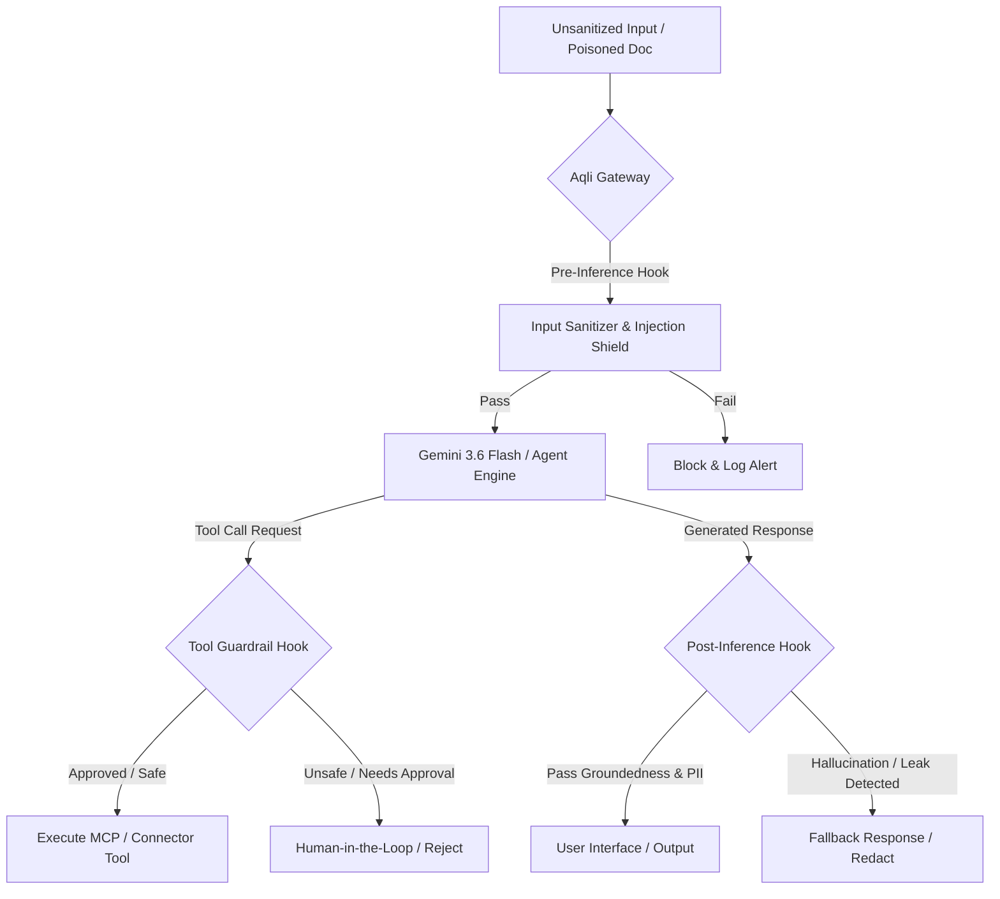

# Threat Model and Deterministic Hooks

يوفر هذا المستند توصيفاً شاملاً لنموذج التهديدات (Threat Model) وهندسة الضوابط الحتمية (Deterministic Hooks Engine) لمنصة **Aqli RAG**. صُممت هذه الطبقة الأمنية لضمان عدم خروج الوكلاء التوليديين (AI Agents) عن نطاق الصلاحيات، ولتوفير حماية صارمة ضد هجمات الذكاء الاصطناعي الحديثة (OWASP Top 10 for LLM Applications) في بيئة متعددة المستأجرين (Multi-Tenant SaaS) تدعم اللغة العربية والإنجليزية.

---

## 1. تحليل المخاطر ونموذج التهديدات (STRIDE & OWASP LLM)

تتعرض منصة **Aqli RAG** لتهديدات متقدمة نتيجة طبيعتها كـ Hybrid RAG تدمج بين جلب البيانات الداخلية عبر `pgvector` والبحث في الويب والاتصال بخوادم MCP خارجية.



### جدول التهديدات الرئيسية والآليات الدفاعية

| معرف التهديد | فئة OWASP LLM | التهديد المباشر في منصة Aqli RAG | التأثير والمخاطر | آلية المعالجة الحتمية (Deterministic Mitigation) |
|---|---|---|---|---|
| **TR-01** | **LLM01: Prompt Injection** | حقن تعليمات خبيثة داخل المستندات المرفوعة (Indirect) أو عبارات البحث (Direct) لتجاوز نمط العمل (Strict Mode). | اختراق شخصية الوكيل، تنفيذ أدوات غير مصرح بها، أو تسريب بيانات سياقية. | فحص حتمي قبل الاستدلال (Regex + Dual-LLM Pre-Filter) + عزل مدخلات RAG في وسم `<context_untrusted>` محدد. |
| **TR-02** | **LLM02: Sensitive Info Leakage** | استرجاع متجهي (Vector Search) يعيد نصوصاً مملوكة لمستأجر آخر نتيجة خطأ في استعلام `pgvector` أو تداخل الفهارس. | تسريب بيانات عملاء آخرين (Cross-Tenant Data Breach) وانتهاك GDPR/HIPAA. | تفعيل RLS إجباري مع إلحاق شروط `workspace_id` دائمًا في شجرة استعلام SQL قبل التنفيذ. |
| **TR-03** | **LLM06: Excessive Agency** | استدعاء الوكيل لأدوات MCP خارجية (مثل حذف ملفات، تعديل صفوف، أو إرسال Webhook) بدون تأكيد أو قيود صلاحية. | تغييرات غير مرغوبة في قواعد بيانات العميل أو أنظمة خضرية خارجية. | نظام موافقات صريح (Tool Approval Engine) + تقييد المخطط (Zod Schema Validation) + بيئة معزولة (Sandbox Execution). |
| **TR-04** | **LLM09: Overreliance / Hallucination** | توليد معلومات كاذبة أو مضللة في الوضع المقيد (Strict Mode) وزعم وجودها في المستندات. | اتخاذ قرارات عمل خاطئة بناءً على إجابات وهمية غير مدعومة باستشهادات حقيقية. | فحص مطابقة حتمي (Groundedness Score Check) بواسطة `gemini-3.5-flash-lite` وتصحيح العودة (Fallback) في حال انخفاض النسبة عن 0.85. |
| **TR-05** | **LLM08: Vector & Data Poisoning** | رفع مستندات تحتوي على نصوص بيضاء مخفية أو وسوم مضللة لتوجيه نتائج البحث الدلالي لصالح مهاجم. | إفساد نتائج الاسترجاع والتأثير على إجابات جميع مستخدمي مساحة العمل. | تطبيعي ومسح وسوم HTML/CSS أثناء المعالجة (Ingestion Pipeline) + حساب تقييم الثقة في المصدر قبل الفهرسة. |

---

## 2. محرك الخطاطات الحتمية (Deterministic Lifecycle Hooks Engine)

تعتمد منصة Aqli RAG على طبقة وسيطة حتمية (Deterministic Middleware Framework) تحيط بجميع استدعاءات `AI SDK 7` ومحرك الاستدلال. لا تُترك أي قرارات أمنية حاسمة لنماذج الذكاء الاصطناعي نفسها.

### 2.1 حطاطات ما قبل الاستدلال (Pre-Inference Hooks)

تنفذ هذه الحطاطات قبل إرسال الطلب إلى `gemini-3.6-flash` أو أي نموذج آخر:

1. **`sanitizeInputHook`**:
   - تطهير المدخلات النصية من أي وسوم Control Characters أو خداع الترميز (Unicode Steganography / RTL Override Injection).
   - توحيد النصوص العربية (إزالة التشكيل المضلل، توحيد الهمزات والألف للحد من التلاعب النصي).
2. **`enforceWorkspaceIsolationHook`**:
   - حصر استعلام المتجهات بـ `workspace_id` الحالي حتمياً على مستوى البرمجية وليس عبر Prompt.
3. **`strictModeContextGuard`**:
   - في حالة وضع `Strict Mode`: إذا كانت قاعدة استرجاع المستندات خالية (`retrieved_chunks.length === 0`)، يتم إلغاء استدعاء النموذج فوراً وإعادة إجابة ثابته: *"لم يتم العثور على سياق كافٍ في مساحة المعرفة لتلبية الطلب في الوضع المقيد."*

```typescript
// Example Implementation: Pre-Inference Pipeline Integration
import { z } from "zod";

export interface SecurityContext {
  workspaceId: string;
  userId: string;
  mode: "strict" | "augmented" | "open";
}

export async function preInferenceGuardrail(
  prompt: string,
  context: SecurityContext,
  retrievedChunks: Array<{ id: string; content: string }>
) {
  // 1. Unicode & RTL Normalization Shield
  const sanitizedPrompt = prompt
    .replace(/[\u200B-\u200D\uFEFF]/g, "") // Strip zero-width chars
    .trim();

  // 2. Strict Mode Mandatory Grounding Guard
  if (context.mode === "strict" && retrievedChunks.length === 0) {
    return {
      blocked: true,
      reason: "STRICT_MODE_NO_CONTEXT",
      fallbackResponse: context.workspaceId.startsWith("ar") 
        ? "عذراً، لا تتوفر معلومات كافية في المستندات المتاحة لإجابة سؤالك في الوضع المقيد."
        : "No relevant information found in the knowledge base under Strict Mode."
    };
  }

  // 3. Prompt Injection Heuristic Pattern Check
  const injectionPatterns = [
    /ignore previous instructions/i,
    /تجاهل التعليمات السابقة/i,
    /system prompt override/i,
    /تخطى القيود الأمنية/i
  ];
  
  const hasInjectionAttempt = injectionPatterns.some(pattern => pattern.test(sanitizedPrompt));
  if (hasInjectionAttempt) {
    return {
      blocked: true,
      reason: "PROMPT_INJECTION_DETECTED",
      fallbackResponse: "تم رفض الطلب لاحتوائه على أنماط غير مسموح بها."
    };
  }

  return { blocked: false, sanitizedPrompt };
}
```

### 2.2 حطاطات تنفيذ الأدوات وMCP (Tool & MCP Execution Hooks)

عندما يقرر الوكيل استدعام أداة (Tool Call) أو الاتصال بـ MCP Server، تمر الأداة عبر خطاطة التحقق الحتمي:

1. **`validateToolCallSchema`**: التحقق من مطابقة المدخلات للنموذج الهيكلي (Zod Schema Validation).
2. **`verifyToolPermissions`**: التأكد من أن دور المستخدم (RBAC) يمتلك صلاحية تشغيل الأداة (مثال: أداة `delete_document` تتطلب دور `workspace_admin`).
3. **`humanInTheLoopApproval`**: إن كانت الأداة مصنفة كـ `High Risk` (مثل تعديل بيانات أو استدعاء MCP خارجي مدفوع)، يتم إيقاف تنفيذ الوكيل وإرسال طلب موافقة إلى واجهة المستخدم عبر استجابة متدفقة مع مفتاح موافقة محدد.

```typescript
// Tool Execution Guardrail Configuration
export const toolGuardrailPolicy = {
  "get_search_citations": { riskLevel: "LOW", requiresApproval: false },
  "execute_sql_query": { riskLevel: "CRITICAL", requiresApproval: true, allowedRoles: ["workspace_admin"] },
  "external_mcp_fetch": { riskLevel: "MEDIUM", requiresApproval: false, rateLimitPerMin: 20 },
  "delete_workspace_source": { riskLevel: "HIGH", requiresApproval: true, allowedRoles: ["workspace_admin"] }
} as const;
```

### 2.3 حطاطات ما بعد الاستدلال (Post-Inference Hooks)

قبل تسليم الإجابة إلى واجهة المستخدم، تُنفذ الحطاطات التالية:

1. **`piiRedactionHook`**: فحص الإجابة المولدة وإخفاء البيانات الحساسة (أرقام بطاقات الائتمان، الهويات الوطنية، مفاتيح API) باستخدام التعبير النمطي الحتمي ووظائف التحليل المتقدم.
2. **`groundednessCheckHook`**: قياس نسبة الاقتباس للرد مقابل القطع النصية المجلوبة (Retrieved Chunks). إذا انخفض التقييم عن **0.85** في `Strict Mode`، يُلغى الرد أو يُرفق بتحذير صريح.
3. **`citationVerifierHook`**: التأكد من أن جميع الاستشهادات المرجعية (Citations) المذكورة في النص تمتد إلى مراجع حقيقية وتملك `chunk_id` صحيح وموجود في قاعدة البيانات.

---

## 3. مصفوفة الخطط العلاجية ومعايير القبول (Mitigation Matrix & Criteria)

تحدد القائمة التالية معايير القبول البرمجية واختبارات التحقق الأمنية الصارمة للتأكد من فاعلية التهديدات وحطاطات الأمن قبل الاعتماد في الإنتاج:

### جدول التحقق والمعايير

```
[ ] 1. عزل المستأجرين (Tenant Isolation Audit)
    ├─ المعيار: لا يمكن لأي استعلام pgvector جلب Chunks لا تنتمي لـ workspace_id الحالي.
    ├─ أسلوب التحقق: Run Automated Integration Tests محاكية لاستعلامات هجينة بدون تمرير ID ويجب أن تعيد 0 نتائج بسبب RLS.
    └─ الربط السلسلة: راجع [Sandbox, Secrets, Supply Chain, and Compliance](./02-sandbox-secrets-supply-chain-and-compliance.md) لتفاصيل سياسات RLS.

[ ] 2. حماية حقن التعليمات الحثية (Prompt Injection Immunity)
    ├─ المعيار: فشل 100% من هجمات الحقن المباشر وغير المباشر الشائعة في اختراق شخصية الوكيل أو الوصول لبيانات بيئية.
    ├─ أسلوب التحقق: تشغيل مجموعة اختبارات OWASP Benchmark للغة العربية والإنجليزية عبر RAG Eval Harness.
    └─ النتيجة المقبولة: Blocked أو Safe Fallback دون استجابة للأمر المحقون.

[ ] 3. التحقق الحتمي من استدعاء الأدوات (Tool Execution Safety)
    ├─ المعيار: يُحظر تماماً تنفيذ الأدوات عالية المخاطر بدون توقيع موافقة من العميل (Human-in-the-Loop Token).
    ├─ أسلوب التحقق: استدعاء أداة delete_workspace_source محاكاة والتأكد من توقف الوكيل وإرجاع حالة ACTION_REQUIRED.
    └─ النتيجة المقبولة: HTTP 202 مع Payload يتضمن approval_id.

[ ] 4. إخفاء البيانات الشخصية والحساسة (PII Sanitization)
    ├─ المعيار: حجب أرقام الهواتف، البطاقات البنكية، والمفاتيح السرية تلقائياً من المخرجات.
    ├─ أسلوب التحقق: اختبار إدخال نص يحتوي على مفاتيح API وهمية وتأكيد استبدالها بـ [REDACTED_KEY].
    └─ النتيجة المقبولة: تطابق المخرجات مع معايير الحجب المقررة.
```

---

## 4. التكامل مع معمارية النظام والأدوات المجاور

تتكامل حطاطات التهديدات والدعم الحتمي بشكل مباشر مع بقية أجزاء الحزمة الأمنية للمنصة:
- سياسات حظر الوصول وعزل الحاويات البرمجية موثقة في [Sandbox, Secrets, Supply Chain, and Compliance](./02-sandbox-secrets-supply-chain-and-compliance.md).
- يتم تسجيل جميع الأحداث وحالات الحظر الصادرة عن Deterministic Hooks في سجل التدقيق الموحد (Audit Log Engine) للتوافق مع تشريعات GDPR وHIPAA.