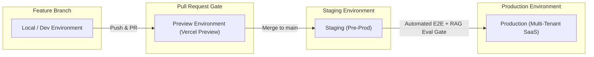
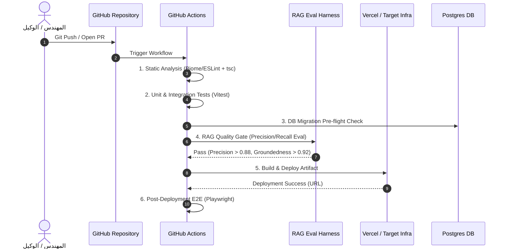

# Environments, CI/CD, and Deployment

تحدد هذه الوثيقة مواصفات بيئات التشغيل، وأنابيب التكامل والتسليم المستمر (CI/CD)، واستراتيجيات النشر والاسترجاع (Rollback) لمنصة **Aqli RAG**. صُمِّمَت هذه العمليات لتلبية متطلبات المؤسسات الصارمة في الأمان والعزل (Multi-Tenant RLS)، مع ضمان استقرار نماذج الذكاء الاصطناعي وعمليات التضمين (Embeddings) واستعلامات المتجهات دون انقطاع في الخدمة.

---

## 1. بيئات التشغيل وهيكلية الترقية (Environments & Promotion Flow)

تتألف المنصة من ثلاث بيئات تشغيلية رئيسية معزولة تمامًا لمنع تسرّب البيانات الضمانية أو التداخل في فضاء المتجهات (Vector Space).



### مصفوفة مقارنة بيئات التشغيل

| الخاصية | بيئة التطوير (Local/Dev) | بيئة المعاينة والتجهيز (Preview/Staging) | بيئة الإنتاج (Production) |
| :--- | :--- | :--- | :--- |
| **الغرض** | التطوير اليومي واختبار الوكلاء | اختبار التكامل والتقييم قبل الدمج | الخدمة المباشرة للمستخدمين |
| **النطاق (Domain)** | `localhost:3000` | `staging.aqli.ai` / `*-aqli.vercel.app` | `app.aqli.ai` / نطاقات المؤسسات |
| **عزل قاعدة البيانات** | Docker Postgres محلي مع `pgvector` | قاعدة بيانات Staging مع RLS مفعّل ومحتوى زائف (Synthetic Data) | Cluster أصلية مع RLS مشددة، `pgcrypto` وKMS |
| **فهرس المتجهات** | HNSW محلي ببيانات اختبار محدودة | `pgvector` مقسّم مع بيانات اختبار ثنائية اللغة | `pgvector` مقسّم مع Partial Index لكل Workspace |
| **مزود الذكاء الاصطناعي** | Gemini Flash-Lite / Mock Providers | Gemini 3.5 Flash-Lite & 3.6 Flash (Staging Keys) | Production API Keys مع Rate Limiting وFailover |
| **إدارة الأسرار** | ملف `.env.local` مشفر | Vercel Environment Variables (Preview/Staging) | Doppler / AWS Secrets Manager + `pgcrypto` |
| **هدف النشر** | Local Node.js / Turbopack | Vercel Preview Deployments / Staging K8s Namespace | Vercel Production Edge/Serverless أو K8s Pods |

---

## 2. مراحل أنابيب CI/CD (Pipeline Stages)

تدار كافة عمليات البناء والاختبار والنشر عبر GitHub Actions بالتكامل مع Vercel وTurborepo لتسريع التنفيذ عبر التخزين المؤقت المشترك (Remote Caching).



### تفاصيل مراحل الأنبوب (Pipeline Breakdown)

```yaml
# .github/workflows/ci-cd-pipeline.yml (نموذج مواصفات خط الإنتاج)
name: Aqli RAG CI/CD Pipeline

on:
  push:
    branches: [main]
  pull_request:
    branches: [main]

jobs:
  quality-gate:
    runs-on: ubuntu-latest
    timeout-minutes: 10
    steps:
      - uses: actions/checkout@v4
      - uses: pnpm/action-setup@v3
      - uses: actions/setup-node@v4
        with:
          node-version: 20
          cache: 'pnpm'

      - name: Install Dependencies
        run: pnpm install --frozen-lockfile

      - name: Typecheck & Lint
        run: |
          pnpm run typecheck
          pnpm run lint

      - name: Unit & Integration Tests
        run: pnpm test:ci
        env:
          DATABASE_URL: ${{ secrets.TEST_DATABASE_URL }}

  rag-eval-gate:
    needs: quality-gate
    runs-on: ubuntu-latest
    timeout-minutes: 15
    steps:
      - uses: actions/checkout@v4
      - name: Run RAG Retrieval & Generation Evals
        run: pnpm run eval:rag
        env:
          GEMINI_API_KEY: ${{ secrets.STAGING_GEMINI_API_KEY }}
          EVAL_DATASET_PATH: ./evals/datasets/ar-en-groundtruth.json

  deploy-staging:
    needs: rag-eval-gate
    if: github.ref == 'refs/heads/main'
    runs-on: ubuntu-latest
    steps:
      - name: Deploy to Staging Target
        run: pnpm exec vercel deploy --prebuilt --token=${{ secrets.VERCEL_TOKEN }}

  e2e-tests:
    needs: deploy-staging
    runs-on: ubuntu-latest
    steps:
      - name: Playwright E2E Verification
        run: pnpm test:e2e
        env:
          BASE_URL: ${{ steps.deploy.outputs.preview_url }}
```

#### قواعد التجاوز والفشل (Pass/Fail Criteria)
1. **التحليل الساكن والأنواع**: لا يُسمح بوجود أي أخطاء TypeScript (`strict: true` و`noUncheckedIndexedAccess`).
2. **اختبارات الوحدة**: نسبة تغطية الأكواد (Code Coverage) يجب ألا تقل عن **80%** للخدمات الأساسية و**90%** لمعالجات RLS والأمان.
3. **بوابة تقييم RAG (RAG Eval Gate)**:
   - **Context Recall**: $\ge 0.85$ في المستندات الثنائية اللغة (عربي/إنجليزي).
   - **Faithfulness / Groundedness**: $\ge 0.90$ لتجنب الهلوسة في الردود.
   - **Latency (P95)**: أقل من 1200ms لمعالجة Re-ranking وسياق Hybrid Search.

---

## 3. أهداف النشر والبنية التحتية (Deployment Targets & DB Strategy)

تعتمد المنصة معمارية خالية من حالة الخادم (Stateless Edge/Serverless) مع التخصيص للمهام الطويلة عبر Vercel Workflows أو K8s Background Workers.

```
+-----------------------------------------------------------------------+
|                           Traffic Ingress                             |
|                Cloudflare WAF / Enterprise Gateway                    |
+-----------------------------------------------------------------------+
                                   |
                  +----------------+----------------+
                  |                                 |
                  v                                 v
+-----------------------------------+ +-----------------------------------+
|     Primary: Vercel Cloud         | | Self-Hosted / Enterprise K8s      |
| - Next.js 16.2 App Router (Edge)  | | - Docker Image (Node.js Standalone)|
| - Serverless Functions (Inference)| | - Helm Deployment (Multi-Region)  |
| - Vercel Queues (Ingestion Jobs)  | | - BullMQ + Redis for Job Queue  |
+-----------------------------------+ +-----------------------------------+
                  |                                 |
                  +----------------+----------------+
                                   |
                                   v
+-----------------------------------------------------------------------+
|                         Managed Postgres Database                     |
|  - pgvector (HNSW Indexing)       - pgcrypto Column Encryption        |
|  - Multi-Tenant RLS Enforcement   - Read Replicas for Hybrid Search   |
+-----------------------------------------------------------------------+
```

### استراتيجية الهجرة الخالية من التوقف (Zero-Downtime Database Migration)

نظراً لاحتواء قاعدة البيانات على امتدادات حاسمة مثل `pgvector` وسجلات مشفرة عبر `pgcrypto` وسياسات RLS، تُطبق الخطوات التالية لمنع إغلاق الجداول (Table Locking):

1. **إضافة الأعمدة والسياسات بدون قفل متزامن**:
   - يتم تشغيل تعديلات المخطط (Schema Changes) باستخدام استراتيجية **Expand and Contract**.
   - إضافة الفهارس المتجهية تتم باستخدام الأمر غير القابل للحظر:
     ```sql
     CREATE INDEX CONCURRENTLY IF NOT EXISTS idx_workspace_chunks_embedding 
     ON document_chunks 
     USING hnsw (embedding vector_cosine_ops)
     WHERE (workspace_id IS NOT NULL);
     ```
2. **فصل عمليات الهجرة عن التجميع البنائي (Decoupled Migration)**:
   - لا تُنفَّذ المهاجرة تلقائياً أثناء أمر `build`. بل عبر خطوة منفصلة Pre-deployment Job في CI/CD مع التحقق من عدم وجود Lock Conflict.
3. **توافق سياسات RLS العكسي**:
   - كل تغيير في سياسات Row-Level Security يجب أن يدعم النسخة الحالية والنسخة السابقة من التطبيق في الوقت نفسه لضمان استمرار عمل الـ Active Containers أو Serverless Lambdas أثناء فترة الانتقال.

---

## 4. استراتيجية الإدراج والتراجع (Deployment & Rollback Strategy)

تستخدم المنصة نموذج النشر التدريجي (Canary Deployment) بالتكامل مع اختبار الدخان الآلي.

### جدول معايير النشر واستراتيجية التراجع

| نوع الترقية | استراتيجية النشر | نسبة التدرج الزمني | شرط التراجع التلقائي (Auto-Rollback Trigger) |
| :--- | :--- | :--- | :--- |
| **أكواد Frontend / UI** | Vercel Instant Traffic Shift | 10% -> 50% -> 100% خلال 15 دقيقة | ارتفاع أخطاء 5xx أعلى من 0.5% |
| **أكواد AI SDK / Prompts** | Dynamic Feature Flag Routing | 5% -> 25% -> 100% خلال ساعة | انخفاض درجة Groundedness عن 0.85 أو ارتفاع Latency > 2.5s |
| **تعديلات Database / RLS** | Blue-Green Schema Dual-write | 0% -> 100% فور التحقق | وجود Lock contention أو أخطاء Permission Denied في RLS |
| **مكينات معالجة Ingestion** | Worker Canary Group | 1 Queue Worker -> All Workers | فشل معالجة الملفات (Extraction Failures) بنسبة > 2% |

### خطوات التراجع السريع (Rollback Protocol Checklist)

عند حدوث تنبيه حرِج أو فشل في مؤشرات الأداء الرئيسي بعد النشر:

- [ ] **الخطوة 1 (Traffic Routing)**: تحويل جميع حركة المرور فوريًا إلى النسخة المستقرة السابقة (Deployment Alias Rollback عبر Vercel CLI أو Kubernetes Service selector) خلال أقل من 30 ثانية.
  ```bash
  # أمر التراجع الفوري على Vercel
  pnpm exec vercel alias set <PREVIOUS_SUCCESSFUL_DEPLOYMENT_BUILD_ID> app.aqli.ai
  ```
- [ ] **الخطوة 2 (Feature Flag Isolation)**: إذا كان الخلل مقتصرًا على نموذج معين أو أداة MCP، يتم إيقاف الأداة عبر لوحة التحكم الديناميكية (Feature Flag) دون الحاجة لإعادة نشر الكود.
- [ ] **الخطوة 3 (DB Compatibility Check)**: التأكد من عدم استخدام التراجع لإسقاط أعمدة أو تغيير أنواع بيانات المتجهات التي أضيفت في المهاجرة الأخيرة، بفضل اتباع قواعد التوافق التراجعي (Backward-compatible Schema).
- [ ] **الخطوة 4 (Vector Re-indexing Rollback)**: في حال تبديل نموذج التضمين (e.g., Gemini Embedding 2) ووجود خلل، يتم إعادة توجيه الاستعلامات إلى فهرس المتجهات القديم المتروك مؤقتًا (Dual Index Window لمدة 48 ساعة).

---

## 5. العقود واختبارات التحقق المعتمدة للوكلاء (Agent Verification Contracts)

لضمان عمل وكلاء الذكاء الاصطناعي وخط إنتاج CI/CD بدون أخطاء بشرية أو انحرافات غير متوقعة، تم تحديد معايير القبول والتحقق التالية:

### قائمة معايير القبول (Acceptance Criteria Checklist)

- [ ] **عقد النشر الآلي**: لا يتطلب أي نشر إلى بيئة الإنتاج تدخلًا يدويًا أو تعديلًا مباشرًا على خوادم الإنتاج (Fully Automated GitOps Pipeline).
- [ ] **عقد عزل المستأجرين (RLS Validation)**: يتضمن خط CI/CD اختبارًا آليًا يضمن عدم إمكانية جلب أي `document_chunk` ينتمي لـ `workspace_id` آخر حتى لو أُجري بحث دلالي موجه بقيمة Vector مشابهة 100%.
- [ ] **عقد أداء البحث الهجين (Hybrid Search Latency)**: استعلامات `BM25 + pgvector HNSW` يجب ألا تتجاوز 150ms في بيئة Production عند حجم 1,000,000 مقطع نصي.
- [ ] **عقد التبديل التلقائي للنماذج (Inference Fallback)**: عند وصول Gemini 3.6 Flash إلى حد الاستخدام (Rate Limit 429)، يجب أن يتحول النظام تلقائيًا خلال أقل من 100ms إلى Gemini 3.5 Flash-Lite مع إرسال سجل تدقيق.
- [ ] **عقد المراقبة والجاهزية**: توفر المسارات `/api/health` و`/api/readiness` مؤشرات دقيقة عن حالة الاتصال بقاعدة البيانات، امتداد `pgvector`، ومصادقة محركات الذكاء الاصطناعي.

للمزيد حول كيفية إعداد أجهزة التتبع وسجلات التدقيق ومراقبة مؤشرات الخدمة، يرجى المراجعة التفصيلية في وثيقة [Observability, SLOs, and Cost Governance](./02-observability-slos-and-cost-governance.md).