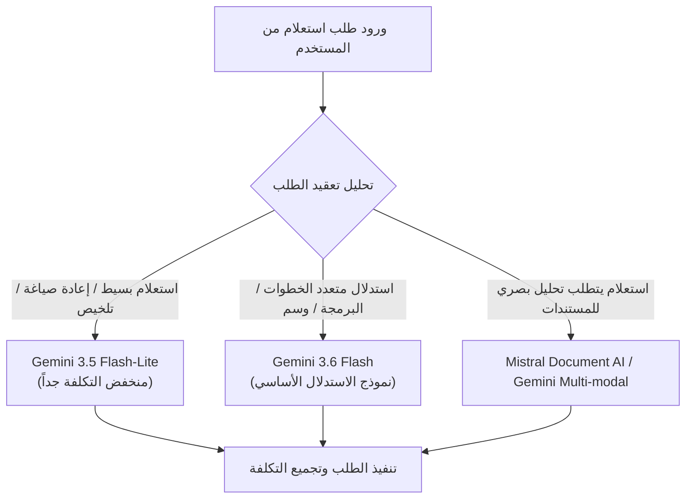

# Observability, SLOs, and Cost Governance

تحدد هذه الوثيقة المعايير المؤسسية للمراقبة الممتدة (Observability)، وتتبع الوكلاء (Agent Telemetry)، وأهداف مستوى الخدمة (SLOs)، وسياسات إدارة التكاليف وحوكمتها لمنصة **Aqli RAG**. نظراً لطبيعة النظام كـ SaaS متعدد المستأجرين (Multi-Tenant) يعتمد على الذكاء الاصطناعي الهجين والتعامل مع بيانات حساسة، فإن نظام المراقبة يدمج بين تتبع الأداء التقني التقليدي وتتبع جودة الاستدلال والاسترجاع وتكاليف الرموز (Tokens).

للاطلاع على كيفية بناء خطوط التجميع والنشر التلقائي التي تغذي هذه البيئات، يرجى مراجعة وثيقة [Environments, CI/CD, and Deployment](./01-environments-ci-cd-and-deployment.md).

---

## 1. بنية المراقبة الشاملة (Observability Architecture)

تعتمد المنصة على معيار **OpenTelemetry (OTel)** الموحد لجمع السجلات، والآثار (Traces)، والمقاييس (Metrics)، مع ربط كل عنصر بسياق المستأجر (`workspace_id`) والمستخدم دون الانتهاك لخصوصية البيانات الحساسة.

```mermaid
graph TD
    SubApp[Next.js App / AI SDK 7] -->|@ai-sdk/otel| OTelCollector[OpenTelemetry Collector]
    SubDB[PostgreSQL / pgvector] -->|pg_stat_statements| OTelCollector
    SubVector[Hybrid Search Pipeline] -->|Custom Spans| OTelCollector
    SubMCP[MCP Servers / Tools] -->|Invocation Telemetry| OTelCollector

    OTelCollector -->|Redacted Logs| DatadogLogs[Datadog / Elastic Logs]
    OTelCollector -->|Trace Spans| Jaeger[Jaeger / Tempo / Arize Phoenix]
    OTelCollector -->|Metrics| Prom[Prometheus / Grafana]
    
    OTelCollector -->|LLM Usage & Cost| CostEngine[Cost & Budget Engine]
    CostEngine -->|Hard Cap Enforcement| RedisLimits[(Redis Rate Limiter)]
```

### 1.1 التتبع الموزع (Distributed Tracing)
تُستغل حزمة `@ai-sdk/otel` في **AI SDK 7** لإنشاء مسارات تتبع ممتدة (End-to-End Traces) تبدأ من طلب المستخدم في الواجهة الأمامية وصولاً إلى استجابة النموذج أو أداة MCP.

*   **معايير نطاقات التتبع (Span Standards):**
    *   `workspace.id`: المعرف الفريد لمساحة العمل.
    *   `rag.mode`: وضع العمل الحالي (`strict` | `augmented` | `open`).
    *   `rag.retrieval.strategy`: نوع البحث المستعمل (`hybrid` | `vector_only` | `bm25_only`).
    *   `ai.model.id`: اسم النموذج المصرح به (مثل `gemini-3.6-flash` أو `gemini-3.5-flash-lite`).
    *   `ai.pipeline.step`: المرحلة الحالية (`query_rewriting` | `embedding` | `vector_search` | `reranking` | `llm_generation`).

### 1.2 السجلات المهيكلة والحماية من تسرب البيانات (Structured Logging & PII Redaction)
تُخرج جميع الخدمات سجلات بصيغة JSON مهيكلة. تُمرر السجلات عبر طبقة تنقية (Redaction Layer) قبل تسجيلها على أقراص الحفظ أو إرسالها إلى مزودي المراقبة خارجيين لضمان الامتثال لـ GDPR وHIPAA:

```json
{
  "timestamp": "2026-03-30T10:15:30.123Z",
  "level": "INFO",
  "trace_id": "4bf92f3577b34da6a3ce929d0e0e4736",
  "span_id": "00f067aa0ba902b7",
  "workspace_id": "ws_enterprise_9918",
  "user_id": "usr_8821a",
  "component": "rag-retrieval-engine",
  "event": "hybrid_search_completed",
  "duration_ms": 142,
  "metadata": {
    "chunks_retrieved": 12,
    "top_k": 5,
    "rerank_score_avg": 0.892,
    "query_length": 45,
    "raw_query_hash": "e3b0c44298fc1c149afbf4c8996fb92427ae41e4649b934ca495991b7852b855"
  }
}
```

*   **قواعد التنقية الإلزامية (PII Redaction Rules):**
    1. **استبعاد النصوص الكاملة للطلبات والاستجابات**: يُمنع تسجيل `prompt_text` أو `completion_text` في السجلات العامة، ويسجل بدلاً عنها `sha256_hash` وعدد الرموز.
    2. **حجب الأسرار والمفاتيح**: تُحذف تلقائياً أي مطابقة لأنماط `api_key`, `bearer_token`, `jwt`, `pgcrypto_key`.
    3. **السجلات الميدانية للتدقيق (Audit Logs)**: تُخزن التغييرات على الموارد والمستندات في جدول خاص مشفر داخل Postgres (`workspace_audit_logs`) مع تفعيل RLS لضمان عدم وصول مستأجر لبيانات غيره.

---

## 2. قياس تتبع الوكلاء وتقييم الـ RAG (Agent Telemetry & RAG Evals)

لا تقتصر المراقبة في نظام **Aqli RAG** على المقاييس التشغيلية الساكنة، بل تمتد لتغطي السلوك غير القطعي (Non-deterministic) لنماذج الذكاء الاصطناعي وخطوط استرجاع المعلومات.

### 2.1 تتبع تفاعلات الوكيل والأدوات (Agent & MCP Telemetry)
لكل استدعاء أداة (Tool Call) أو تفاعل مع خادم MCP، يتم تسجيل مقاييس الأداء والسلوك التالية:

| المقياس | اسم المتريك (Prometheus Metric) | الوصف وشرط التنبيه |
| :--- | :--- | :--- |
| **زمن استدعاء الأدوات** | `agent_tool_duration_seconds` | زمن تنفيذ أداة MCP أو أداة داخلية. تنبيه إذا تجاوز p95 > 3.0s |
| **معدل رفض الأدوات** | `agent_tool_approval_rejected_total` | عدد المرات التي رفض فيها المستخدم تنفيذ الأداة في نمط التعديل |
| **عمق التفكير/الخطوات** | `agent_reasoning_steps_per_request` | عدد التكرارات (Loops) للوكيل للوصول للإجابة. تنبيه إذا تجاوز 8 خطوات |
| **فشل الاتصال بـ MCP** | `mcp_server_connection_errors_total` | انقطاع الاتصال بخوادم MCP الخارجية حسب `mcp_server_id` |

### 2.2 تقييم جودة RAG المستمر (Continuous RAG Evaluation)
تُنفذ عملية التقييم التلقائي على نسبة عينات **5%** من إجمالي المحادثات في البيئة الإنتاجية عبر محرك eval مستقل يعمل بطلب غير متزامن (Asynchronous Eval Worker):

```
+-----------------------------------------------------------------------------------+
|                            RAG Evaluation Pipeline                                |
+-----------------------------------------------------------------------------------+
|                                                                                   |
|  [User Query + Context + LLM Answer]                                              |
|                  |                                                                |
|                  v                                                                |
|     +-------------------------+                                                   |
|     | Asynchronous Eval Queue |                                                   |
|     +-------------------------+                                                   |
|                  |                                                                |
|                  v                                                                |
|     +-----------------------------------------------------------------------+     |
|     | Judge LLM Engine (Gemini 3.6 Flash / LLM-as-a-Judge)                  |     |
|     +-----------------------------------------------------------------------+     |
|                  |                                                                |
|         +--------+--------+-------------------+-------------------+               |
|         |                 |                   |                   |               |
|         v                 v                   v                   v               |
|  [Faithfulness]   [Answer Relevance]   [Context Recall]   [Context Precision]     |
|    ( >= 0.90 )       ( >= 0.85 )         ( >= 0.80 )        ( >= 0.85 )          |
|                                                                                   |
+-----------------------------------------------------------------------------------+
```

*   **معايير الجودة المعتمدة (Evaluation Rubrics):**
    *   **الأمانة المصدرية (Faithfulness):** مدى اعتماد الإجابة كلياً على المقاطع المسترجعة دون هلاوس (يجب أن تكون >= 0.95 في Strict Mode).
    *   **صلة الإجابة (Answer Relevance):** مدى مطابقة الإجابة لسؤال المستخدم وحاجته.
    *   **دقة الاسترجاع (Context Precision):** نسبة المقاطع ذات الصلة في أعلى نتائج البحث المسترجع من `pgvector` و BM25.

---

## 3. أهداف مستوى الخدمة (SLOs) والتنبيهات

تحدد هذه المصفوفة الالتزامات التشغيلية للمنصة عبر مستويين: الأداء التقني المؤسسي وجودة الذكاء الاصطناعي.

### 3.1 جدول أهداف مستوى الخدمة (SLOs Matrix)

| الخدمة / المكون | المتريك المستهدف | الهدف (SLO Target) | النافذة الزمنية | الإجراء عند الانتهاك (Error Budget Burn) |
| :--- | :--- | :--- | :--- | :--- |
| **إتاحة واجهة التطبيق والـ APIs** | `http_requests_success_ratio` | **99.9%** | 30 يوماً | تجميد عمليات النشر غير الحرجة |
| **كمون البحث الهجين (Hybrid Search)** | `rag_retrieval_latency_ms` (p95) | **< 250ms** | 7 أيام | إعادة تصحيح فهارس HNSW وتخصيص موارد DB |
| **زمن استجابة دفق النصوص (TTFT)** | `llm_first_token_latency_ms` (p95) | **< 800ms** | 24 ساعة | توجيه الطلبات تلقائياً إلى `gemini-3.5-flash-lite` |
| **معالجة المستندات (Ingestion)** | `document_ingestion_seconds_per_mb` (p90) | **< 15s / MB** | 24 ساعة | زيادة عدد عمال قوائم الانتظار (Queue Workers) |
| **دقة الإجابة المقيّدة (Strict Mode)** | `rag_groundedness_score` (Average) | **>= 0.92** | 7 أيام | مراجعة استراتيجيات Chunking واستدعاء Reranker |

### 3.2 سياسات التنبيه وتوجيه الإشعارات (Alert Routing)

```
                       +-----------------------+
                       | Prometheus / Datadog  |
                       +-----------------------+
                                   |
            +----------------------+----------------------+
            |                                             |
            v                                             v
  [Severity: CRITICAL]                           [Severity: WARNING]
  (SLO Error Budget Burn > 50% in 1h)            (SLO Error Budget Burn > 20% in 6h)
            |                                             |
            v                                             v
  +-------------------+                         +-------------------+
  | PagerDuty On-Call |                         | Slack / MS Teams  |
  |  + SMS / Voice    |                         | Operations Channel|
  +-------------------+                         +-------------------+
```

*   **التنبيهات الحرجة (Critical Severity - Immediate On-Call):**
    *   فشل العزل بين المستأجرين (تسرب مقطع نصوص بين `workspace_id` مختلفين في نتائج الاسترجاع).
    *   استهلال ميزانية خطأ الإتاحة (Error Budget Burn Rate) بأكثر من 50% خلال ساعة واحدة.
    *   ارتفاع نسبة أخطاء استدعاء النماذج الأساسية (`Gemini API 5xx`) لأكثر من 5% لمدة 5 دقائق.
*   **تنبيهات التحذير (Warning Severity - Slack Alert):**
    *   تجاوز تكلفة مستأجر معين لـ 80% من حد الميزانية المحددة له.
    *   انخفاض نسبة دقة الاسترجاع (Context Precision) دون 0.75 في مساحة عمل معينة.
    *   بطء خط معالجة ملفات PDF وتراكم المهام في Vercel Queues / BullMQ لأكثر من 100 مستند.

---

## 4. حوكمة التكاليف وميزانيات المستأجرين (Cost Governance & Budgeting)

تضمن معمارية منصة **Aqli RAG** السيطرة التامة على تكاليف استهلاك النماذج واستخراج المتجهات وتخزينها لكل مستأجر، مع إمكانية فرز الاستهلاك وفق نموذج "احضر نموذجك الخاص" (BYO-LLM) أو نموذج الاشتراكات المدمجة.

### 4.1 تخصيص التكاليف وتتبع الاستهلاك (Multi-Tenant Cost Attribution)
يُحسب الاستهلاك المالي بشكل لحظي عبر تسجيل كمية الرموز (Tokens) وموارد التخزين المستهلكة وإدراجها في جدول `workspace_usage_ledger`:

$$\text{Total Request Cost} = (N_{\text{in}} \times C_{\text{input\_tok}}) + (N_{\text{out}} \times C_{\text{output\_tok}}) + (N_{\text{emb\_tok}} \times C_{\text{emb\_tok}}) + C_{\text{mcp\_execution}}$$

```sql
-- Schema for Multi-Tenant Usage Ledger
CREATE TABLE workspace_usage_ledger (
    id UUID PRIMARY KEY DEFAULT gen_random_uuid(),
    workspace_id UUID NOT NULL REFERENCES workspaces(id) ON DELETE CASCADE,
    user_id UUID NOT NULL,
    trace_id VARCHAR(64) NOT NULL,
    provider_id VARCHAR(32) NOT NULL, -- e.g., 'google-gemini', 'openai'
    model_id VARCHAR(64) NOT NULL,    -- e.g., 'gemini-3.6-flash', 'gemini-embedding-2'
    input_tokens INT NOT NULL DEFAULT 0,
    output_tokens INT NOT NULL DEFAULT 0,
    estimated_cost_usd NUMERIC(10, 6) NOT NULL DEFAULT 0.000000,
    created_at TIMESTAMPTZ NOT NULL DEFAULT NOW()
);

-- RLS Policy for Strict Isolation
ALTER TABLE workspace_usage_ledger ENABLE ROW LEVEL SECURITY;
CREATE POLICY workspace_usage_isolation ON workspace_usage_ledger
    FOR SELECT USING (workspace_id = current_setting('app.current_workspace_id')::uuid);
```

### 4.2 استراتيجية التوجيه الديناميكي للتحكم بالتقلفة (Dynamic Model Routing)
تعتمد المنصة محرك توجيه الذكاء الاصطناعي (AI Router) لتقليل التكلفة بنسبة تصل إلى 60% دون المساس بجودة الاستجابة النهائية:



### 4.3 سياسات الحد الأقصى والإيقاف التلقائي (Budget Caps & Rate Limiting)
تُطبق مستويات التحكم التالية بناءً على فئة اشتراك المستأجر (Tier):

```typescript
// System Configuration for Tenant Budget Enforcer
export interface TenantBudgetPolicy {
  tier: 'free' | 'pro' | 'enterprise';
  monthlyDollarLimit: number;
  softLimitPercentage: number; // e.g., 80% -> Trigger Warning Notification
  hardLimitAction: 'block_requests' | 'fallback_to_byok' | 'degrade_to_strict_lite';
  maxTokensPerQuery: number;
}

export const BUDGET_POLICIES: Record<string, TenantBudgetPolicy> = {
  free: {
    tier: 'free',
    monthlyDollarLimit: 5.00,
    softLimitPercentage: 0.80,
    hardLimitAction: 'block_requests',
    maxTokensPerQuery: 4096,
  },
  pro: {
    tier: 'pro',
    monthlyDollarLimit: 100.00,
    softLimitPercentage: 0.85,
    hardLimitAction: 'degrade_to_strict_lite', // Force Gemini 3.5 Flash-lite & disable web tools
    maxTokensPerQuery: 16384,
  },
  enterprise: {
    tier: 'enterprise',
    monthlyDollarLimit: 2500.00,
    softLimitPercentage: 0.90,
    hardLimitAction: 'fallback_to_byok', // Prompt user to supply their own Gemini / OpenAI API Keys
    maxTokensPerQuery: 65536,
  },
};
```

---

## 5. قائمة التحقق للجاهزية التشغيلية (Operational Readiness Checklist)

قبل اعتماد نشر أي تحديث جديد إلى بيئة الإنتاج، يجب تحقق مسؤول النظام أو وكيل الهندسة الذاتية من العناصر التالية:

* [ ] **تفعيل التتبع الممتد**: التأكد من سريان التتبع عبر `@ai-sdk/otel` وتدفق الـ Spans إلى منصة التتبع المعتمدة.
* [ ] **اختبار تنقية البيانات الحساسة (PII Check)**: تشغيل اختبارات الوحدة للتأكد من حذف المفاتيح ونصوص الاستعلامات الصريحة من السجلات العامة.
* [ ] **فحص عزل المستأجرين في السجلات**: التحقق من إضافة `workspace_id` إجبارياً على كافة مقاييس Prometheus وسجلات JSON.
* [ ] **تحقق التنبيهات الحرجة**: إجراء محاكاة لانتهاك الـ SLO وتأكيد وصول الإشعارات إلى PagerDuty وقناة العمليات.
* [ ] **تطبيق حدود الميزانية**: التحقق من أن محرك التحكم بالتكاليف يوقف أو يوجه الطلبات عند تجاوز 100% من الحد الأقصى للمستأجر.
* [ ] **صحة فهارس البحث**: التحقق من قياسات `pg_stat_statements` وتأكد أن زمن استعلامات HNSW و BM25 ضمن حدود الـ SLO المحدد (p95 < 250ms).