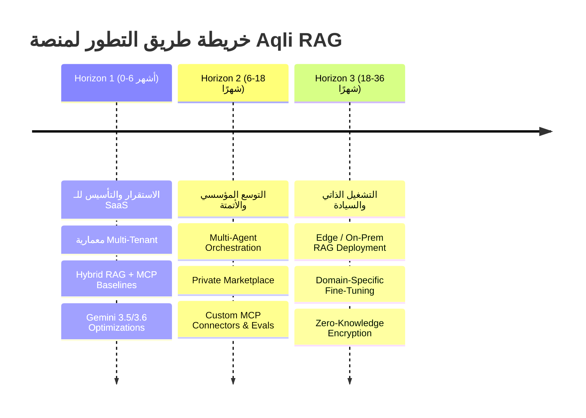
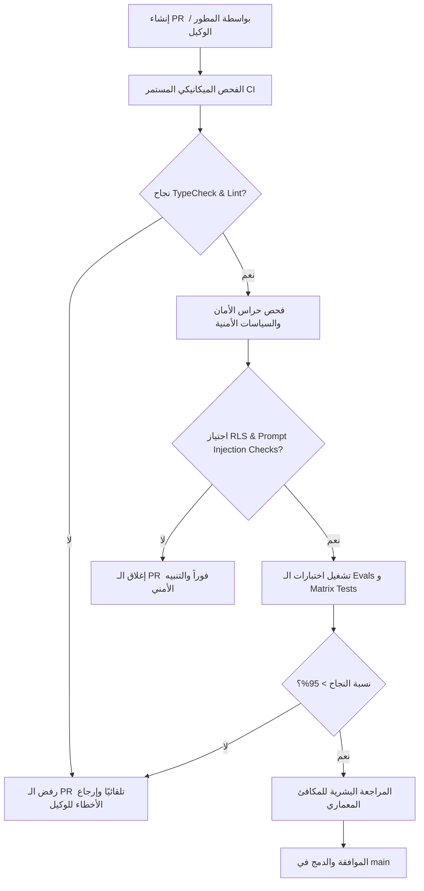

# Evolution Roadmap and Technical Debt Policy

تحدد هذه الوثيقة استراتيجية التطور المستقبلي لمنصة **Aqli RAG** وإطار حوكمة الديون التقنية ومراجعة الكود المُولَّد بالذكاء الاصطناعي (AI-Generated Code). يغطي هذا المستند خريطة الطريق على مدى ثلاثة آفاق زمنية (Horizons)، وسياسة معالجة الديون التراكمية، مع وضع حواجز حماية (Guardrails) صارمة لمنع التدهور البرمجي (Code Rot) ومخاطر العشوائية الناتجة عن الاعتماد المفرط على الوكلاء المولدين للكود.

---

## 1. آفاق التطور التقني والوظيفي (Post-Launch Horizons)

تتبع المنصة النموذج الثلاثي الأبعاد لتطوير البرمجيات المؤسسية، حيث تُوزع المهام والتطوير المتتابع على ثلاثة آفاق محددة المعالم ومعايير القبول.



### 1.1 الأفق الأول: الاستقرار والتأسيس للمؤسسات (Horizon 1: Months 0–6)
*التركيز الأساسي:* ضبط الأداء، إحكام العزل، وتثبيت البنية التحتية الهجينة ثنائية اللغة.

| المكون / الميزة | التوصيف التقني | حواجز النجاح ومعايير القبول (Acceptance Criteria) |
|---|---|---|
| **تحسين الاسترجاع الهجين** | ضبط استعلامات RLS في PostgreSQL + `pgvector` و`pg_trgm` لزيادة الدقة المتقاطعة (Hybrid RSR). | تحقيق P95 Query Latency < 400ms مع Re-ranking باستخدام `gemini-3.5-flash-lite`. |
| **استقرار إدارة الجلسات** | استخدام React 19.2 Activity API للحفاظ على اتصالات الدردشة في الخلفية دون استهلاك موارد الزبون. | صفر فقدان لحالة البث (Stream Continuity) عند التنقل بين صفحات لوحة التحكم. |
| **بروتوكول MCP المتقدم** | تفعيل موافقات الأدوات الصريحة (`Tool Approvals`) في AI SDK 7 مع تعقب سجل التدقيق لكل استدعاء. | تسجيل 100% من استدعاءات MCP الخارجية في جدول `audit_logs` محمي بـ RLS. |
| **دعم ملفات PDF المركبة** | تحسين معالجة المستندات العربية المعقدة عبر Mistral Document AI وتوزيع العمل عبر Vercel Queues. | نجاح استخراج وتضمين الجداول ثنائية اللغة من المستندات بدون إتلاف هيكل الجدول. |

### 1.2 الأفق الثاني: التوسع المؤسسي وأتمتة الوكلاء (Horizon 2: Months 6–18)
*التركيز الأساسي:* الأتمتة المتقدمة، تعزيز أدوات الذكاء الاصطناعي، والافتتاح التجاري للسوق (Marketplace).

| المكون / الميزة | التوصيف التقني | حواجز النجاح ومعايير القبول (Acceptance Criteria) |
|---|---|---|
| **الأوركسترا متعددة الوكلاء** | الاعتماد الكامل على `WorkflowAgent` لإنشاء مسارات عمل بحثية استدلالية طويلة الأمد قابلة للاستئناف. | استمرار استكمال المهام الاستدلالية المكونة من +10 خطوات في حال انقطاع الشبكة أو إغلاق المتصفح. |
| **السوق المؤسسي الخاص** | دعم Private Marketplace لمساحات العمل المؤسسية لنشر الأدوات والموصلات المغلقة. | عزل حزم المهارات (Skills) والموصلات المخصصة على مستوى المستأجر مع دعم التحكم بالأدوار (RBAC). |
| **تقييم الاسترجاع الذاتي** | تطبيق نظام Continuous RAG Evaluation Harness باستخدام نماذج قاضية (LM Judges) لتقييم الإجابات. | تسجيل درجة Groundedness Score لا تقل عن 0.90 بناءً على تقييم عينة عشوائية بنسبة 5% من الاستجابات. |
| **المحرك متعدد التضمينات** | دعم التبديل الديناميكي بين نماذج التضمين مع آلية إعادة فهرسة خلفية صامتة (Background Re-indexing). | إتمام عملية إعادة التضمين المجدولة بدون تعطيل خدمة الاستعلام الحية (Zero Downtime Re-indexing). |

### 1.3 الأفق الثالث: التشغيل الذاتي والسيادة الكاملة للبيانات (Horizon 3: Months 18–36)
*التركيز الأساسي:* السيادة الرقمية، البيئات الملتزمة كلياً بالسياسات المحلية (On-Premises)، والتشفير التام.

| المكون / الميزة | التوصيف التقني | حواجز النجاح ومعايير القبول (Acceptance Criteria) |
|---|---|---|
| **التشفير بدون معرفة (Zero-Knowledge)** | تشفير حقول البيانات والمتجهات بمفاتيح يملكها العميل حصراً (Client-Side Envelope Encryption). | تعذر قراءة المتجهات أو النصوص من قبل موظفي قاعدة البيانات أو المزود السحابي دون المفتاح الخاص. |
| **نشر Edge / Local RAG** | توفير إصدار خفيف من محرك RAG يعمل داخل شبكة العميل الخاصة (On-Prem Kubernetes). | عمل محرك الاسترجاع الكامل دون التكيف أو الاتصال بالإنترنت الخارجي (Air-Gapped Compliance). |
| **النماذج العربية المخصصة** | دمج نماذج مفتوحة المصدر مجددة ومعدلة (Fine-tuned) للغة العربية والعمليات القانونية/المالية. | تفوق النموذج المحلي المعدل على النموذج العام بنسبة 15% في اختبارات الفهم القانوني العربي. |

---

## 2. سياسة إدارة الديون التقنية (Technical Debt Governance Policy)

لمنع تراكم العيوب البرمجية وتأكل معمارية النظام، تُصنف الديون التقنية إلى أربعة محاور وتخضع لسياسة حوكمة مالية وتنفيذية صارمة.

### 2.1 تصنيف الديون التقنية وآليات التعامل معها

```
┌────────────────────────────────────────────────────────────────────────┐
│                        تصنيفات الديون التقنية                          │
├───────────────────┬────────────────────┬───────────────────────────────┤
│ 1. الديون المعمارية │ 2. الديون المتجهية  │ 3. ديون الهندسة التوجيهية     │
│ (Architectural)   │ (Vector/Embedding) │ (Prompt/Model Debt)           │
├───────────────────┴────────────────────┴───────────────────────────────┤
│ 4. ديون الكود المولد بالذكاء الاصطناعي (AI Slop & Testing Debt)        │
└────────────────────────────────────────────────────────────────────────┘
```

| فئة الدين التقني | الأمثلة والتوصيف | حد الخطر Trigger Threshold | إجراء المعالجة الإجباري |
|---|---|---|---|
| **الديون المعمارية (Architectural Debt)** | تسرب منطق RLS خارج قاعدة البيانات، خرق مجالات Monorepo packages، أو التعرّض المباشر للـ S3 APIs. | وجود استعلام يفكك عزل `workspace_id` يدويًا دون المرور بـ RLS. | إعادة هيكلة فورية (Blocker PR)، إيقاف النشر لحين التأكد من الاختبارات. |
| **ديون البيانات المتجهية (Vector DB Debt)** | تراكم المتجهات المعزولة (Orphan Embeddings)، أو عدم تحسين فهارس HNSW بمرور الوقت. | تجاوز نسبة المتجهات اليتيمة 3% من إجمالي الجدول، أو هبوط Recall عن 92%. | تشغيل مؤتمت لمهام `VACUUM ANALYZE` وإعادة بناء الفهرس `REINDEX INDEX` في أوقات الانخفاض. |
| **ديون التوجيه والذكاء الاصطناعي (Prompt & AI Debt)** | الاعتماد على Prompts طويلة وغير مهيكلة، أو عدم تثبيت إصدارات النماذج (Model Version Drift). | انخفاض نسبة الالتزام بالمخرجات المهيكلة (JSON Schema compliance) عن 98%. | نقل Prompts لتقنية `uploadSkill` أو تحويل المخرجات إلى Structured Outputs موثقة بنظام Zod. |
| **ديون البرمجة العشوائية (AI Slop Debt)** | الكود المُولد المتروك بدون اختبارات، الحزم المكررة، أو وجود استثناءات غير معالجة `catch (e) {}`. | انخفاض تغطية الاختبارات الوظيفية عن 80% في الحزم الأساسية (`@aqli/ai-providers`, `@aqli/db`). | تفعيل مراجعة جودة إجبارية ومنع الـ Merge حتى استكمال Test Harness. |

### 2.2 ميزانية صيانة الديون التقنية (Capacity Allocation)
1. **قاعدة الـ 20% المستمرة:** يُخصص 20% من السعة الإنتاجية (Capacity) لجميع المطورين والوكلاء البرمجيين في كل دورة تطويرية (Sprint) لمعالجة التذاكر المندرجة تحت وسم `tech-debt`.
2. **سبرينت التطهير (Refactoring Sprint):** بعد كل 4 دورات تطويرية، تُخصص دورة كاملة مدتها أسبوعان لمعالجة الديون التقنية المعمارية وتحديث التبعيات (Dependencies Update) ولا يُسمح بإضافة ميزات وظيفية جديدة خلالها.

---

## 3. معايير وإجراءات مراجعة الكود المُوَلَّد بالذكاء الاصطناعي (AI-Generated Code Review Practices)

مع استخدام أدوات البرمجة المستندة إلى الوكلاء (Agentic Engineering)، تتضاعف سرعة التكوين ولكن تزداد مخاطر ثغرات السلامة والكود الزائد (Code Slop). تُطبق الضوابط التالية كحزام أمان صارم (Harness).

### 3.1 حزمة حماية حزام الأمان (Slop Prevention Harness)



### 3.2 قائمة التحقق الميكانيكية قبل الدمج (Automated Gateways Checklist)

يجب أن يمر كل طلب سحب (Pull Request) مُولد جزئياً أو كلياً بواسطة الذكاء الاصطناعي عبر الاختيارات التالية في بيئة CI/CD:

- [ ] **Strict Typing Check:** عدم وجود أي استخدام لـ `any` أو `ts-ignore` دون تعليل موثق وملف من قِبل مهندس معماري.
- [ ] **RLS Safety Check:** كل استعلام جديد لقاعدة البيانات في `@aqli/db` يحتوي صراحة على تصفية بـ `workspace_id` أو يستخدم عميل Supabase/Postgres المربوط بـ Context المستخدم.
- [ ] **Prompt Injection Guard:** التنسيقات المُدخلة في سياق AI SDK لا تستخدم الدمج النصي المباشر (String Concatenation) بل تعتمد على `messages` و`system` المخصصة من المكتبة.
- [ ] **Zero Dead-Code Policy:** عدم وجود حزم غير مستخدمة (Phantom Dependencies) مضافة في `package.json` أو ملفات استيراد لم تُستخدم.
- [ ] **Bilingual Safety:** أي نص موجه للمستخدِم في الشاشات يدعم التدويل `next-intl` ولا يحتوي على نصوص صلبة (Hardcoded Strings) بالعربية أو الإنجليزية.

### 3.3 مصفوفة التفريق بين الاختبارات والتقييمات (Tests vs. Evals Engine)

| نوع الفحص | الهدف | النطاق المطبق | الأداة المستهدفة | معيار النجاح |
|---|---|---|---|---|
| **Deterministic Tests** | التحقق من العمليات المحددة منطقياً (الأمان، CRUD، التحويلات). | API Routes, RLS Policies, Data Connectors. | Vitest / Playwright | نجاح 100% دون أي استثناء. |
| **Non-Deterministic Evals** | التحقق من جودة سلوك الوكلاء وناتج RAG ودقة التلخيص. | Agent System Prompts, Retrieval, Reranking. | Custom Eval Harness / LM Judge | تحقيق Metric Threshold (Groundedness > 0.9, Faithfulness > 0.85). |

---

## 4. دورية تحديث النماذج وسياسة استبدال المكونات (Modernization & Migration Policy)

نظرًا للتطور السريع في نماذج الذكاء الاصطناعي ومكتبات النظام الأساسية (مثل AI SDK وNext.js)، تُطبق المنصة السياسات المحددة أدناه لضمان تحديث المكونات دون الانقطاع عن العمل.

### 4.1 خطة إعادة الفهرسة ونقل نماذج التضمين (Embedding Migration Workflow)

عند ترقية نموذج التضمين (مثلاً عند الانقال من `gemini-embedding-2` إلى إصدار أحدث أو نموذج بفتحة أبعاد مختلفة):

1. **الإنشاء الموازي (Dual-Indexing Phase):** يتم إضافة عمود ومتجهات جديدة في جدول `document_chunks` (مثال: `embedding_v2 vector(3072)`).
2. **الفهرسة الخلفية (Background Population):** يتم تشغيل وظائف معالجة غير متزامنة (Queue Worker) لتوليد التضمينات للبيانات القديمة باستخدام السعة المنخفضة التشغيلية (Off-peak hours).
3. **التبديل البرمجي (Shadow Querying & Cutover):** تُرسل الاستعلامات للنموذجين في وقت واحد لتقييم الدقة، وعند المطابقة التامة، يتم تبديل الموجه (Query Router) للنموذج الجديد.
4. **التنظيف (Deprecation Clean-up):** حذف الفهارس القديمة والأعمدة السابقة بطلب تغيير محكوم عبر migration script.

```sql
-- مثال لإضافة عمود التضمين الجديد دون تعطيل الجدول الحي
ALTER TABLE document_chunks 
ADD COLUMN IF NOT EXISTS embedding_v2 vector(3072);

-- إنشاء فهرس HNSW جزئي وغير معطل أثناء العمل
CREATE INDEX CONCURRENTLY IF NOT EXISTS idx_chunks_embedding_v2 
ON document_chunks USING hnsw (embedding_v2 vector_cosine_ops)
WHERE workspace_id IS NOT NULL;
```

### 4.2 دورية الترقية والمتابعة التقنية (Maintenance Cadence)

```
┌─────────────────────────────────────────────────────────────────────────┐
│                        جدول التحديثات المجدولة                          │
├─────────────────┬──────────────────────┬────────────────────────────────┤
│ أسبوعياً        │ شهرياً               │ فصلياً (كل 3 أشهر)             │
│ - أخطاء الثغرات │ - تحديث SDKs         │ - مراجعة النماذج الأساسية      │
│   الأمنية (Snyk)│   (AI SDK, Next.js)  │   (Gemini Flash/Pro Migration) │
│ - مراجعة الديون │ - تحليل أداء RAG     │ - إخصاب وتصفية قواعد المعرفة   │
│   الإنتاجية     │   وحساب التكاليف     │   وإعادة بناء الفهارس (Reindex)│
└─────────────────┴──────────────────────┴────────────────────────────────┘
```

---

## 5. الخطوات التالية والربط التشغيلي

لتشغيل هذا المخطط وضمان تنفيذه عبر فريق العمل والوكلاء المساعدين:
1. انتقل إلى دليل التشغيل ونماذج المعرفة التفصيلية في [Maintenance Workflows and Knowledge Management](./02-maintenance-workflows-and-knowledge-management.md) لاكتشاف أنماط التشغيل اليومي وسلسلة إدارة المعرفة الممتدة.
2. اعمد إلى اعتماد ملفات `AGENTS.md` في مجلدات المشروع المطابقة لقواعد هذا المستند لضمان امتثال الوكلاء البرمجيين بمتطلبات جودة الكود المولد وأمان الركائز.