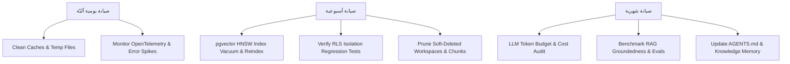

# Maintenance Workflows and Knowledge Management

تُحدد هذه الوثيقة إطار عمليات الصيانة الدورية، ونموذج التشغيل المعتمد للفرق الهجينة (مهندسون ووكلاء ذكاء اصطناعي)، وإستراتيجيات إدارة وتوسيع نظام المعرفة (Knowledge Base) وملفات الذاكرة للوكلاء المطورين لمنصة **Aqli RAG**. تبني هذه السياسات على التوجهات الإستراتيجية المحددة في [Evolution Roadmap and Technical Debt Policy](./01-evolution-roadmap-and-technical-debt-policy.md) لضمان استمرارية التشغيل واستقرار أداء RAG بكفاءة عالية.

---

## 1. جدول عمليات الصيانة الدورية (Recurring Maintenance Cadence)

تخضع منصة **Aqli RAG** لجدول صيانة آلي وموجه بالمهام لضمان سلامة قاعدة البيانات المتجهية (pgvector)، واستجابة عزل المستأجرين (Multi-tenant RLS)، وإعادة تحسين الفهارس، ومراقبة استهلاك النماذج (`gemini-3.5-flash-lite` و`gemini-3.6-flash`).



### 1.1 مصفوفة المهام والأتمتة

| الفئة | المهمة | التكرار | أداة التنفيد / السكريبت | معيار النجاح (Acceptance Criteria) |
| :--- | :--- | :--- | :--- | :--- |
| **قواعد البيانات والمتجهات** | إعادة بناء فهرس HNSW وضغط الجداول | أسبوعي (الأحد 02:00 UTC) | `scripts/db/reindex-pgvector.sql` | انخفاض زمن الاسترجاع الـ p95 للبحث الهجين إلى أقل من 80ms، وعدم وجود فجوات في `pg_stat_statements`. |
| **الأمان والعزل** | الفحص التراجعي لسياسات RLS | يومي (مع كل PR وCron) | `scripts/security/test-rls-isolation.ts` | نجاح 100% لاختبارات اختراق العزل بين `workspace_id` المختلفة؛ صفر تسريب للبيانات. |
| **المصادر والتخزين** | تنظيف الملفات المؤقتة والمقطوعة | أسبوعي | `scripts/jobs/prune-orphaned-chunks.ts` | مسح كل القطع (Chunks) التي لا ترتبط بـ `source_id` نشط في S3/R2 وجدول `document_chunks`. |
| **تكاليف الذكاء الاصطناعي** | مراجعة ميزانية الرموز والاستدعاءات | شهري | `scripts/analytics/audit-llm-usage.ts` | مطابقة تكاليف AI SDK 7 ومزودي النماذج مع حدود التكلفة لكل Workspace، ورصد الوكلاء المفرطين في الاستدعاء. |
| **التقييم والجودة** | تقييم جودة RAG والتأريض (Evals) | أسبوعي / مع التحديثات | `npm run eval:rag-groundedness` | تحقيق نسبة Groundedness >= 92% ونسبة Recall >= 88% على مجموعة بيانات الاختبار المعيارية ثنائية اللغة. |

---

## 2. نموذج التشغيل الهجين (Team Operating Model)

تعتمد إدارة منصة **Aqli RAG** على نمط "الهندسة القائمة على الوكلاء" (Agentic Engineering Framework)، حيث يعمل المهندسون كمرشِدين ومراقبين (Conductors) بينما يتولى وكلاء الذكاء الاصطناعي كتابة الكود والتنفيذ تحت حواجز حماية (Guardrails) محددة.

```
┌────────────────────────────────────────────────────────────────────────┐
│                        Human Lead / Conductor                          │
│   - Defines ADRs, Eval Rubrics, System Architecture & Guardrails      │
└──────────────────────────────────┬─────────────────────────────────────┘
                                   │
                                   ▼
┌────────────────────────────────────────────────────────────────────────┐
│                      AI Coding & Workflow Agents                       │
│   - Implements Features, Adapter Extensions, Bug Fixes, DB Migration   │
└──────────────────────────────────┬─────────────────────────────────────┘
                                   │
                                   ▼
┌────────────────────────────────────────────────────────────────────────┐
│                        Automated Test & Harness                        │
│   - RLS Validation, RAG Evals, Vitest Units, Playwright E2E            │
└────────────────────────────────────────────────────────────────────────┘
```

### 2.1 أدوار الفريق ومسؤوليات التشغيل

1. **المايسترو البشري (Lead Conductor / Architect)**:
   - مسؤول عن اعتماد قرارات المعمارية (ADRs) وتعديل ملفات التوجيه العليا (`AGENTS.md`).
   - صياغة معايير التقييم (Eval Rubrics) واختبارات الجودة غير المحددة (Non-deterministic behavior).
   - المراجعة النهائية والتوقيع على التغييرات ذات الخطورة العالية (الحزمة الأمنية، تعديل RLS، وتغييرات Schema المساس بـ pgvector).

2. **المنسق التقني (Orchestrator Engineer)**:
   - تقسيم الميزات المطلوبة إلى مهام خالية من الغموض قابلة للتنفيذ بواسطة الوكلاء (Agent-sized units).
   - إدارة جلسات التطوير عبر إمداد الوكيل بالسياق الدقيق (Context Assembly) وتطبيق الكشف التدريجي (Progressive Disclosure).
   - معالجة الحالات الحدية (Edge Cases) ونسبة الـ 80% المعقدة التي يتغاضى عنها الذكاء الاصطناعي.

3. **دليل الطوارئ والاستجابة للأعطال (On-Call Runbook for Agent/RAG Failures)**:
   - **ارتفاع الهلوسات (Hallucination Spike)**: تحويل وضع Workspace المتأثر فوراً إلى `Strict Mode` عبر API الداخلي، وتقليل قيمة Top-K في البحث الهجين لرفع الدقة.
   - **فشل مزود النماذج (Gemini API Degradation)**: تفعيل التبديل الآلي (Failover) عبر AI SDK 7 Provider Registry للتحويل إلى نموذج بديل (مثل Anthropic / OpenAI) متوافق مع Context Window المتاح.
   - **تأخر الفهرسة (Ingestion Backlog)**: زيادة وظائف Vercel Queues / BullMQ وإيقاف معالجة ملفات OCR ذات الأولوية المنخفضة حتى انتهاء الازدحام.

---

## 3. إدارة المعرفة وتوسيع ذاكرة الوكلاء (Knowledge Management & Context Scaling)

ضمان جودة استجابات وكلاء التطوير ووكلاء RAG يتطلب تنظيماً صارماً لسياق النظام لمنع تدهور الذاكرة (Context Drift) أو تجاوز الحدود المسموحة للرموز (Token Limits).

### 3.1 تصنيف وإدارة سياق النظام (Context Taxonomy)

| نوع السياق (Context Type) | المكونات في Aqli RAG | مكان التخزين / الآلية | إستراتيجية التحديث |
| :--- | :--- | :--- | :--- |
| **التعليمات (Instructions)** | قواعد البرمجة، معايير TypeScript، وسياسات Next.js 16.2 | `AGENTS.md` و`.cursorrules` | ديناميكي مع كل Sprint حسب التقنيات المحدثة. |
| **المعرفة (Knowledge)** | قرارات المعمارية (ADRs)، توثيق Schemas المخططات، ومعايير i18n | `/docs/adr/` و`/docs/architecture/` | عند اتخاذ قرار معماري جديد أو تعديل مكون. |
| **الذاكرة (Memory)** | ملخصات القرارات السابقة، الأخطاء الشائعة المكتشفة | `.agent/memory/lessons-learned.md` | تودَع آلياً بعد تحليلات Retrospective وبناء الحلول. |
| **الأمثلة (Examples)** | نماذج لـ MCP Tools، وWorkflowAgents، وPGVector Hybrid Queries | `/examples/` و`tests/fixtures/` | تُحدّث مع كل تغيير في إصدارات الحزم (مثل AI SDK 7). |
| **الأدوات (Tools)** | أدوات استخراج البيانات، الأدوات المتوافقة مع MCP، وSkills | `packages/ai-providers/skills/` | كشف تدريجي (Progressive Disclosure) عبر `uploadSkill`. |
| **حواجز الحماية (Guardrails)** | محددات RLS، قواعد التشفير، وفحوصات الأمان | `packages/db/security/` وZod Schemas | ثابتة وقاسية، يمنع الوكيل من تعديلها بدون إذن بشري. |

### 3.2 هيكلية ملفات الذاكرة وتطور AGENTS.md

يتم تقسيم ملف `AGENTS.md` في جذور المشروع إلى وحدات مرجعية لتفادي خنق نافذة السياق الخاصة بوكلاء التطوير:

```
├── AGENTS.md                          # الملف الرئيسي (إرشادات سريعة وحوادث قائمة)
├── .agent/
│   ├── rules/
│   │   ├── 01-architecture-and-stack.md # قواعد Next.js 16.2 وReact 19.2
│   │   ├── 02-rag-and-pgvector.md       # قواعد البحث الهجين واستخراج المقاطع
│   │   ├── 03-security-and-rls.md        # سياسات Multi-Tenants وتشفير pgcrypto
│   │   └── 04-mcp-and-tools.md          # معايير بروتوكول MCP واستدعاء الأدوات
│   └── memory/
│       ├── adr-index.md                 # فهرس قرارات المعمارية
│       └── known-pitfalls.md            # الأخطاء الشائعة والحلول المجربة
```

### 3.3 سجل قرارات المعمارية (ADR Workflow)

تُسجّل كل حالة تغيير في التقنيات أو قواعد RAG عبر نموذج ADR موحد:

```markdown
# ADR-004: التبديل إلى Gemini Embedding 2 واستخدام HNSW Vector Index

## الحالة: مقترحة / مقبولة / ملغاة
تاريخ القرار: YYYY-MM-DD

## السياق والمسألة
تحسين الدقة الاسترجاعية للمستندات العربية/الإنجليزية متعددة الوسائط وتخفيض الكمون أثناء البحث الهجين.

## القرار المتخذ
اعتماد نموذج `gemini-embedding-2` بأبعاد 3072 وتطبيق فهرس HNSW على pgvector مع الإعدادات:
`m = 16`, `ef_construction = 64`.

## العواقب والأثر
- **الإيجابي**: تحسن دقة استرجاع النصوص والصور بنسبة 18%، ودعم البحث متعدد اللغات.
- **السلبي**: الحاجة لإعادة التضمين كاملة (Re-indexing) وتوفير سكريبت هجرة خلفي دون توقف الخدمة.
```

---

## 4. خط أنابيب الصيانة والاختبارات الآلية (Verification Harness)

تخضع جميع عمليات الصيانة وتحديثات الكود لسلسلة اختبارات صارمة محددة برمجياً لتأكيد الأداء الوظيفي والأمني.

```bash
# سكريبت الفحص الشامل للصيانة الدورية (تنفذه بيئة CI/CD)
npm run maintenance:full-check
```

### 4.1 قائمة تحقق القبول لصيانة النظام (Maintenance Acceptance Checklist)

- [ ] **عزل البيانات**: نجاح تشغيل `npm run test:rls` الذي ينشئ مستأجرين وهميين ويتحقق من استحالة الوصول المتقاطع للبيانات.
- [ ] **جودة المتجهات**: اكتمال إعادة الفهرسة بـ `VACUUM ANALYZE document_chunks` ودون تسجيل استعلامات HNSW بطيئة في `pg_stat_statements`.
- [ ] **سلامة أدوات MCP**: التحقق من استجابة خوادم MCP المدمجة والخارجية عبر `npm run test:mcp-health`.
- [ ] **دقة RAG**: استيفاء درجات التقييم (Groundedness Score >= 0.92) في أداة `eval:rag-groundedness`.
- [ ] **توافق الترجمة وi18n**: خلو الملفات اللغوية من المفاتيح المفقودة (Missing Keys) للواجهات العربية والإنجليزية عبر `next-intl-cli check`.
- [ ] **سجل التذاكر والمعرفة**: تحديث `known-pitfalls.md` بأي استثناءات طرأت أثناء فترة الصيانة وتوثيق الحل.