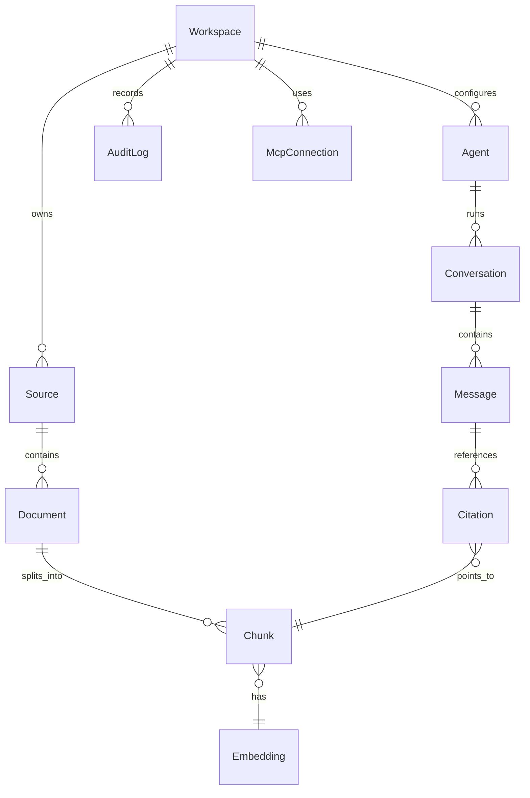
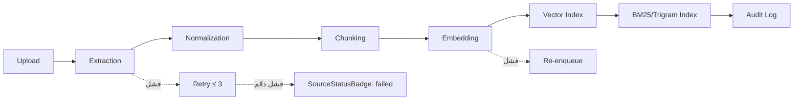

# Coding Rules and Testing Contract

> **هذا القسم يُعرّف العقد الهندسي بين المهندس البشري ووكلاء البرمجة (Vibe Coding Agents).** أي كود لا يلتزم بالقواعد أدناه يُرفض قبل المراجعة البشرية. الاختبارات والتقييمات (Evals) هي العقد الفعلي مع الذكاء الاصطناعي — لا يُدمَج أي تغيير دون اجتيازها.

---

## 1. المبادئ الحاكمة

| مبدأ | التطبيق في Aqli RAG |
|---|---|
| **السياق حقًا يسبق الكود** | كل ميزة تبدأ بتحديث `AGENTS.md` أو ملف مواصفات قبل كتابة أي سطر. |
| **العزل بين المستأجرين لا يُفاوَض عليه** | أي مسار بيانات يجب أن يمرّ عبر `workspace_id` وسياسات RLS — لا استثناء. |
| **اللوغانيات (Tags) فوق الاختيارات** | أي عمود حساس في Postgres يشمل `@pii` أو `@audit-logged` في JSDoc/SQL. |
| **العقد = اختبارات + تقييمات** | الاختبارات تتحقق من السلوك الحتمي، التقييمات تتحقق من سلوك اللغة الطبيعية (استرجاع، إجابات RAG). |
| **التوجيه الاقتصادي** | مهام Reranking/Query Rewriting تُوجَّه إلى `gemini-3.5-flash-lite`؛ الاستدلال متعدد الخطوات إلى `gemini-3.6-flash`. |

---

## 2. قواعد TypeScript الصارمة

### 2.1 إعدادات المترجم (tsconfig.json)

| الخاصية | القيمة | السبب |
|---|---|---|
| `strict` | `true` | لا كود دون فحص كامل للأنواع. |
| `noUncheckedIndexedAccess` | `true` | الوصول إلى عناصر المصفوفات يجب أن يُعالج `undefined`. |
| `exactOptionalPropertyTypes` | `true` | الخصائص الاختيارية لا تقبل `undefined` صراحةً. |
| `noImplicitOverride` | `true` | كل تجاوز للأساليب يجب أن يستخدم `override`. |
| `noFallthroughCasesInSwitch` | `true` | منع السقوط الضمني في `switch`. |
| `forceConsistentCasingInFileNames` | `true` | توحيد حالة الأحرف في اسماء الملفات. |

### 2.2 قواعد التنسيق والتسمية (ESLint + Prettier)

| القاعدة | المعيار |
|---|---|
| تنسيق الكود | Prettier مع `printWidth: 100`، `semi: true`، `singleQuote: true`، `trailingComma: 'all'` |
| استيراد الوحدات | ترتيب أبجدي عبر `eslint-plugin-import`، تجميع: مكتبات خارجية → حزم داخلية → أنواع |
| تسمية المكونات | `PascalCase` للكائنات والمكونات؛ `camelCase` للدوال والمتغيرات؛ `UPPER_SNAKE_CASE` للثوابت |
| تسمية الملفات | `kebab-case` لكل الملفات باستثناء مكونات React (`PascalCase.tsx`) |
| تعليقات JSDoc | إلزامية لكل الدوال المُصدَّرة من الحزم (`export`) في `db/` و`ai-providers/` و`mcp/` |
| استيراد الأنواع | `import type { ... }` بشكل صريح دائمًا |

### 2.3 قواعد هيكلية للمشروع (Monorepo)

```
packages/
├── ui/            # مكونات React + Tailwind v4 + shadcn/ui
├── db/            # مخطط Drizzle/Supabase، التهجرات، RLS، الدوال SQL
├── ai-providers/  # Provider Registry، Adapter Pattern لكل مزودي AI
├── mcp/           # خادم MCP الداخلي + عميل MCP الخارجي
└── connectors/    # موصلات مصادر البيانات (Google Drive, Slack, ...)
```

| القاعدة | التطبيق |
|---|---|
| لا استيراد عبر الحزم عبر مسارات نسبية | استيراد الحزم عبر `workspace:*` في `package.json` فقط. |
| لا منطق أعمال في `ui/` | كل منطق الأعمال في حزم الخادم؛ `ui/` يحتوي على عرض وإدارة حالة فقط. |
| لا وصول مباشر إلى قاعدة البيانات من `ai-providers/` | الوصول إلى البيانات يكون عبر طبقة `db/` المُصدَّرة فقط. |
| لا استدعاء مباشر لمزود خارجي | كل الاستدعاءات تمر عبر `ProviderRegistry` في `ai-providers/`. |

---

## 3. القواعد الصلبة (Hard Rules) — لا استثناء

### 3.1 عزل المستأجرين وRLS

```typescript
// ❌ ممنوع: أي استعلام دون تصفية workspace_id
await db.select().from(documents);

// ✅ إلزامي: تمرير workspaceId وضمان فعالية RLS
await getDocumentsForWorkspace(workspaceId, options);
```

| القاعدة | آلية التحقق |
|---|---|
| كل استعلام في الخادم يجب أن يمر عبر طبقة `db/` التي تُفعّل RLS | فحص تلقائي في CI يبحث عن `db.select().from(...)` دون `workspaceId`. |
| كل استعلام Postgres في `db/` يجب أن يُحدّد `workspace_id` في `WHERE` أو `JOIN` | اختبارات تكامل تُنشئ مستأجرين متعددين وتتأكد من عدم تسرّب البيانات. |
| مفاتيح تشفير البيانات مشتقة لكل Workspace | اختبار: فك تشفير بيانات WS-A بمفتاح WS-B يجب أن يفشل. |

### 3.2 معالجة الأخطاء

```typescript
// ✅ التوقيع القياسي للأخطاء
type Result<T, E = AppError> =
  | { ok: true; data: T }
  | { ok: false; error: E };

// كل دوال الخادم تُعيد Result ولا تقذف استثناءات غير معروفة
export async function ingestDocument(
  workspaceId: WorkspaceId,
  source: UploadSource
): Promise<Result<IngestionResult, IngestionError>>;
```

| المعرف | متى يُستخدم | ما يحدث |
|---|---|---|
| `AppError` | أخطاء منطقية متوقعة | يُعاد للمستخدم برسالة واضحة. |
| `DatabaseError` | فشل في Postgres | يُسجّل كـ `pino` error، يعاد للمستخدم رسالة عامة. |
| `ProviderError` | فشل مزود AI/Embedding | يُفعّل Fallback عند توفر مزود بديل. |
| `RLSViolationError` | محاولة استعلام دون `workspace_id` | يُرفض الطلب، يكتب في سجل التدقيق. |
| `IngestionError` | فشل في خط أنابيب المعالجة | يُعاد للمستخدم، يُعرض في `SourceStatusBadge`. |

### 3.3 معالجة اللغة العربية الثنائية

| القاعدة | آلية التحقق |
|---|---|
| كل نص عربي في قاعدة البيانات يُمرّر عبر `normalizeArabicText()` للتطبيع | وحدة اختبار `arabic-normalization.test.ts`. |
| التطبيع يطابق الأحرف التالية: | `ا/أ/إ/آ`، `ى/ي`، `ة/ه`، إزالة التشكيل اختياريًا. |
| كشف اللغة لكل مقطع يُخزَّن في `chunks.language` (`'ar'` / \`'en'` / \`'mixed'\`) | اختبار يتأكد من ملء الحقل في كل مقطع. |
| البحث الهجين يجب أن يطابق `pg_trgm` مع `fuzzystrmatch` | اختبار تكامل يبحث عن "القانون" و"القانون" و"القانون؟" يتوقع نفس النتائج. |

---

## 4. هيكلة الوكلاء (Agentic Engineering)

### 4.1 بروتوكول كتابة الوكلاء

كل وكيل في النظام (Master Agent، Sub-agents، Reranker، Query Rewriter) يجب أن:

1. يُعرّف في ملف منفصل تحت `packages/ai-providers/src/agents/{name}/`.
2. يُرفق معه ملف مواصفات `{name}.spec.ts` يصف سلوكه.
3. يحتوي على `systemPrompt` واضح بالعربية أو الإنجليزية حسب الجمهور.
4. يحدّد فهرس الأدوات المتاحة له (مفلتر لكل `workspace_id`).
5. يحدّد نموذجه بشكل صريح (`gemini-3.6-flash` أو `gemini-3.5-flash-lite`).

```typescript
// هيكل ملف تعريف الوكيل
export const legalResearchAgent = defineAgent({
  name: 'legal-researcher',
  model: 'gemini-3.6-flash',
  systemPrompt: LEGAL_RESEARCH_PROMPT, // منفصل في ملف prompts/
  tools: [scopedRetrievalTool, citationTool, webSearchTool],
  mode: 'strict' as const,           // strict | augmented | open
  scope: { knowledgeBase: 'all' },   // أو قائمة مصادر محددة
  maxSteps: 10,
  timeoutMs: 30_000,
});
```

### 4.2 قواعد System Prompts

| القاعدة | التطبيق |
|---|---|
| لا Prompts مكتوبة كنص حر في الكود | تُخزَّن في ملفات `packages/ai-providers/src/prompts/*.md`. |
| كل Prompt يدعم `{{placeholders}}` ديناميكية | يُحقن عبر `renderPrompt(template, vars)` لا عبر قوالب النصوص. |
| لا تتضمن Prompts أسرارًا أو مفاتيح | فحص CI يرفض أي `.md` يحتوي نمطًا شبه مفتاح. |
| كل Prompt يحتوي على تعليمات Citation صريحة | "إن لم تجد الإجابة في المصادر، قل إنك لا تعرف" في Strict Mode. |

---

## 5. التيقّن والاختبارات (The Testing Contract)

### 5.1大衣 طبقات الاختبار

| الطبقة | الأداة | النسبة المستهدفة | ما تتحقق منه |
|---|---|---|---|
| **وحدة (Unit)** | Vitest | ≥ 90% خطوط | دوال مفردة، التطبيع العربي، Provider Adapters، فهرسة المتجهات. |
| **تكامل (Integration)** | Vitest + DB حقيقية | ≥ 70% فروع | خط أنابيب RAG كاملً، RLS، أداء Hybrid Search، عزل Workspaces. |
| **E2E** | Playwright | سيناريوهات محددة | تدفق المصادقة، رفع مستند، محادثة كاملة، Generator RAG. |
| **تقييمات (Evals)** | تقييم RAG مخصص | > 80% تمرير | جودة الاسترجاع، دقة الإجابات، الاستشهادات، عدم الهلوسة. |

### 5.2 عقد الاختبارات الديterministic

```typescript
// مثال: اختبار تكامل لخط أنابيب RAG
describe('RAG Pipeline — Strict Mode', () => {
  // ✅ تأهيل البيئة: مستأجران، مصادر مختلفة
  beforeAll(async () => {
    await setupWorkspace('ws-alpha', { sources: [legalDoc] });
    await setupWorkspace('ws-beta', { sources: [medicalDoc] });
  });

  test('لا تتسرب نتائج ws-alpha إلى ws-beta', async () => {
    const res = await retrieveRelevant({
      workspaceId: 'ws-beta',
      query: 'ما هو القانون التجاري؟',
      mode: 'strict',
    });
    expect(res.documents.some(d => d.workspaceId === 'ws-alpha')).toBe(false);
  });

  test('الاستشهادات تشير إلى المقطع الصحيح', async () => {
    const answer = await generateAnswer({
      workspaceId: 'ws-alpha',
      query: 'ما هو القانون التجاري؟',
      mode: 'strict',
    });
    for (const citation of answer.citations) {
      expect(citation.chunkId).toBeDefined();
      const chunk = await getChunk(citation.chunkId, 'ws-alpha');
      expect(chunk).not.toBeNull();
    }
  });
});
```

### 5.3 عقد تقييمات RAG (RAG Evals)

التقييمات تغطّي السلوك غير الحتمي للنماذج اللغوية. تُكتب في `packages/ai-providers/src/evals/*.eval.ts`:

| فئة التقييم | معايير النجاح | العدد الأدنى للاختبارات |
|---|---|---|
| **دقة الاسترجاع (Recall@5)** | ≥ 0.85 على مجموعة عربية، ≥ 0.85 على مجموعة إنجليزية | 50 استعلام لكل لغة |
| **دقة الإجابة (Faithfulness)** | ≥ 0.90 — الإجابة تستند فقط للمصادر في Strict Mode | 30 حالة |
| **استشهادات قابلة للتحقق** | 100% من الإجابات مع استشهادات `chunkId` صحيحة | 30 حالة |
| **رفض عند نقص المصادر** | في Strict Mode: لا إجابة بدون استشهاد | 15 حالة "لا مصدر" |
| **تمييز المصدر/الويب** | في Augmented Mode: تسمية صحيحة للحوام 使得 | 20 حالة |
| **عدم هلوسة** | 0% هلوسة حكمية في Strict، < 5% في Augmented | 40 حالة |

```typescript
// مثال: هيكل تقييم RAG
export const strictModeEval = defineRagEval({
  name: 'strict-mode-faithfulness',
  dataset: 'datasets/strict-mode-30.json',
  model: 'gemini-3.6-flash',
  rubric: {
    faithfulness: { threshold: 0.90, weight: 0.4 },
    citationCorrectness: { threshold: 1.0, weight: 0.3 },
    refusalWhenNoSource: { threshold: 1.0, weight: 0.3 },
  },
  judgeModel: 'gemini-3.6-flash',  // نموذج حكم مستقل
  judgePrompt: 'prompts/judge-faithfulness.md',
});
```

---

## 6. قواعد قاعدة البيانات و SQL

### 6.1 مخطط الكيانات الأساسية



### 6.2 قواعد PostgreSQL

| القاعدة | آلية التحقق |
|---|---|
| كل جدول يتضمن `id UUID PRIMARY KEY DEFAULT uuid_generate_v4()` | فحص مخطط CI يتأكد من وجود العمود. |
| كل جدول يتضمن `workspace_id UUID NOT NULL` (ما عدا جداول النظام) | فحص CI. |
| كل جدول يتضمن `created_at TIMESTAMPTZ DEFAULT now()` و `updated_at TIMESTAMPTZ` | فحص CI. |
| RLS مفعّل على كل جدول يحتوي بيانات مستخدم | `SELECT relname, relrowsecurity FROM pg_class` في CI. |
| مفاتيح API مشفّرة بـ `pgcrypto` | اختبار: `SELECT encrypt_api_key('test-key', 'ws-id')` يعيد نصًا مشفرًا. |
| فهارس HNSW على `chunks.embedding` بمعلومة `workspace_id` كفلتر جزئي | فحص وجود `CREATE INDEX ... ON chunks USING hnsw(embedding) WHERE workspace_id = ...` أو استراتيجية معادلة. |
| دوال Hybrid Search في Postgres عبر `plpgsql` | اختبار تكامل يدعو `hybrid_search(workspace_id, query, limit)` ويتحقق من النتائج. |

### 6.3 التهجرات (Migrations)

| القاعدة | التطبيق |
|---|---|
| كل تهجرة ذات اتجاه واحد (Forward-only) | دراسة التهجيرات بالنسبة للمسار العكسي لا تكون محذورة. |
| كل تهجرة تحتوي على `UP` فقط | لا `DOWN` — التراجع يتم عبر تهجرة جديدة. |
| تهجرات RLS تُراجَع بشريًا إلزاميًا | علامة `-- @requires-human-review` في رأس الملف. |
| لا `DROP TABLE` أو `DROP COLUMN` دون تهجرة مسبقة لتعطيل الاستخدام | مرحلة 1: إيقاف الكتابة، مرحلة 2 (بعد أسبوع): الحذف. |

---

## 7. قواعد البنية التحتية والنشر

### 7.1 متغيرات البيئة

| المتغير | الغاية | مطلوب؟ |
|---|---|---|
| `DATABASE_URL` | اتصال Postgres (مع SSL) | نعم |
| `GEMINI_API_KEY` | مفتاح Gemini الافتراضي | نعم |
| `S3_ENDPOINT` / `S3_ACCESS_KEY` / `S3_SECRET_KEY` | تخزين الكائنات لكل مستأجر | نعم |
| `ENCRYPTION_MASTER_KEY` | المفتاح الرئيسي لـ Envelope Encryption | نعم |
| `OTEL_EXPORTER_OTLP_ENDPOINT` | إرسال القياسات إلى OpenTelemetry | اختياري |
| `MCP_SERVER_PORT` | منفذ خادم MCP الداخلي | اختياري (افتراضي 3001) |

**قاعدة صلبة:** لا تُقرأ متغيرات البيئة في طبقة `ui/` إطلاقًا. كل الأسرار في الخادم فقط.

### 7.2 قواعد Vercel/Serverless

| القاعدة | السبب |
|---|---|
| مهام الفهرسة الطويلة عبر Vercel Queues أو BullMQ | حدود زمن الدوال (Timeout). |
| لا حالة في الذاكرة بين الطلبات | Serverless = عديم الحالة. |
| مهام MCP طويلة الأمد عبر MCP Server منفصل (وليس Serverless) | MCP يحتاج اتصالًا مستمرًا. |

---

## 8. قواعد MCP (Model Context Protocol)

### 8.1 خادم MCP الداخلي

| القاعدة | آلية التحقق |
|---|---|
| كل أداة MCP تتحقق من `workspaceId` وصلاحيات المستخدم | اختبار: استدعاء بأداة `search_knowledge_base` مع `workspaceId` غير مملوك للمستخدم يجب أن يُرفض. |
| كل استدعاء يُسجّل في `audit_logs` | اختبار تكامل يتأكد من وجود السجل. |
| أدوات MCP تتبع TypeScript-only Interface | لا استدعاءات `eval` أو `Function(string)`. |

### 8.2 عميل MCP الخارجي

```typescript
// ✅ كل اتصال MCP خارجي يتطلب موافقة صريحة
const result = await mcpClient.callTool({
  serverId: 'github-mcp',
  tool: 'create_issue',
  args: { title, body },
  requireApproval: true,   // إلزامي للأدوات الكتابة/الإلحاقية
  workspaceId,
  userId,
});
```

| القاعدة | آلية التحقق |
|---|---|
| الأدوات الكتابية (Write/Update/Delete) تتطلب `requireApproval: true` | فحص CI يبحث عن `callTool` دون `requireApproval` للأدوات الكتابية. |
| لا تمرير مفاتيح API إلى خوادم MCP خارجية | فحص CI على شيفرة العميل. |
|上市公司 | استدعاء أداة MCP خارجية يُسجّل في Audit Log | اختبار تكامل. |

---

## 9. قواعد الواجهة الأمامية (UI/UX)

### 9.1 دعم RTL/LTR

| القاعدة | التحقق |
|---|---|
| كل مكون في `ui/` يستخدم `dir={textDirection}` استنادًا للغة المحتوى | اختبار Playwright يبدّل بين RTL و LTR ويتأكد من اتجاه النص. |
| لا `text-align: left` صريح في CSS | فحص CI على ملفات CSS/Tailwind. |
| التبديل بين العربية والإنجليزية لا يُعيد تحميل الصفحة | اختبار E2E. |

### 9.2 مكونات مشتركة — قواعد الاستخدام

| المكون | الاستخدام المسموح | الاستخدام الممنوع |
|---|---|---|
| `ChatComposer` | في `/chat` و`/chat/[id]` | في صفحات الإعدادات. |
| `SourceStatusBadge` | في `/sources` و`/dashboard` | في المحادثة (يُستخدم `CitationCard` بدلًا منه). |
| `ProviderSwitcher` | في `/settings/providers` | في `/chat` (التبديل يتم عبر `AgentPicker`). |
| `RTL/LTR ThemeProvider` | جذر التطبيق فقط | لا يُستخدم داخل مكونات فردية. |

---

## 10. قواعب الأمان والامتثال

### 10.1 تشفير البيانات

| النوع | الآلية | التحقق |
|---|---|---|
| أثناء النقل | TLS 1.2+ على كل الاتصالات (Postgres, S3, API) | فحص CI على تكوين الخادم. |
| في السكون (DB) | `pgcrypto` على الأعمدة الحساسة (`api_keys`, `mcp_credentials`) | اختبار: قراءة العمود مباشرة تعيد نصًا مشفرًا. |
| في السكون (S3) | SSE-KMS على كل الدلاء | اختبار: دلو جديد يجب أن يكون SSE-KMS مفعّلًا. |
| مفاتيح التشفير | Envelope Encryption: مفتاح رئيسي + مفتاح مشتق لكل Workspace | اختبار: فك تشفير بيانات WS-A بمفتاح WS-B يفشل. |

### 10.2 سجل التدقيق (Audit Log)

كل الأحداث التالية تُسجّل إلزاميًا في `audit_logs`:

| الحدث | الحقول المسجّلة |
|---|---|
| جلب/حذف/مشاركة مصدر | `workspaceId`, `userId`, `sourceId`, `action`, `timestamp`, `ip` |
| استدعاء أداة MCP خارجية | `workspaceId`, `userId`, `mcpServerId`, `toolName`, `args`(مشفر), `status` |
| تغيير إعدادات الفوترة/المزود | `workspaceId`, `userId`, `providerType`, `oldValue`→`newValue` |
| فشل RLS | `workspaceId`, `userId`, `query`, `timestamp`, `severity: 'critical'` |
| تسجيل دخول/خروج | `userId`, `provider`, `ip`, `userAgent` |

### 10.3 GDPR / HIPAA

| المتطلب | الآلية |
|---|---|
| تصدير بيانات المستخدم | `GET /api/workspace/:id/export` — يُصدّر JSON/ZIP لكل المصادر والمحادثات. |
| حذف بيانات المستخدم | `DELETE /api/workspace/:id` — حذف متسلسل من DB + S3 + فهارس pgvector. |
| سياسة الاحتفاظ | قابل للتهيئة لكل مصدر في `/settings/security`: 30/90/365 يومًا أو "أبديًا". |

---

## 11. قاعدة الأمانة المعرفية (Citations)

```typescript
// ✅ كل إجابة في Strict/Augmented Mode يجب أن تحتوي استشهادات
interface RAGAnswer {
  text: string;
  citations: Array<{
    chunkId: string;
    sourceId: string;
    sourceTitle: string;
    page?: number;
    excerpt: string;      // مقتطف إثبات
    mode: 'strict' | 'augmented' | 'web';
  }>;
  refusalReason?: string; // عند الرفض في Strict Mode
}
```

| القاعدة | آلية التحقق |
|---|---|
| في Strict Mode: لا إجابة بدون `citations.length > 0` | تقييم `strict-mode-faithfulness`. |
| في Augmented Mode: تمييز واضح بين `mode: 'strict'` و`mode: 'web'` | اختبار E2E يتأكد من عرض علامة "من الويب". |
| مقتطف الإثبات (`excerpt`) يجب أن يكون موجودًا فعلًا في `Chunk` | اختبار تكامل يقرأ المقطع ويتأكد من تطابق المقتطف. |

---

## 12. المراقبة والقياسات (Observability)

### 12.1 OpenTelemetry Spans إلزامية

| العملية | اسم Span | السمات المسجّلة |
|---|---|---|
| استدعاء نموذج AI | `ai.inference` | `model`, `provider`, `workspaceId`, `inputTokens`, `outputTokens`, `latencyMs` |
| استرجاع RAG | `rag.retrieve` | `workspaceId`, `query`, `mode`, `numResults`, `latencyMs` |
| خط أنابيب المعالجة | `pipeline.ingest` | `workspaceId`, `sourceId`, `documentId`, `step`, `status` |
| استدعاء أداة MCP | `mcp.tool.call` | `serverId`, `toolName`, `workspaceId`, `durationMs` |
| Hybrid Search | `db.hybrid_search` | `workspaceId`, `query`, `topK`, `latencyMs` |

### 12.2 مقاييس رئيسية (Metrics)

| المقياس | العتبة | إجراء |
|---|---|---|
| زمن Hybrid Search p95 | < 200ms | تنبيه عند التجاوز. |
| زون Inference p95 | < 3s | تنبيه، تفعيل Fallback إن وجد. |
| نسبة فشل الفهرسة | < 2% | تنبيه عند التجاوز. |
| تسرّب RLS | 0 | تنبيه فوري (Critical). |

---

## 13. قواعد التزام (التوقعات)

### 13.1 خط أنابيب المعالجة (Processing Pipeline)



### 13.2 زمن المعالجة المستهدف

| المرحلة | المستهدف (p95) |
|---|---|
| رفع ملف ≤ 10MB | < 5s |
| استخلاص مستند 50 صفحة | < 60s |
| Embedding لـ 100 مقطع | < 30s |
| فلية كاملة من الرفع إلى قابل للبحث | < 3 minuti |

---

## 14. بروتوكول استثناء القواعد (Derogation Protocol)

أي استثناء لقاعدة من القواعد أعلاه يتطلب:

1. فتح issue بعنوان `[DEROGATION] {rule-id} — {short-reason}`.
2. توثيق السبب التقني والبدائل المُستبعدة.
3. الحصول على موافقة مهندس معماري رئيسي (Human Architect).
4. تسجيل الاستثناء في `DEROGATIONS.md` مع تاريخ انتهاء (لا يتجاوز 90 يومًا).

---

## 15. ملاحق الاختبار

### البرامج النصية للتشغيل

```bash
# تشغيل اختبارات الوحدة
pnpm vitest run --project=packages/*

# تششغيل اختبارات التكامل (مع Postgres حقيقية)
DATABASE_URL=postgres://localhost:5432/aqli_test \
  pnpm vitest run --config vitest.integration.config.ts

# تشغيل تقييمات RAG (تستدعي Gemini API)
GEMINI_API_KEY=$GEMINI_API_KEY \
  pnpm eval:rag --suite=strict-mode-faithfulness

# تشغيل E2E (Playwright)
pnpm playwright test --project=chromium --grep="@rtl"

# فحص RLS تلقائيًا
pnpm tsx scripts/check-rls-coverage.ts
```

### قائمة الفحوصات قبل الدمج (Pre-Merge Gates)

- [ ] `pnpm typecheck` — لا أخطاء أنواع.
- [ ] `pnpm lint` — kein تحذيرات.
- [ ] `pnpm test:unit` — نسبة تغطية ≥ 90%.
- [ ] `pnpm test:integration` — كل الاختبارات تمر.
- [ ] `pnpm test:e2e:rtl` و`pnpm test:e2e:ltr` — تمر.
- [ ] `pnpm eval:rag` — ≥ 80% تجاوز في كل التقييمات.
- [ ] `pnpm check:rls` — لا استعلامات بدون `workspaceId`.
- [ ] `pnpm audit` — لا ثغرات معروفة عالية.
- [ ] مراجعة بشرية لأي تهجرة قاعدة بيانات.
- [ ] مراجعة بشرية لأي تغيير في `packages/db/src/rls/`.

> **ملاحظة للوكلاء:** هذه القواعد ليست اقتراحات. الفشل في اجتياز أي باب من أبواب القياس أعلاه يعني استرجاع المهمة إلى مرحلة التحرير. راجع [سياق المشروع والأوامر](./01-project-context-and-commands.md) للأوامر التفصيلية، و[سير العمل ومعايير الإنجاز والحدود](./03-workflow-done-criteria-and-boundaries.md) لتعريف "منجز".