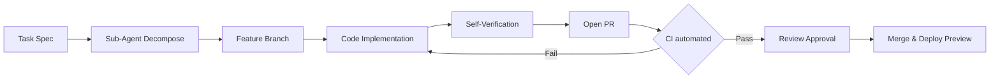

# Workflow, Done Criteria, and Boundaries

## 1. مسار طلبات السحب (PR Workflow) ونموذج التشغيل (Conductor/Orchestrator)

يعتمد هذا المشروع نموذج **التشغيل الهادف (Agentic Engineering)** حيث لا تُكتب الكود عبر "Vibe Coding" عشوائي، بل تُفكّك المهام لوحدات بحجم وكيل (Agent-sized units) ذات معايير نجاح صريحة. مسار PR الإلزامي هو:

1. **استخراج المهمة (Task Decomposition)**: كل ميزة كبيرة (مثل "إضافة موصل Google Drive") تُقسم في `tasks/` كأفرع مستقلة بحجم وكيل واحد (Sub-agent task).
2. **الفرع المخصص (Branching)**: `feat/<scope>-<task-name>` مثلاً `feat/connectors-gdrive-auth`.
3. **التنفيذ المتحوط (Implementation under Harness)**: تنفيذ مسيطر بـ [قواعد الكود وعقد الاختبارات](./02-coding-rules-and-testing-contract.md).
4. **التحقق الذاتي (Self-verification)**: الوكيل مسؤول عن تمرير `pnpm typecheck && pnpm test && pnpm lint` محلياً قبل فتح PR.
5. **التحقق الآلي (Automated CI Checks)**: مراحل CI/CD تعمل كحارس (Guardrail) لرفض أي تغيير لا يلبي العقد.
6. **المراجعة البشرية/الوكيلية (Review)**: PR Reviewer يتأكد من تطابق الكود مع مواصفات المهام الأصلية (Static Context).

### حدود مسؤولية الرسائل (Commit Messages)
- استخدام **Conventional Commits** صارم:
  - `feat(scope): ...` للميزات، `fix(scope): ...` للإصلاحات.
  - وسم الأخيرة بـ `scope` حسب المديول: `db`, `ai-rag`, `mcp`, `ui`, `auth`, `connectors`, `marketplace`.

---

## 2. خطوات التحقق الآلي (CI Pipeline Quality Gates)

كل PR يجب أن يكسر هذه البوابات بنجاح، ولا يُسمح بالدمج (Merge) إلا بعد جلوسها بالكامل:

| البوابة (Gate) | الأمر / الأداة | شرط التوقف (Stop Condition) |
|---|---|---|
| **Type Safety** | `tsc --noEmit` | أي خطأ TypeScript في `strict` يوقف PR. |
| **Lint & Format** | `next lint && prettier --check` | أي تحذير Lint أو فرق تنسيق يوقف PR. |
| **Unit/Integration Tests** | `vitest run` | تراجع في نسبة النجاح (Regression) أو أي `test FAIL` يوقف PR. |
| **E2E Tests** | `playwright test` | فشل اختبار دورة أساسية (Core Flow) كـ RAG ingestion يوقف PR. |
| **RLS / DB Isolation** | `pnpm test:rls-isolation` | أي تسريب بيانات Workspace آخر عبر RLS bypass يوقف PR فوراً. |
| **RAG Eval Harness** | `pnpm eval:rag` | تراجع مقياس Groundedness أو Retrieval Recall عن خط الأساس (Baseline). تفاصيل في جدول التقييم أسفل. |

---

## 3. التحقق من السلوك غير المحدد: Evals كعقد للوكيل

بينما تفحص الاختبارات (Tests) الجوانب الحتمية (Deterministic) كالواجهات والـ RLS، فإن **التقييمات (Evals)** هي التي تفحص سلوك الـ AI في حالات البحث الهجين (Hybrid RAG) وتوليد الإجابات ثنائية اللغة.

| اسم التقييم (Eval) | المقياس (Rubric) | الحد الأدنى (Threshold) |
|---|---|---|
| **Retrieval Faithfulness** | هل الإجابة مبنية حصراً على المصادر المسترجعة (Strict Mode)؟ | Faithfulness ≥ 0.95 |
| **Context Sufficiency** | هل النظام يرفض الإجابة عند عدم كفاية السياق في Strict Mode؟ | Refusal Rate = 100% للأسئلة خارج النطاق |
| **Citation Precision** | دقة الإشارة (Citations) للوصول للمقاطع المقصودة (Chunk Provenance). | Citation Match ≥ 0.90 |
| **Arabic/English Normalization** | هل البحث الضبابي (`pg_trgm`) يتطابق مع التطبيع العربي (الهمزات/التاء المربوطة)؟ | Recall ≥ 0.88 |

معايير النجاح:
- لا يُسمح بدمج أي تغيير في مسار المعالجة (`ai-providers`, `connectors`) يُسقط أي مقاييس `RAG Eval` عن الـ Baseline المعد سابقاً.
- LM Judge أو用人 (Human Evaluator) يجيب بناء/رفض بناءً على عدم وجود "Hallucinations" في أوضاع الـ RAG المقيّد.

---

## 4. تعريف النجاح للوكيل (Definition of Done: DoD)

لا تعتبر المهمة (Task) "منجزة (Done)" إلا باستيفاء **كل** البنود التالية. يجب على وكيل الترميز (Coding Agent) التحقق منها ضمناً قبل تسليم PR:

- [ ] **الكود يلبي المعايير**: `tsc`, `eslint`, `prettier` خالية من الأخطاء.
- [ ] **عزل المستأجرين (Tenant Isolation)**: إذا لمست المهمة طبقة البيانات (DB Layer)، يجب تمرير اختبارات RLS (`pnpm test:rls-isolation`) لضمان عدم تسرّب البيانات عبر `workspace_id`.
- [ ] **أمان المفاتيح والبيانات الحساسة (GDPR/HIPAA)**: لا توجد مفاتيح API مكتوبة CODE (Hardcoded). أي اتصال خارجي يسجّل في Audit Log. لا تمرير مفاتيح للمتصفح أبداً.
- [ ] **ثنائية اللغة (RTL/LTR)**: إذا كانت المهمة في الواجهة (UI)، يجب اختبار التخطيط لكل من `ar` و `en` عبر `next-intl`.
- [ ] **اختبارات حتمية (Deterministic Tests)**: إضافة اختبارات `vitest` للمنطق الجديد، وخاصة في دوال الـ `pgvector` Hybrid Search والموصلات (Connectors).
- [ ] **تحديث الذاكرة (Memory & Docs)**: تحديث ملفات `docs/` أو `AGENTS.md` إذا تغيرت واجهات API أو مواصفات النظام (System Specs).
- [ ] **مقاييس RAG Eval**: إرفاق نتائج `RAG Eval` للتغييرات في خط أنابيب الاسترجاع والتوليد (Retrieval & Generation).

---

## 5. حدود الأدوات وقواعد استخدامها (Tool Boundaries)

لتفادي مشكلة الـ "80% Token window" وضمان عدم خروج الوكلاء عن السياق، تُحدد الأدوات بصرامة:

| الأداة (Tool) | الاستخدام المصرّح (Allowed Boundaries) | الاستخدام الممنوع (Stop/Pause Condition) |
|---|---|---|
| **DB Migration Tools** (`postgres`, `drizzle`, etc.) | إنشاء/تعديل المخطط (Schemas)، تعديل RLS. | عدم إنشاء `down migration` يعني خطأ. يجب إضافة rollback دائماً. |
| **File System Access** | تعديل ملفات المديول المعني فقط (`packages/mcp`, `packages/mcp`, `apps/web`). | الوصول أو التعديل على ملفات `.env*`, `vercel.json` ممنوع. |
| **HTTP Requests / Install** | رسمياً عبر `pnpm` فقط لإضافة ليب approved. | تثبيت أي حزمة بمكونات تجريبية (Telemetry خارجية) أو أوامر `curl` للنصوص البعيدة ممنوعة. |
| **Vercel / Inngest Deploy Hooks** | تفعيل قوائم الإنتظار (Queues) للمعالجة غير المتزامنة (Ingestion). | وضع المفاتيح في الكود (Hardcoded Secrets) ممنوع وتوقف PR. |
| **AI API / OpenAI Calls** | الطبقة الخادمة والـ Server Actions في @sdk exclusively. | استدعاء `@ai-sdk/react` أو المفاتيح في الكلاينت يقود للحظر. |

---

## 6. شروط التوقف (Stop Conditions) وحالات التدخل البشري

الوكيل ليس مستقلاً مطلقاً. العمليات التالية تتطلب إيقافاً فورياً وحصولاً على موافقة بشرية (Human Approval):

| الموقف (Situation) | شرط التوقف (Stop Condition) | مطلوب موافقة من | الإجراء المطلوب (Required Action) |
|---|---|---|---|
| **تغيير بنية قاعدة البيانات الجذرية (DB Degradation)** | فشل `pgvector` في كتابة متجهات جديدة أو تجاوز مساحة التخزين. | Database Architect | تدخل يدوي لإصلاح الفهارس (Re-index). |
| **تسريب مفاتيح API (Keys Leakage)**| ظهور API Keys في Kinsta/Sentry أو الـ Logs. | Security Officer | إلغاء المفتاح فوراً، تدويره (Rotate)، وإصلاح الكود. |
| **فشل RAG Eval بانخفاض حاد** | تراجع `Retrieval Faithfulness` أو `Hallucination` زيادة عن 20%. | AI/Data Lead | `Halt` للدمج، تحليل الـ Reranker / Embedding Bottleneck. |
| **نضوب Bundle Size / Memory** | تجاوز حجم الـ Edge Function لـ 1MB أو زيادة Load Time عن `2s`. | Frontend Architect | تحليل Vercel Observability، إيقاف الـ Edge limit. |